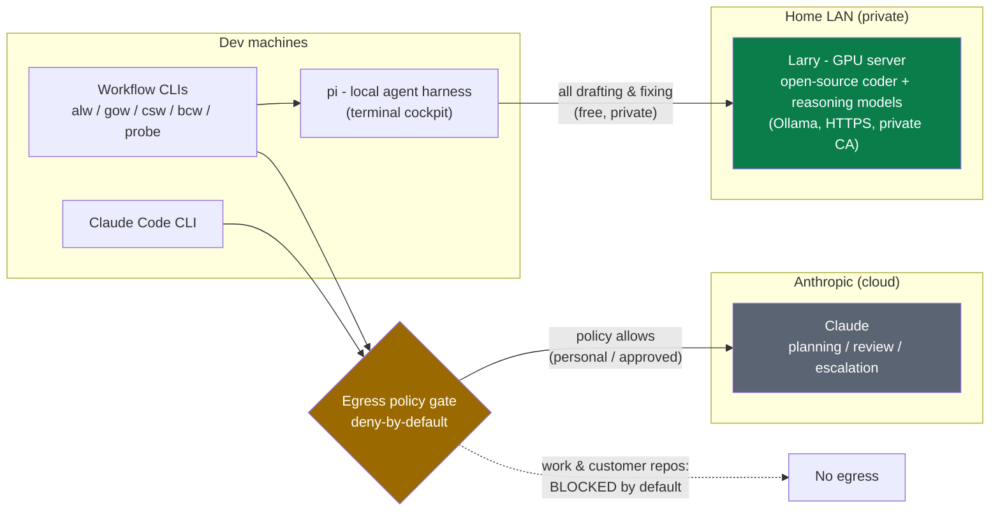
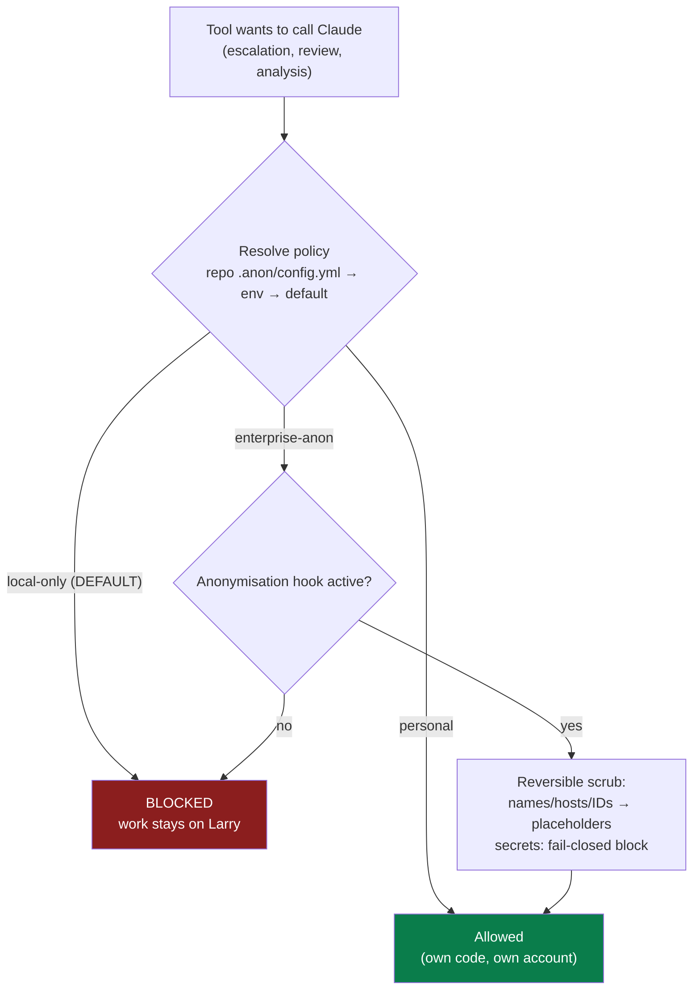
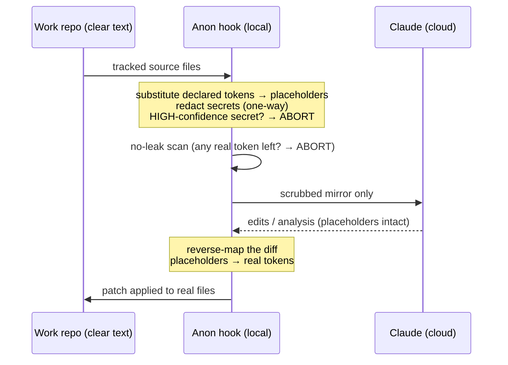
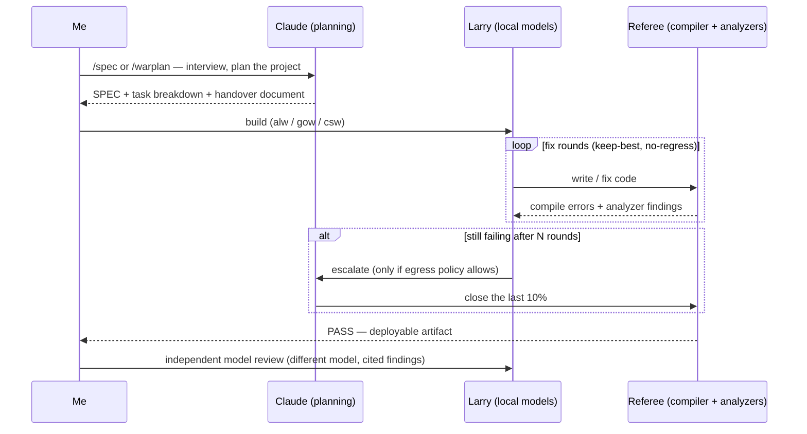
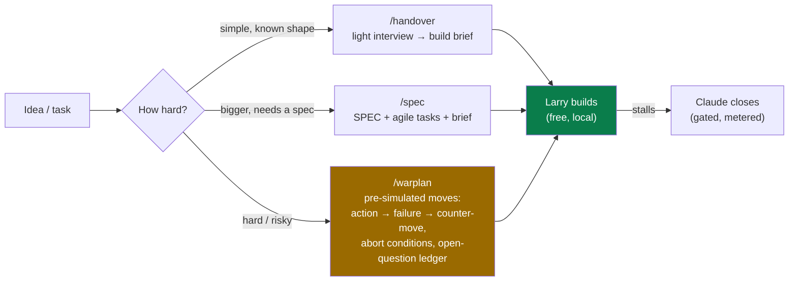

# AI-Assisted Development Workflows — Overview

*A one-page tour of how I use local and cloud AI for software development: what runs where,
how customer/work code is protected, and where the quality gates sit.*

---

## The idea in one paragraph

A **self-hosted GPU server ("Larry")** on my home LAN runs open-source coding models and does the
bulk of the work for free and in private. **Claude (Anthropic)** is used sparingly, for what large
models are uniquely good at: requirements interviews, planning hard projects, and closing the last
stubborn 10% of a build. Between the two sits a **deny-by-default egress gate**: nothing from a
work or customer repository can reach Anthropic unless policy explicitly allows it. Code quality
is enforced not by trusting any model, but by a **deterministic referee** — the real compiler and
static analyzers — plus an independent model review.

---

## 1. Architecture — what runs where

- **Larry** — a Linux GPU box serving 14–35B open-source models over the LAN (TLS, private CA).
  All routine code generation, fixing, analysis, and investigation happens here. Zero per-token cost;
  no orchestrated call sends data off the network (see the trusted-local-model boundary below —
  the gate governs the pipeline's own calls, not arbitrary shell commands a local model may run).
- **pi** — a lightweight terminal agent that drives Larry's models with read/write/shell tools.
- **Claude** — subscription, invoked deliberately, and *only* through the gate.

---

## 2. Data protection — the egress gate

Every path that could send code to Anthropic funnels through one policy check. The policy is
resolved **per repository**, so a customer checkout is protected even if the machine's default
changes.

Key properties:

| Property | How |
|---|---|
| **Deny-by-default** | No config at all = `local-only` = no *orchestrated* egress. Escalation silently disarms. |
| **What the gate does NOT cover** | The gate governs calls the pipeline **orchestrates** (Claude, OpenRouter, GitHub). `pi` gives local models a shell, so a local model *could* make its own network request. This is a **trusted-local-model** boundary, chosen deliberately: local models are trusted, and confinement is not enforced at the OS/network layer. Patch-emitting runs are the exception — they get a read-only tool allowlist, so they have no shell at all. |
| **Per-repo** | A work repo stays `local-only` while a personal repo on the same machine is `personal`. |
| **Secrets fail closed** | A high-confidence credential (keys, tokens, connection strings) **aborts** any send, even when policy allows it. |
| **Anonymisation (built, tested)** | See below — reversible substitution + secret gate + a pre-send no-leak assertion. |

### The anonymisation hook (for an approved enterprise Claude account)

Designed for the day work code *is* permitted to use an enterprise Claude account (no-training,
zero-data-retention terms): even then, named entities never leave in the clear. The mechanism has
three layers, all built and test-covered:

**1. Reversible token substitution.** A per-repo, git-ignored map replaces declared sensitive
tokens — customer/company names, internal hostnames, tenant IDs — plus auto-detected GUIDs and
user paths, with stable placeholders (`ANON_NAME_001`). The same real value always maps to the
same placeholder, so the substitution is exactly invertible: `reverse(forward(x)) == x` is a
property test in the suite. Claude only ever sees placeholders; its answer is mapped back locally.

**2. Secret gate — one-way and fail-closed.** Credentials are a separate class: private keys,
cloud provider keys (AWS/Azure/GCP), repo tokens, JWTs and connection-string passwords are
detected, **replaced with an inert dummy and never restored** — and any high-confidence hit
**aborts the send entirely** unless a human explicitly overrides. A secret's correct destination
is removal, not anonymisation.

**3. Pre-send no-leak assertion.** Before any network call, the outgoing content is re-scanned
for every known real token and every live secret pattern. Anything found = hard abort. This is a
gate, not a log line.

For **agentic** use (where the AI edits files itself, not just reads a prompt), a fourth piece
covers the filesystem: the AI works in a **scrubbed mirror** of the repository — every tracked
text file anonymised, binaries excluded — and its resulting diff is reverse-mapped and applied to
the real repository. The model's environment never contains a clear-text copy.

**Honest scope** (stated up front, because a security review will ask): the substitution protects
*identifiers* — names, hosts, IDs, credentials. The **structure and business logic of the code
still leaves the machine**; that exposure is governed by the enterprise contract (no-training,
retention terms), not by this tool. The hook is defence-in-depth on top of the contract, not a
substitute for it. Until such an account exists, the answer for work code is simpler: the
`local-only` default, where nothing leaves at all.

---

## 3. The build workflow — one shape, three languages

The same lifecycle for AL (Business Central), Go, and C#/Azure Functions:
**interview → handover → build loop → review → promote**. The critical design choice: **the
referee is the real toolchain, never a model's opinion.**

Quality gates, in order:

1. **Deterministic referee** — AL compiler **with CodeCop/UICop/PerTenantExtensionCop analyzers**
   (Go: `build`+`vet`+`test`; C#: `build`+format gate+`test`). A build cannot pass with, e.g.,
   a missing permission set.
2. **Curated knowledge injection** — a rules library (Microsoft's BCQuality + a custom house-style
   layer: permission sets, promoted-action pattern, procedure length, performance idioms) is
   automatically injected into every coder prompt and cited by reviewers.
3. **Independent review** — a *different* model reviews behaviour against intent and the rule
   library, citing each finding.
4. **Keep-best / no-regress** — every fix round is scored; a round that makes things worse is
   rolled back automatically.

---

## 4. Planning tiers — spend intelligence where it pays

The **warplan** tier is the notable one: for a genuinely hard project, Claude is used *once* to
fight the build on paper — every move with its expected failure and counter-move, plus explicit
abort conditions. The output is a local markdown blueprint a free model can then execute
repeatedly, with no further cloud calls. Strong intelligence is bought once and cached as a
document.

Alongside builds:

- **`bcw analyse`** — point it at a customer BC extension → technical wiki + performance /
  licensing-compliance report, generated locally (a deterministic collector does the code survey;
  the model only reasons over verified facts — object IDs and findings are extracted, not guessed).
- **`probe`** — read-only investigation session over any repo, entirely local.
- **`/al`** — a BC/AL expert Q&A over the current repo, grounded in the curated reference and the
  real compiler+analyzers (it verifies claims by compiling, not by assertion).
- **`/bc-agent`** — Business Central **AI-agent discovery**: point it at a folder of customer
  requirements → a prefilled requirements workbook (unknowns flagged as open questions) and/or a
  delivery plan for building a BC agent, grounded in the BC-agent reference (AL-REFERENCE §28–31).
  Customer/NDA material → **runs on Larry, local-only**, in line with the egress default; nothing
  leaves the LAN.

---

## 5. Cost & operations

| | Larry (local) | Claude (cloud) |
|---|---|---|
| Drafting, fixing, analysis, investigation | ✅ everything routine | — |
| Requirements interviews, specs, war-plans | — | ✅ where depth pays |
| Stalled-build escalation | — | ✅ opt-in, per project, gated |
| Cost | electricity | subscription, metered use |
| Data exposure | none (LAN only) | policy-gated, secrets blocked |

Every Claude call is now **priced at the point of egress** — input, output and cache-read tokens
plus dollar cost land in the build's metrics row. A call whose usage cannot be attributed is
counted as unattributable, never as free, because a zero-token result that gets recorded as $0.00
makes the whole cost picture look better than it is.

Operational extras: a maintenance web dashboard for the GPU server (model management, logs,
build launcher, knowledge-base harvesting), per-build metrics feeding a **model leaderboard**
(which local model earns its keep), and a one-command deploy for each piece. Everything is in a
git repo — the tooling, the pipelines, the knowledge base, and the runbooks to reproduce the
setup on a new machine (including a WSL2 client profile for a corporate laptop, where the
default posture is: **all inference local, zero cloud egress**).

---

## 6. Does the split actually work? — measured, not assumed

The "local does the bulk, cloud closes the last 10%" claim is a testable one, so it was tested.
Four pre-registered experiments ran between 2026-08-21 and 2026-08-25. Each declared its arms and
its sample size **before** the driver existed.

| Question | Answer | Numbers |
|---|---|---|
| Does the local model have a real capability limit? | Yes | 0 passes in 82 tracked runs on the hard fixture. Claude: 5/5, `p = 1.9e-05` |
| Can the cloud model rescue the local model's own dead ends? | Yes | 8 stalled trees, Claude closed 8/8. The local model had already spent five repair rounds on each and closed none |
| Does a cheap middle-tier cloud model help? | **No** | 0/10 against a control of 0/10, `p = 1.0`, over 30 billed calls. The rung stays switched off |
| Is paying for escalation worth it? | Only above a price | Fixed-round escalation beats never escalating once a failed build costs more than about **$0.56**. Below that, the free path wins |

Three caveats are carried in the write-up rather than buried: the result covers **one** fixture,
the samples are small, and the measured noise floor is wide. Three of the four bench fixtures pass
under every arm and prove nothing at all — only the hard one discriminates.

The honest summary: **capability is settled, economics are not.** Knowing that a cloud model *can*
close a build says nothing about whether an automatic trigger should spend money at round N, since
the trigger must decide without knowing the outcome. That trigger now runs in observation mode —
it records what it would have done and costs nothing — until there is enough prospective data to
judge it on regret rather than on accuracy.

Full evidence index: `reference/bench-results/README.md`.

---

*Everything above is versioned in a private git repository — configs, pipeline code, prompts,
knowledge rules, and setup runbooks — so the whole environment is reproducible and auditable.*
