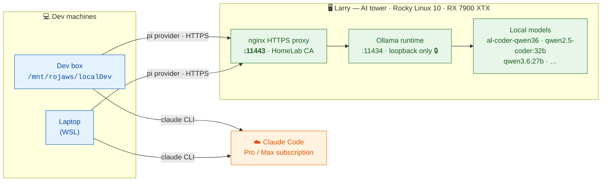
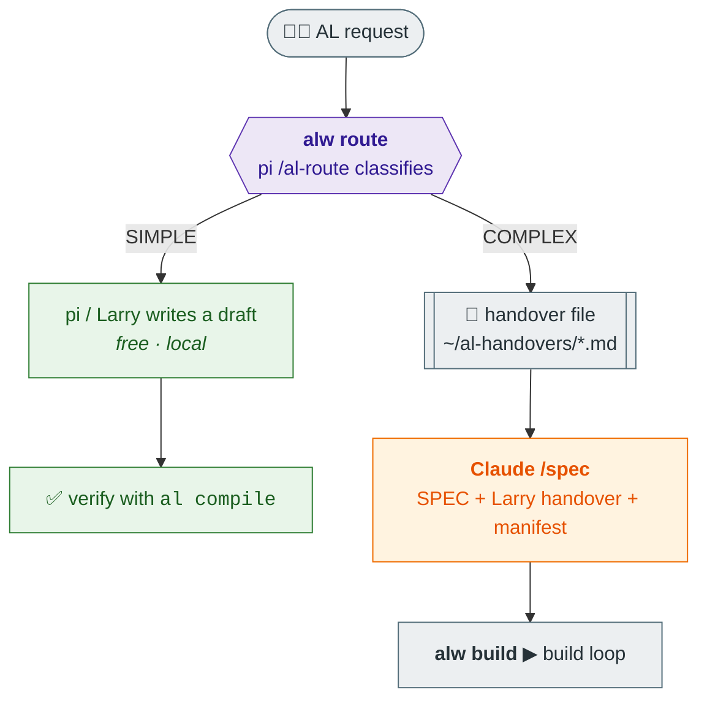
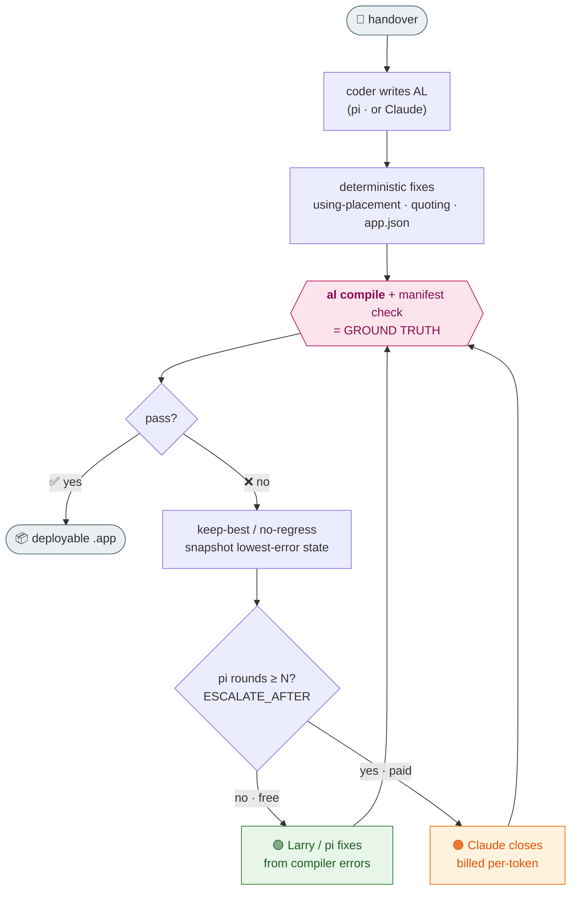
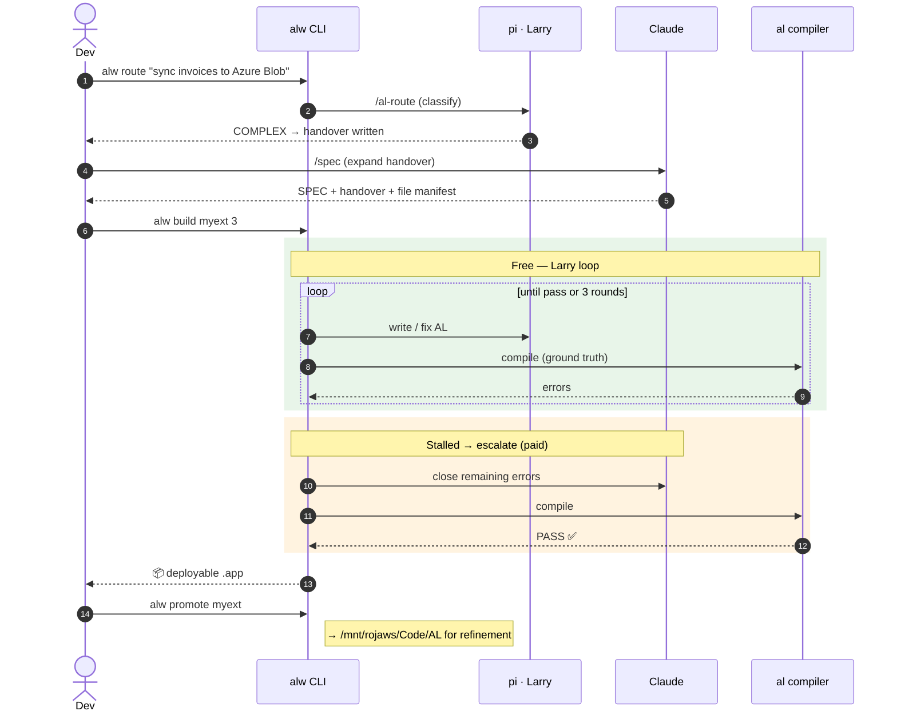
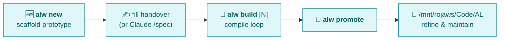
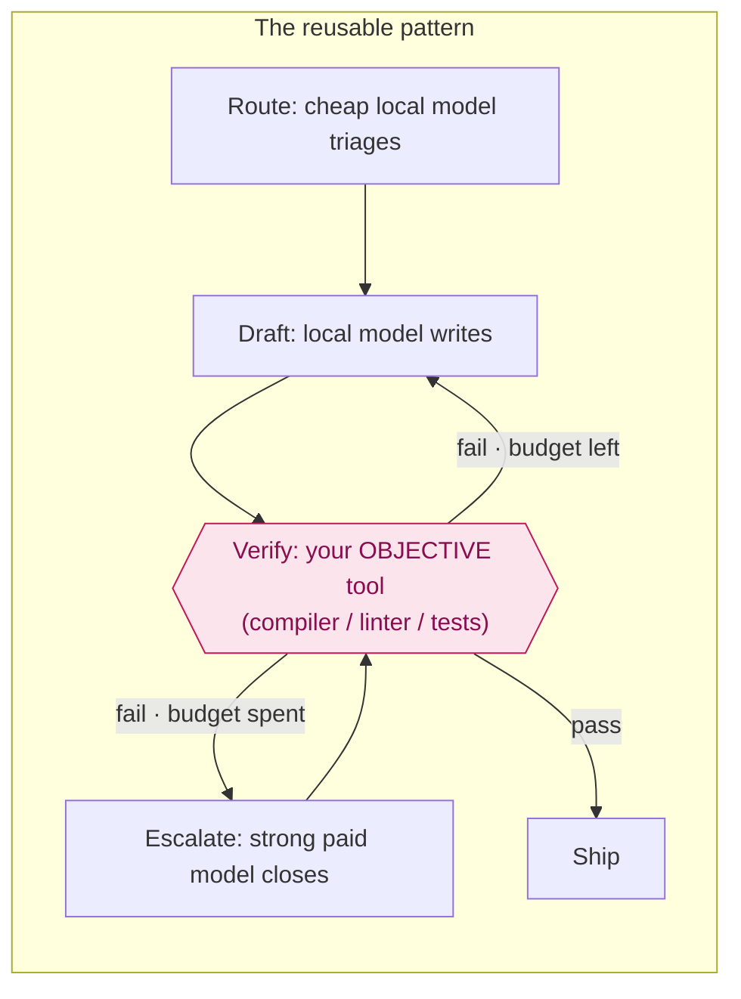

# AL Coding Workflow — Larry, pi & Claude

*How we build Microsoft Dynamics 365 Business Central (AL) extensions with a local
GPU box (Larry), a local agent harness (pi), and Claude — local-first, compiler-verified,
and cost-controlled.*

> **For a colleague coming from Sage/other stacks:** the shape here is language-agnostic.
> Swap "AL compiler" for your build/lint tool and "Larry's models" for any local or
> hosted LLM, and the same pattern (local drafts → objective verifier → escalate to a
> strong model only when stuck) applies. See [Adapting this for Sage](#adapting-this-for-sage).

---

## TL;DR

A cheap local model on **Larry** does the bulk of the typing. The **AL compiler** — not
another LLM — decides whether the code is correct. A build loop feeds compiler errors
back to the model until it passes, and **only if it stalls** does it hand off to **Claude**
(which costs money). One CLI, `alw`, drives the whole thing.

---

## The three players

| Player | What it is | Role | Cost |
|---|---|---|---|
| **Larry** | Rocky Linux 10 tower, Radeon RX 7900 XTX, running **Ollama** | Serves local coding models over the LAN | Free (electricity) |
| **pi** | `pi-coding-agent` — a local CLI agent harness | Runs the tool loop, points at Larry; does triage + first drafts | Free (uses Larry) |
| **Claude** | Claude Code (Pro/Max subscription) | Planning (`/spec`), hard problems, and closing stalled builds | Paid per token when used as coder |

**Golden rule:** Larry/pi handle ~90% (drafts, simple asks, scaffolding). Claude is
reserved for planning and the last stubborn 10%. The **compiler is the referee** — there
is no LLM "reviewer" grading the code.

---

## 1 · Infrastructure & network

**Why the proxy?** Larry's raw Ollama port (`:11434`) is firewalled to loopback. LAN
clients reach it through an **nginx HTTPS proxy on `:11443`**, secured by a private
"HomeLab" CA that each dev machine trusts in its OS store (Node/pi is told to use it via
`NODE_OPTIONS=--use-system-ca`).

---

## 2 · Who does what (routing a request)

- **SIMPLE** (a record loop, JSON parse, one small object) → pi answers on the spot; the
  compiler is the only check needed.
- **COMPLEX** (new extension, multiple objects, HTTP/OAuth, schema changes, API-uncertainty)
  → pi writes an *intent handover*, Claude expands it into a full spec, then the build loop runs.

---

## 3 · The build loop — compiler as ground truth, with cost-safe escalation

`run-build.py` writes the AL, compiles it, and feeds errors back to the coder. It keeps the
**best** (lowest-error) version so a bad edit can't make things worse. Escalation to Claude
is **off by default** and only arms when you pass a round budget.

**Escalation in one line:** `alw build myext` = free forever (Larry only);
`alw build myext 3` = Larry gets 3 fix rounds, then Claude finishes. You never spend Claude
quota by accident.

---

## 4 · End-to-end (a complex extension)

---

## 5 · Prototype lifecycle

New builds live in `…/projects/prototypes/` (with the tooling, out of the polished tree).
Once they compile, `alw promote` moves them to `/mnt/rojaws/Code/AL/` where finished
projects are refined and maintained.

---

## Key design principles

1. **Local-first.** The cheap local model does most of the work; the strong paid model is a
   scalpel, not a default.
2. **The compiler is the referee.** We removed the old "LLM reviewer" — an objective build
   (`al compile` + a file-manifest check) decides correctness. No model grades another model.
3. **Keep-best / no-regress.** Every round is scored; a regression is reverted so the loop
   can only improve.
4. **Cost is always deliberate.** Escalation to Claude is opt-in per build (`ESCALATE_AFTER=N`);
   the default spends nothing.
5. **Local models draft, they don't ship.** Small models happily hallucinate APIs, so their
   output is never trusted until the compiler (or Claude) has validated it.

---

## Tooling glossary

| Tool | What it does |
|---|---|
| **`alw`** | The one CLI: `route` (triage), `new` (scaffold), `build [N]` (compile loop + escalation), `promote` (ship to Code/AL). Named `alw`, not `al`, to avoid clashing with the dotnet AL compiler. |
| **`/al-route`** | A pi prompt-template that classifies an ask SIMPLE vs COMPLEX and either answers or writes a handover. |
| **`run-build.py`** | The build orchestrator `alw build` calls: write → compile → keep-best fix loop → escalation → `.app`. |
| **ALNvim** | Neovim plugin for AL (LSP, DAP, ghost/FIM completions off Larry, and `<leader>aw` → the `alw` menu). |

---

## Adapting this for Sage

The architecture is a **pattern**, not AL-specific:

To port it to Sage development, replace three things:
- **Verifier:** swap `al compile` for the Sage build/lint/test that objectively says pass/fail.
- **Local model:** point the agent at whatever local or hosted model suits Sage code.
- **Handover/spec conventions:** keep a machine-readable file manifest so the loop knows what
  "done" looks like.

Everything else — local-first drafting, compiler-as-referee, keep-best loop, opt-in
escalation — carries over unchanged.

---

*Internal doc. Larry is on the home LAN (`larry.home.arpa`); off-LAN access needs the VPN.*
