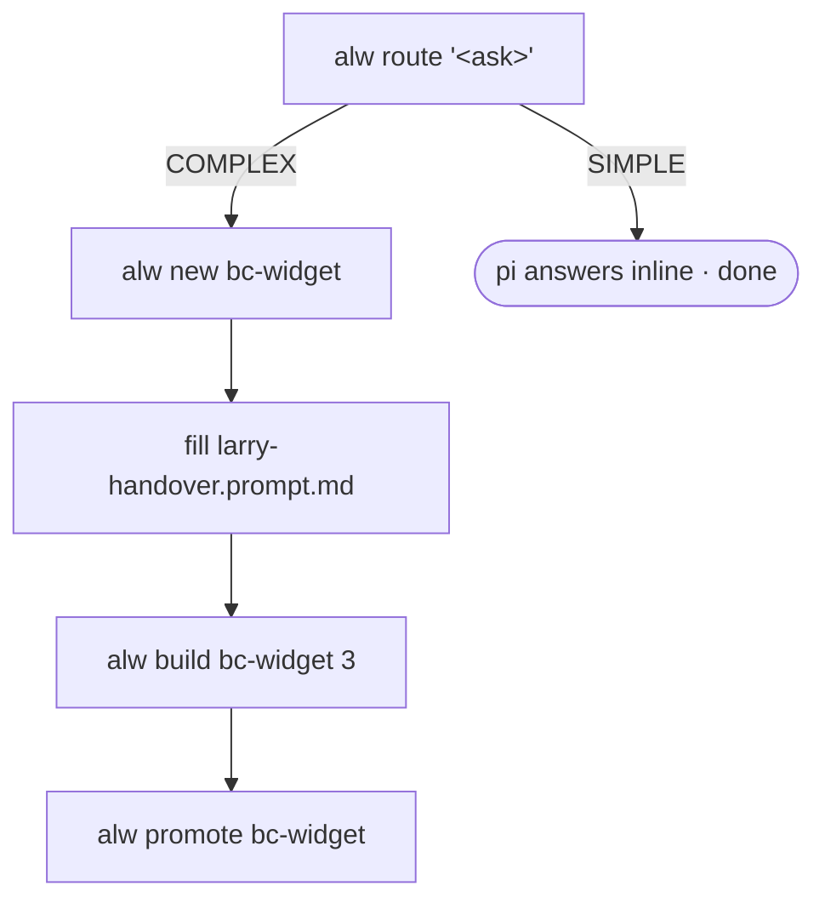

# `alw` — AL Workflow bridge

> One CLI spanning the two AL harnesses — **pi/Larry** (local, free) for triage and first drafts,
> **Claude** for the hard parts — plus the prototype→build→promote lifecycle.

🧭 **The one idea:** *the AL compiler (with cop analyzers) is the referee; pi output is always a
draft until it compiles.*

**Status: 🟢 live.** On PATH via `~/.config/zsh/.zshenv`. Sibling of [`gow`](GOW.md) / [`csw`](CSW.md);
see the shared [Project Lifecycle](PROJECT-LIFECYCLE.md).

| Fact | Value |
|---|---|
| Script | `~/.local/bin/alw` |
| Build loop | `run-build.py` ([RUN-BUILD.md](RUN-BUILD.md)) |
| Model | `ollama/al-coder-qwen36` (AL-tuned) |
| Referee | `al compile` + cop analyzers + manifest |
| Promote target | `/mnt/rojaws/Code/AL` |
| Requires | pi → Larry over HTTPS; `NODE_OPTIONS=--use-system-ca` (script sets it) |

---

# ═══ Commands ═══

```sh
alw route "<ask>"          # triage an AL ask via pi /al-route
alw new <name>             # scaffold a fresh prototype
alw build <name|path> [N]  # run the build pipeline; N = escalate-after rounds
alw promote <name>         # move a built prototype to /mnt/rojaws/Code/AL
alw help
```

### `alw route "<ask>"`
Runs pi's `/al-route` headless (no need to be *inside* pi).
- **SIMPLE** → pi writes the answer inline (well-known AL APIs, correctness rules baked in).
- **COMPLEX** → pi writes a handover to `~/al-handovers/<slug>-handover.md` + a next-steps banner.
  Detected via `VERDICT: COMPLEX` **or** an `al-handovers` mention.

### `alw new <name>`
Scaffolds `…/projects/prototypes/<name>/`:
- `larry-handover.prompt.md` — from `setup/templates/larry-handover.template.md`, `[PROJECT NAME]`→`<name>`
- `cleanup.sh` — **generic**: deletes any `src/` file or `app.json` not in *its own* handover manifest ([SE-2](#sharp-edges))
- `docs/{SPEC,TASKS,AL-PROJECT-STRUCTURE}.md` — placeholders (expand via Claude `/spec`)
- `src/` — empty

### `alw build <name|path> [N]`
Runs `CODER_BACKEND=pi [ESCALATE_AFTER=N] python3 run-build.py --project <resolved>`.
- **Lints the handover first** (`handover_lint.py`) and refuses to build on ERRORs — every defect it
  catches (bad manifest, mangled app.json, missing permission set, undeclared snippet vars, phantom BC
  names) otherwise burns hours as fake model failures ([SE-3](#sharp-edges)). Bypass one run with `LINT=0`.
- Bare name resolves: **prototypes → `projects/` → `/mnt/rojaws/Code/AL/`** (a path is used as-is).
- Omit `N` → **manual**: pi only, never spends Claude. `N` (numeric) → **armed**: pi does N rounds,
  then Claude Code closes (billed per-token).
- **`--review`** → after a clean compile, a coms **validator peer** (a different model) reviews the AL
  for behaviour bugs the compiler can't catch and feeds one Larry fix round; e.g.
  `alw build bc-widget --review`. See [COMS.md](COMS.md).

### `alw promote <name>`
`mv prototypes/<name> → /mnt/rojaws/Code/AL/<name>`. Guards a missing source, refuses to clobber a target.

## Lifecycle


*Figure 1 — SIMPLE asks short-circuit at `route`; COMPLEX flows through the full loop.*

---

# ═══ Reference ═══

## Configuration (env overrides)

| Var | Default | Meaning |
|---|---|---|
| `PI_BIN` | `~/.npm-global/bin/pi` | pi binary |
| `PI_EXT` | `~/.pi/ollama-provider.ts` | pi provider extension |
| `PI_CODER_MODEL` | `ollama/al-coder-qwen36` | pi model (route + build); AL-tuned |
| `RUN_BUILD` | `…/setup/pipeline/run-build.py` | build orchestrator |
| `PROTOTYPES_DIR` | `…/projects/prototypes` | where `new`/`build` look/create |
| `PROJECTS_DIR` | `…/projects` | second resolution root |
| `CODE_AL` | `/mnt/rojaws/Code/AL` | promote target / third resolution root |
| `TEMPLATE` | `setup/templates/larry-handover.template.md` | handover skeleton |
| `HANDOVER_DIR` | `~/al-handovers` | where COMPLEX handovers land |
| `NODE_OPTIONS` | `--use-system-ca` | so Node/pi trust the HomeLab CA (auto-set) |

## Escalation & money

Escalation is a **`run-build.py`** concept, surfaced here as `[N]` — **not** part of `/al-route`.
Off unless you pass `N`, so Claude quota is never spent by accident: `alw build x` = free (Larry only);
`alw build x 3` = free for 3 rounds, then paid.

## Neovim shortcut

`<leader>aw` opens an **AL Workflow** menu (`vim.ui.select`) → Route / New / Build / Promote (route/build
in a terminal split; new/promote as a notify). Lives in the **private** nvim config
(`~/.config/nvim/lua/config/alw.lua`), not the public ALNvim repo, because `alw` embeds Larry/HomeLab paths.

## Sharp edges

- **SE-1 — `alw`, never `al`.** `al` is the dotnet AL compiler (`~/.dotnet/tools/al`); a script named
  `al` would shadow it and break `al compile`. *Avoid:* the tool is `alw`; `run-build.py` calls the
  compiler by absolute path, so it's unaffected either way.
- **SE-2 — `cleanup.sh` deletes by manifest.** It removes any `src/` file or `app.json` **not** in its
  own handover manifest. *Why:* keeps a build honest to the contract. *Avoid:* if you hand-add a file,
  add it to the manifest or the next build deletes it.
- **SE-3 — a bad handover reads as a model failure.** Malformed manifests/app.json used to burn fix
  rounds looking like the model was dumb. *Guard (regression test):* `handover_lint.py` runs first and
  blocks the build on ERRORs; `LINT=0` bypasses for one run.

## Provenance
- **New here:** the `alw` bridge, the prototype→promote flow, the AL-tuned model wiring.
- **Reused:** `run-build.py` orchestrator ([RUN-BUILD.md](RUN-BUILD.md)); pi `/al-route` prompt; the
  coms validator peer ([COMS.md](COMS.md)).
- **Upstream, untouched:** the dotnet `al` CLI (`al compile`, `al launchmcpserver`).
