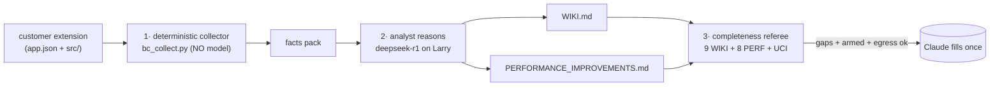

# `bcw` — BC extension analysis workflow

> `bcw` analyses a **customer's** Business Central AL extension and writes two documents into the
> extension folder — `WIKI.md` (technical wiki) and `PERFORMANCE_IMPROVEMENTS.md` (performance +
> UCI licensing-exposure). The analysis sibling of `alw`/`gow`/`csw`: same pi→Claude shape, but
> **no code is written or compiled** — the output is documentation about someone else's source.

🧭 **The one idea:** *customer AL stays on Larry by default. A deterministic collector does the part
local models fail (the tool loop); the model only reasons over a facts pack.*

**Status: 🟢 live, 🟡 depth-limited locally.** The local draft is *complete-but-shallower* than
Claude — escalate for a customer-facing deliverable ([SE-3](#sharp-edges)).

---

# ═══ Why it's built this way ═══

## Core constraint

The analysis is a multi-pass read (glob → grep → read → reason). Local models fail the **agentic tool
loop** — they emit tool calls as code blocks and produce shallow output (memory:
`feedback_larry_local_models_bc_analysis`). And the source is a customer's, so it must not leave the box.
So `bcw` **splits the work**:


*Figure 1 — the collector isolates the exact step local models choke on; the analyst only reasons.*

1. **Deterministic collector** (`pipeline/bc_collect.py`, no model) runs the prompt's fixed greps +
   object inventory + `app.json` parse → a **facts pack**. IDs come from real declarations; UCI red-flags
   are classified live-vs-commented.
2. **Analyst** reasons over the facts pack + curated source (no tools needed — its strength). Two focused
   calls: `WIKI.md`, then `PERFORMANCE_IMPROVEMENTS.md`.
3. **Completeness referee** (not a code-fix loop — there's no code to fix) checks all 9 WIKI sections and
   8 PERF checks + UCI are present, prints a gap report, and — if escalation is armed and egress allows —
   hands the gaps to Claude **once** to complete.

## Egress — customer data stays local by default

The analyst backend is egress-gated by `egress_policy.py`, exactly like the build pipeline. A customer
extension folder resolves to **`local-only`** by default (no `.anon/config.yml`, no `EGRESS_POLICY`), so
the source is analysed **on Larry (deepseek-r1)** and **never sent to Anthropic** — regardless of any
Claude credit balance.

- **Work/customer code** → leave the default. Stays on Larry. `--backend claude` errors; escalation disarms.
- **Your own / non-work extension** → `bcw analyse <folder> --backend claude` (or `EGRESS_POLICY=personal`)
  for best quality.
- **Work code, once enterprise Claude + anon land** → `enterprise-anon` lets Claude complete gaps through the scrub.

---

# ═══ Reference ═══

## Usage

```sh
bcw analyse <folder> [N] [--backend pi|claude]
bcw collect <folder>          # print the deterministic facts pack only (no model) — a sanity check
bcw help
```

- `<folder>` — the customer extension dir (`app.json` + `src/`). The two docs are written **into it**.
- `N` — arm **one** Claude completion pass for any gaps the local draft leaves (egress-gated; billed).
- `--backend pi|claude` — override the analyst (default `pi` = `deepseek-r1:14b` on Larry).

```sh
bcw collect ~/customers/Acme_v1.2.3.4                 # facts pack only, no model
bcw analyse ~/customers/Acme_v1.2.3.4                 # local (deepseek), stays on Larry
bcw analyse ~/customers/Acme_v1.2.3.4 1               # local draft; Claude fills gaps IF egress allowed
bcw analyse ~/my-own-ext --backend claude             # Claude analyst (own code only)
```

## Configuration (env)

| Name | Default | Meaning |
|---|---|---|
| `ANALYST_BACKEND` | `pi` | `pi` (Larry reasoner) or `claude` |
| `ANALYST_MODEL` | `ollama/deepseek-r1:14b` | pi reasoning model (needs `reasoning:true`, [SE-2](#sharp-edges)) |
| `ESCALATE_AFTER` | unset | set (e.g. `1`) to arm the Claude gap-completion pass |
| `EGRESS_POLICY` | `local-only` | Anthropic egress gate; per-folder `.anon/config.yml [policy:]` overrides |
| `ANALYST_SOURCE_CAP` | `90000` | char cap on the source bundle (keeps within the local model's 32k context) |

## Prerequisites

- **Larry** has the reasoner pulled: `ssh larry 'ollama pull deepseek-r1:14b'` (~9 GB).
- **pi** registers it: a `reasoning:true` entry in `~/.pi/ollama-provider.ts` ([SE-2](#sharp-edges)). Do
  this on every machine that runs `bcw` (dev box + WSL).
- The analyst instructions live at `tooling/bc-analysis.prompt.md` (canonical; the flow reads it).

## Sharp edges

- **SE-1 — local models can't run the tool loop; the collector does it for them.** They emit tool calls as
  code blocks and read shallowly. *Avoid:* never hand raw source to the local analyst expecting it to
  glob/grep — `bc_collect.py` (no model) produces the facts pack; the model only reasons.
- **SE-2 — deepseek needs `reasoning:true`.** The plain `mk` helper in `ollama-provider.ts` hardcodes
  `reasoning:false`, wrong for a chain-of-thought model; use the `mkReason` helper. Miss this and output degrades.
- **SE-3 — local depth is bounded.** deepseek-r1:14b is 32k and spends tokens on reasoning; large
  extensions get truncated by `ANALYST_SOURCE_CAP` (codeunit-first). The referee catches *structural* gaps
  (missing sections), not analytical depth. *Avoid:* escalate (Claude, bigger context) or run per-area for
  a customer-facing deliverable.

## Provenance
- **New here:** `bc_collect.py` (deterministic facts pack), the two-call analyst, the completeness referee,
  the UCI live-vs-commented classification.
- **Reused:** `egress_policy.py` gate (shared with the build pipeline); the pi→Claude escalation shape.
- **Reasoner:** deepseek-r1:14b on Larry (upstream model, pulled locally).
