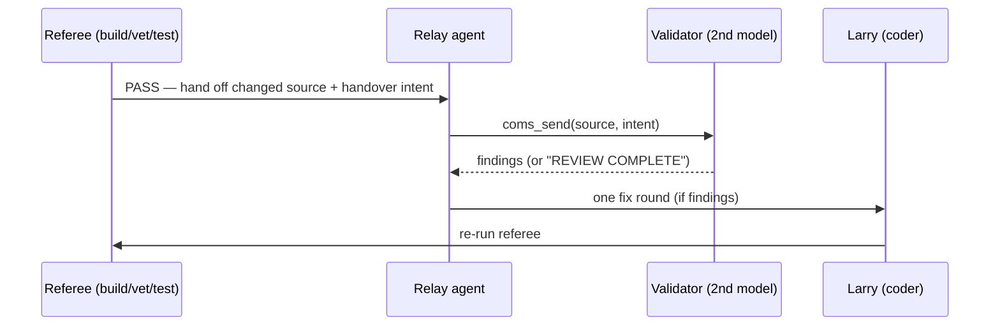

# `coms` — pi peer comms + validator-peer review

> Peer-to-peer communication for the pi coding agent: multiple pi agents join a shared pool as
> **equals** and prompt each other bidirectionally (not orchestrator→worker). We use it to add an
> automated **validator peer** to the gow/csw build loops — the behaviour review the toolchain can't do.

🧭 **The one idea:** *the toolchain referee is necessary but not sufficient; a validator peer on a
**second model** catches the behaviour bugs a green build hides — automatically, no human pass.*

**Status: 🟢 live.** Validator-peer review proven 2026-07-02 (see [Evidence](#evidence)). Single-device
only (unix-socket transport); the network variant is deliberately skipped ([SE-2](#sharp-edges)).

---

# ═══ What & how ═══

## What's installed

- **`~/.pi/coms.ts`** + **`~/.pi/themeMap.ts`** — the extension (vendored copies in `setup/tooling/`).
  Adapted for our pi fork ([SE-1](#sharp-edges)): imports rewritten
  `@mariozechner/pi-coding-agent`→`@earendil-works/pi-coding-agent`, `@mariozechner/pi-tui`→`@earendil-works/pi-tui`,
  `@sinclair/typebox`→`typebox`.
- **`setup/pipeline/coms_review.py`** — the validator-peer review helper used by `run-build-*.py`.

## How coms works

Load per session with `-e ~/.pi/coms.ts` (alongside `-e ~/.pi/ollama-provider.ts`). Launch flags:
`--cname <name>`, `--purpose <text>`, `--project <pool>`, `--color`, `--explicit` (hidden from list).

- **Discovery:** per-project registry files `~/.pi/coms/projects/<project>/agents/<name>.json`; peers
  are pinged (live context %) and dead entries pruned.
- **Tools:** `coms_list` (peers), `coms_send(target, prompt, response_schema?)` → `msg_id`,
  `coms_get(msg_id)` (non-blocking poll), `coms_await(msg_id, timeout_ms?)` (blocking).
- **Safety:** `PI_COMS_MAX_HOPS=5` (loop guard), `PI_COMS_TIMEOUT_MS=1_800_000` (30m).

Two agents in a pool, one `coms_send`→`coms_await`, round-trips a real model reply (verified: coder
sends "ping" → validator replies "Pong!" back through the await).

**Ad-hoc interactive use:** open agents in separate terminals, same `--project`, each with
`-e …ollama-provider.ts -e …coms.ts`, then let them `coms_send`/`coms_await` each other. Use different
`--model`s for an ensemble.

---

# ═══ Validator-peer review ═══

`gow build <proj> --review`  /  `csw build <proj> --review`

*Figure 1 — the peer only runs after the referee is green; a fix round is reverted if it regresses the referee.*

After the referee reaches **PASS**, run-build boots a **validator** pi agent (a *different* model, for
diversity) into a temp coms pool; a headless **relay** agent `coms_send`s the changed source + handover
intent and `coms_await`s findings. Behaviour/spec bugs the compiler can't see feed one **Larry fix round**,
then the referee re-runs. `REVIEW COMPLETE` → the build stands.

- **Off by default** — plain `gow build x` is unchanged.
- **Models:** each runner reviews with **its own coder model** — AL (`run-build.py`) uses `al-coder-qwen36`
  (qwen3-coder is noisy on AL), Go/C# use `qwen3-coder:30b`. Validator + relay share that one model so
  they fit Larry's 24 GB VRAM without swapping. Override via `coms_review.review(..., validator_model=,
  relay_model=)` or `COMS_VALIDATOR_MODEL`/`COMS_RELAY_MODEL`. `PI_COMS_REVIEW_TIMEOUT` (secs, 420).
- **Guardrails:** the review never hard-fails the build (a stalled/empty review is skipped); the fix round
  is reverted if it regresses the referee.

## Evidence

**Proven 2026-07-02:** on a Go program that compiled+vetted clean but returned `"hi"` where the handover
demanded `"hello"`, the validator (`qwen2.5-coder:32b`) flagged it, Larry (`qwen3-coder:30b`) fixed it in
4s, the referee stayed PASS — `go run` then printed `hello world`. This automates the manual "Claude
review" gap that the reqlog TUI conversion surfaced.

## Sharp edges

- **SE-1 — fork import rewrites are mandatory.** Upstream imports `@mariozechner/*`; our pi fork is
  `@earendil-works/*` (+ `@sinclair/typebox`→`typebox`). *Avoid:* re-vendoring upstream verbatim breaks the
  load — apply the rewrites (the vendored copies in `setup/tooling/` already have them).
- **SE-2 — single-device only.** Transport is a unix socket; the network variant (`coms-net.ts` + a bun
  server) is skipped because our agents run locally and bun isn't installed. Don't reach for cross-host coms.
- **SE-3 — a green referee is the trigger, not the verdict.** The peer exists precisely because
  build/vet/test passes while behaviour is wrong. If you skip `--review`, that class ships unguarded.

## Provenance
- **Upstream:** IndyDevDan's MIT `disler/pi-vs-claude-code` (`extensions/coms.ts`).
  <https://github.com/disler/pi-vs-claude-code> · video *"Pi to Pi: Two-Way Agent Orchestration with the Pi Coding Agent"*.
- **New here:** `coms_review.py` (the automated validator-peer wired into `run-build-*.py`), the fork
  import rewrites, the shared-model VRAM fit.
- **Applies to:** the [Larry workflow family](PROJECT-LIFECYCLE.md) loop.
