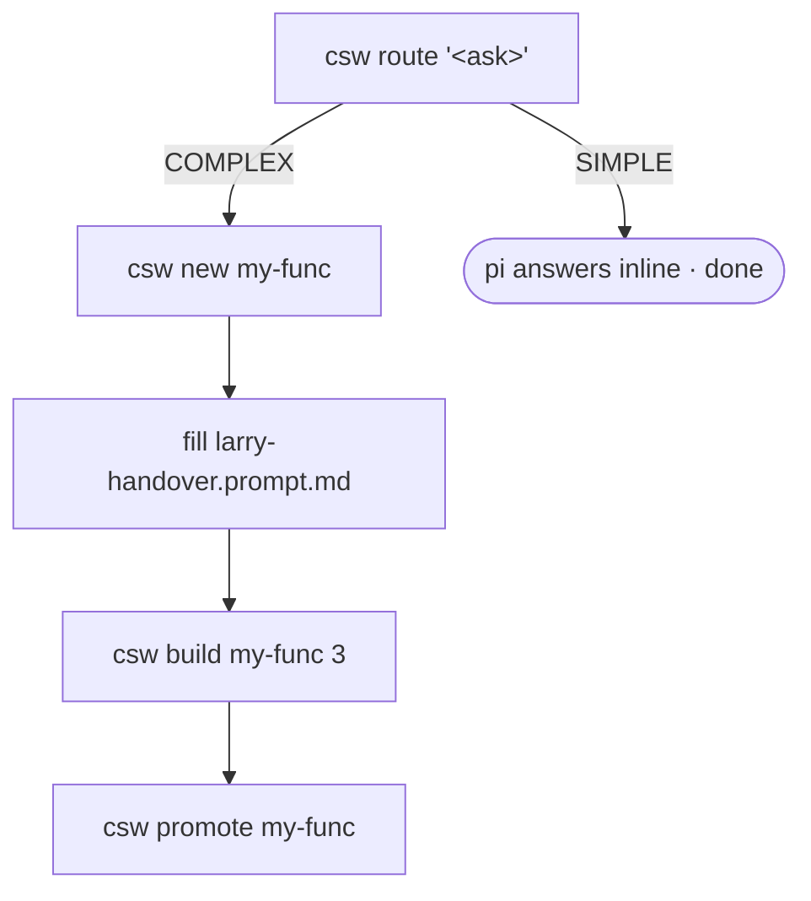

# `csw` — C# Workflow bridge

> The C#/.NET sibling of [`alw`](ALW.md) and [`gow`](GOW.md), tuned for **Azure Functions
> (isolated worker, .NET 10)**. One CLI that drives **Larry** (local `qwen3-coder:30b` over `pi`,
> free) to build C#, with the **.NET toolchain as referee** and **Claude** to close the hard parts.

🧭 **The one idea:** *`dotnet build` + a **format gate** + `dotnet test` is the referee — we never
start the Functions host to judge correctness.*

**Status: 🟢 live.** Sibling of [`alw`](ALW.md)/[`gow`](GOW.md); see the shared
[Project Lifecycle](PROJECT-LIFECYCLE.md).

| Fact | Value |
|---|---|
| Script | `~/.local/bin/csw` |
| Build loop | `setup/pipeline/run-build-cs.py` |
| Route prompt | pi `~/.pi/agent/prompts/cs-route.md` (`/cs-route` inside pi) |
| Handover template | `setup/templates/cs-handover.template.md` |
| Model | `ollama/qwen3-coder:30b` |
| Referee | `dotnet build` + `dotnet format` gate + `dotnet test` |
| Promote target | `~/cs/projects` |
| Requires | pi → Larry; `qwen3-coder:30b` registered; .NET SDK (`dotnet`) on PATH. `func` **not** required ([SE-2](#sharp-edges)) |

---

# ═══ Commands ═══

```sh
csw route "<ask>"          # triage a C#/Functions ask via pi /cs-route
csw new <name>             # scaffold a fresh Azure Functions (isolated) prototype
csw build <name|path> [N]  # run the build/fix loop; N = escalate-after rounds
csw promote <name>         # move a built prototype to ~/cs/projects
csw help
```

### `csw route "<ask>"`
Runs pi's `/cs-route` headless.
- **SIMPLE** → pi writes the C# inline (BCL, single snippet/file), correctness rules baked in.
- **COMPLEX** → pi writes a handover to `~/cs-handovers/<slug>-handover.md` + a next-steps banner.

### `csw new <name>`
Scaffolds `~/cs/projects/prototypes/<name>/` as a **buildable Azure Functions isolated app**:
- `<name>.csproj` — net10.0, `AzureFunctionsVersion v4`, validated package set (Worker 2.0.0 /
  Worker.Sdk 2.0.5 / Extensions.Http.AspNetCore 2.0.2) ([SE-3](#sharp-edges))
- `Program.cs` — `HostBuilder().ConfigureFunctionsWebApplication().Build().Run()`
- `host.json`, `local.settings.json` (git-ignored), `.gitignore` (bin/obj)
- `larry-handover.prompt.md` (from the template), `docs/{SPEC,TASKS}.md`

Override versions/TFM with env (`TFM`, `PKG_WORKER`, `PKG_WORKER_SDK`, `PKG_HTTP`).

### `csw build <name|path> [N]`
Runs `CODER_BACKEND=pi PI_CODER_MODEL=ollama/qwen3-coder:30b [ESCALATE_AFTER=N] python3 run-build-cs.py --project <resolved>`.
- **Lints the handover manifest first** (`handover_lint.py --generic`), refuses to build on ERRORs. Bypass with `LINT=0`.
- Bare name resolves: **prototypes → `~/cs/projects/`** (a path is used as-is).
- **Each round:** `dotnet format` (apply), then **`dotnet build` → `dotnet format --verify-no-changes`
  (format GATE, [SE-1](#sharp-edges)) → `dotnet test`** (test only when a test project exists). Toolchain = ground truth.
- **Keep-best / no-regress:** tracks the lowest-error state, snapshots `.cs`/`.csproj`/`.sln`, reverts a
  regressed round, always fixes from best.
- Omit `N` → pi only, never spends Claude. `N` → pi does N rounds then Claude Code closes (billed).
- **PASS** = build ∧ format-clean ∧ (no tests ∨ tests pass).
- **`--review`** → after PASS, a coms **validator peer** (a different model) reviews for behaviour bugs
  the toolchain can't catch and feeds one Larry fix round; e.g. `csw build my-func --review`. See [COMS.md](COMS.md).

### `csw promote <name>`
`mv prototypes/<name> → ~/cs/projects/<name>`. Guards missing source / existing target.

## Two ways to drive it
- **Terminal:** `csw route|new|build|promote …`.
- **Inside pi:** run `/cs-route <ask>` directly (same classifier). SIMPLE answered in place; COMPLEX
  drops a handover in `~/cs-handovers/`.

## Lifecycle


*Figure 1 — `new` scaffolds a real, already-buildable Functions app before Larry writes a line.*

---

# ═══ Reference ═══

## Configuration (env overrides)

| Var | Default | Meaning |
|---|---|---|
| `PI_CODER_MODEL` | `ollama/qwen3-coder:30b` | C# model on Larry |
| `RUN_BUILD_CS` | `…/setup/pipeline/run-build-cs.py` | build orchestrator |
| `CS_PROTOTYPES` | `~/cs/projects/prototypes` | where `new`/`build` look/create |
| `CS_PROJECTS` | `~/cs/projects` | promote target / second resolution root |
| `TEMPLATE` | `setup/templates/cs-handover.template.md` | handover skeleton |
| `HANDOVER_DIR` | `~/cs-handovers` | where COMPLEX handovers land |
| `TFM` | `net10.0` | target framework for `csw new` |
| `PKG_WORKER` / `PKG_WORKER_SDK` / `PKG_HTTP` | `2.0.0` / `2.0.5` / `2.0.2` | Functions worker package versions |
| `NODE_OPTIONS` | `--use-system-ca` | so Node/pi trust the HomeLab CA (auto-set) |

## Escalation & money

Same as gow: `csw build x` is free (Larry only); `csw build x 3` runs 3 Larry rounds then Claude Code
(`~/.local/bin/claude`, `bypassPermissions`, billed) closes.

## Neovim shortcut

`<leader>cw` opens a **C# Workflow** menu → Route / New / Build / Promote. Lives in
`~/.config/nvim/lua/config/csw.lua` (private; embeds Larry/HomeLab paths).

## Sharp edges

- **SE-1 — format is a hard gate.** A round only passes when `dotnet format --verify-no-changes` is
  clean. *Why:* the loop auto-applies `dotnet format` first (deterministic), so most formatting
  self-heals; anything it can't fix (some analyzer diagnostics) becomes a finding fed back to Larry.
- **SE-2 — no `func` needed.** We never start the Functions host; the referee is compile + format + test.
  `func start`/deploy is a separate manual step. Keeps the build fast and headless.
- **SE-3 — the package set is pinned + validated.** Worker 2.0.0 / Worker.Sdk 2.0.5 / Http.AspNetCore
  2.0.2 on net10. *Avoid:* let the model invent versions and the restore breaks; override deliberately
  via `PKG_*`/`TFM` env only.
- **SE-4 — tests need a real test project.** `dotnet test` runs only when a `*.csproj` named `*Test(s)*`
  or referencing `Microsoft.NET.Test.Sdk` is detected; multi-project solutions build cleanest with a
  `.sln` at the root.

## Provenance
- **New here:** the `csw` bridge + C# build loop (`run-build-cs.py`) with the format gate; the scaffolded
  isolated-Functions app.
- **Reused:** keep-best/no-regress + escalation from `run-build.py`; the coms validator peer
  ([COMS.md](COMS.md)); pi `/cs-route`. `go build`/`gow` and `dotnet`/`csw` are fully independent —
  different models, dirs, referees.
- **Upstream, untouched:** the .NET SDK toolchain (`dotnet build`/`format`/`test`).
