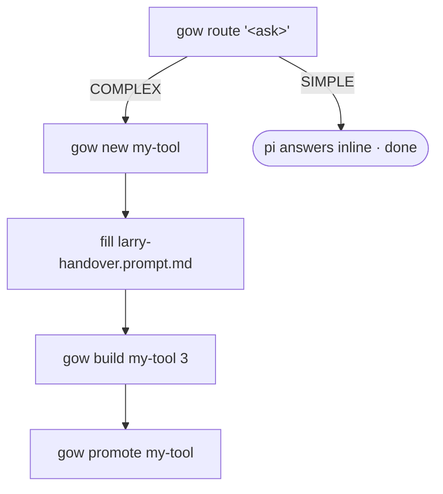

# `gow` — Go Workflow bridge

> The Go sibling of [`alw`](ALW.md). One CLI that drives **Larry** (local `qwen3-coder:30b` over
> `pi`, free) to build Go programs, with the **Go toolchain as referee** and **Claude** to close the
> hard parts. Same prototype → build → promote lifecycle.

🧭 **The one idea:** *`go build`/`vet`/`test` is the referee — but it's necessary, not sufficient;
the closing move for behaviour bugs is a second-model review ([SE-1](#sharp-edges)).*

**Status: 🟢 live.** Proven 2026-07-02 converting `reqlog_gui` from an htmx web GUI to a Bubble Tea
TUI end-to-end (see [Worked example](#worked-example)).

| Fact | Value |
|---|---|
| Script | `~/.local/bin/gow` |
| Build loop | `setup/pipeline/run-build-go.py` |
| Route prompt | pi `~/.pi/agent/prompts/go-route.md` (`/go-route` inside pi) |
| Handover template | `setup/templates/go-handover.template.md` |
| Model | `ollama/qwen3-coder:30b` |
| Referee | `go build ./...` + `go vet ./...` + `go test ./...` |
| Promote target | `~/go/projects` |
| Requires | pi → Larry; `qwen3-coder:30b` registered; `go`/`gofmt` on PATH; `NODE_OPTIONS=--use-system-ca` (auto) |

---

# ═══ Commands ═══

```sh
gow route "<ask>"          # triage a Go ask via pi /go-route
gow new <name>             # scaffold a fresh Go prototype (module + handover + docs)
gow build <name|path> [N]  # run the build/fix loop; N = escalate-after rounds
gow promote <name>         # move a built prototype to ~/go/projects
gow help
```

### `gow route "<ask>"`
Runs pi's `/go-route` headless.
- **SIMPLE** → pi writes the Go inline (stdlib, single snippet/file), correctness rules baked in.
- **COMPLEX** → pi writes a handover to `~/go-handovers/<slug>-handover.md` + a next-steps banner.
  Detected via `VERDICT: COMPLEX` or a `go-handovers` mention.

### `gow new <name>`
Scaffolds `~/go/projects/prototypes/<name>/`:
- `go.mod` — `module <name>` / `go 1.24`
- `main.go` — `package main` + empty `main()` stub (so `go build` works before Larry writes)
- `larry-handover.prompt.md` — from `setup/templates/go-handover.template.md`, `[PROJECT NAME]`→`<name>`
- `docs/{SPEC,TASKS}.md` — placeholders (expand via Claude `/spec`)

### `gow build <name|path> [N]`
Runs `CODER_BACKEND=pi PI_CODER_MODEL=ollama/qwen3-coder:30b [ESCALATE_AFTER=N] python3 run-build-go.py --project <resolved>`.
- **Lints the handover manifest first** (`handover_lint.py --generic`) and refuses to build on ERRORs —
  a malformed manifest silently degrades the write gate. Bypass with `LINT=0`.
- Bare name resolves: **prototypes → `~/go/projects/`** (a path is used as-is).
- **Each round:** `gofmt -w .` + `go mod tidy`, then **`go build ./...` → `go vet ./...` →
  `go test ./...`** (test only when the project has `*_test.go`). The toolchain is ground truth.
- **Keep-best / no-regress:** tracks the lowest-error state, snapshots the `.go` files + `go.mod`/`go.sum`,
  always fixes from the best base (reverts a round that made it worse).
- Omit `N` → **pi only**, never spends Claude. `N` → pi does N rounds, then Claude Code closes (billed).
- **PASS** = build compiles ∧ vet clean ∧ (no tests ∨ tests pass).
- **`--review`** → after PASS, a coms **validator peer** (a different model) reviews for behaviour bugs
  the toolchain can't catch and feeds one Larry fix round; e.g. `gow build my-tool --review` or
  `gow build my-tool 3 --review`. See [COMS.md](COMS.md).

### `gow promote <name>`
`mv prototypes/<name> → ~/go/projects/<name>`. Guards a missing source, refuses to clobber.

## Two ways to drive it
- **Terminal:** `gow route|new|build|promote …` (this doc).
- **Inside pi:** run `/go-route <ask>` directly (same classifier `gow route` calls). SIMPLE gets
  answered in place; COMPLEX drops a handover in `~/go-handovers/` for `gow new` + `/spec`.

## Lifecycle


*Figure 1 — the Go path mirrors `alw`; only the tool, model, and referee differ.*

---

# ═══ Reference ═══

## Configuration (env overrides)

| Var | Default | Meaning |
|---|---|---|
| `PI_BIN` | `~/.npm-global/bin/pi` | pi binary |
| `PI_EXT` | `~/.pi/ollama-provider.ts` | pi provider extension |
| `PI_CODER_MODEL` | `ollama/qwen3-coder:30b` | Go model on Larry |
| `RUN_BUILD_GO` | `…/setup/pipeline/run-build-go.py` | build orchestrator |
| `GO_PROTOTYPES` | `~/go/projects/prototypes` | where `new`/`build` look/create |
| `GO_PROJECTS` | `~/go/projects` | promote target / second resolution root |
| `TEMPLATE` | `setup/templates/go-handover.template.md` | handover skeleton |
| `HANDOVER_DIR` | `~/go-handovers` | where COMPLEX handovers land |
| `GO_VERSION` | `1.24` | go.mod version for `gow new` |
| `NODE_OPTIONS` | `--use-system-ca` | so Node/pi trust the HomeLab CA (auto-set) |

## Escalation & money

Escalation is a **`run-build-go.py`** concept, surfaced as `[N]`. Off unless you pass `N`:
`gow build x` = free (Larry only); `gow build x 3` = free for 3 rounds, then Claude Code
(`~/.local/bin/claude`, `--permission-mode bypassPermissions`) closes.

## Neovim shortcut

`<leader>gw` opens a **Go Workflow** menu → Route / New / Build / Promote. Lives in the private nvim
config (`~/.config/nvim/lua/config/glw.lua`), beside the `alw` menu — kept out of any public repo
because it embeds Larry/HomeLab paths.

## Sharp edges

- **SE-1 — a green build can still be wrong.** `go build`/`vet`/`test` passed on the reqlog TUI while it
  had dead form entry, a delete-confirm with no `y/n` handler, overridden keybindings, and a `Sprintf`
  arg mismatch. *Avoid:* use `--review` (or a Claude review) — a second model reading the code is what
  catches the behaviour class; the toolchain never will.
- **SE-2 — pi must run `--mode json`.** Default text-mode piped to a non-tty produced **empty output and
  no file writes** in testing. *Why:* json writes reliably; the loop trusts `go build`, not pi's stdout,
  so the stream is discarded anyway. The runner sets `--mode json`.
- **SE-3 — use `qwen3-coder:30b`, not the AL-tuned smalls.** `al-coder-north-mini`/`al-coder-qwen36`
  pull deps then bail and can't write a large file. `mk()` in `ollama-provider.ts` sets
  `maxTokens: 16384` so a big single file fits.
- **SE-4 — no `goimports`.** The deterministic step is `gofmt` + `go mod tidy` only; missing-import
  fixes are left to the toolchain-error → model loop.

## Provenance
- **New here:** the `gow` bridge + Go build loop (`run-build-go.py`), a sibling of the AL pipeline.
- **Reused:** the keep-best/no-regress + escalation pattern from `run-build.py`; the coms validator
  peer ([COMS.md](COMS.md)); pi `/go-route`.
- **Upstream, untouched:** the Go toolchain (`go`, `gofmt`, `go vet`, `go test`).

## Worked example

`reqlog_gui` (a mock HTTP server for testing BC API requests) was converted from an htmx web GUI to a
Bubble Tea TUI:

1. Claude wrote `handover-tui.md` (spec) in the project.
2. `qwen3-coder:30b` via pi wrote `main.go` + `tui.go`, reaching a clean `go build` after self-fixing 2 compile errors.
3. `go vet` + a Claude review found 4 behaviour bugs the compiler missed ([SE-1](#sharp-edges)).
4. The bug list went back to `qwen3-coder:30b`, which fixed all 4 to `go build` + `go vet` clean.

That handover → Larry build → referee + review → Larry fix loop is what `gow` packages.
