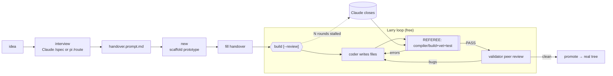

# Project Lifecycle — from interview to shipped, per language

> Take a project from an idea in your head to compiled, reviewed code — driven from the
> **terminal**, with **pi** as the cockpit, **Larry** doing the typing, **Claude** for the
> interview/planning and the stubborn last 10%. Covers **AL** (Business Central), **Go**,
> and **C# / Azure Functions**.
>
> *One shape, three languages:* **interview → handover → `new` → fill → `build [--review]` → `promote`.*

🧭 **The one idea:** *Larry drafts ~90%; the **build tool is the referee**, not another LLM;
Claude is reserved for the interview, planning, and stalls.* Everything below falls out of that.

## Document map

| You want to… | Read |
|---|---|
| Know if this works & what it costs | [Status](#-overview-) · [The cockpit](#the-cockpit) |
| Run a project end to end | [Quick start](#quick-start) · [The five steps](#-the-five-steps-) |
| Understand *why* it's shaped this way | [Design principles](#design-principles) · [Engineering notes](#lessons-learned--engineering-notes) |
| Per-language CLI detail | [ALW](ALW.md) · [GOW](GOW.md) · [CSW](CSW.md) |
| The review pass / build internals | [COMS](COMS.md) · [RUN-BUILD](RUN-BUILD.md) |
| Set up the Claude CLI | [Runbook: Claude CLI](#runbook--the-claude-cli) |

**Status: 🟢 live.** Proven end-to-end in all three languages (AL map factbox, Go reqlog TUI,
C# Azure Function). Runs today on this box.

---

# ═══ Overview ═══

## What this achieves

- ✅ One identical workflow across AL, Go, and C# — learn it once.
- ✅ ~90% of the code written **free** on a local GPU (Larry), not billed to Claude.
- ✅ Correctness enforced by a **real toolchain** (compiler/`go build`/`dotnet build`), not an LLM's opinion.
- ✅ Customer/work code is **egress-gated** — nothing reaches Anthropic unless explicitly allowed.
- ✅ Claude spend is **opt-in per build** (`build <name> N`) — never accidental.

## The cockpit

| Player | Command | Role | Cost |
|---|---|---|---|
| **pi** | `pi` | Local agent harness — home base. Triage (`/*-route`), runs the build CLIs, talks to Larry. | Free (uses Larry) |
| **Larry** | (remote) | GPU box serving the coder models over the LAN. Writes + fixes the code. | Free |
| **Claude** | `claude` | Interviews you, plans (`/spec`), writes the handover, closes stalled builds. | Paid (subscription) |
| **alw / gow / csw** | those | One CLI per language: `route` / `new` / `build` / `promote`. | Free (drives Larry) |
| **bcw** | `bcw analyse` | Analyse a customer BC/AL extension → WIKI + performance/UCI docs ([BCW.md](BCW.md)). | Free local; Claude opt-in |
| **probe** | `probe <dir>` | Read-only local investigation of any repo (pi + Larry, no egress). | Free |
| **egress gate** | (automatic) | Deny-by-default: nothing reaches Anthropic from a work/customer repo unless allowed (`anon`). | — |

**Planning tiers** (pi prompts, symlinked from `tooling/`): `/handover` (light interview → handover) ·
`/spec` (deep: SPEC + TASKS + handover) · `/warplan` (hard projects: failure-mapped moves, forks,
abort conditions — Claude plans, Larry executes) · `/al` (BC/AL expert Q&A over the cwd repo,
knowledge-grounded, read-only).

## Quick start

```sh
claude                                  # describe the idea; /spec writes the handover
alw new tsg-map                         # scaffold prototype (or gow new / csw new)
$EDITOR .../tsg-map/larry-handover.prompt.md   # fill it (or point /spec at the scaffold)
alw build tsg-map --review              # Larry builds; referee loops to clean; peer reviews
alw promote tsg-map                     # → the real source tree
```

## Design principles

1. **The compiler is the referee.** Ground truth is the toolchain (AL compiler + cop analyzers /
   `go build`+`vet`+`test` / `dotnet build`+format+test), never a second LLM's judgement — see [EN-1](#lessons-learned--engineering-notes).
2. **Local drafts, expensive intelligence closes.** Larry writes ~90% for free; Claude is spent
   only on the interview, planning, and the stalled last rounds.
3. **The handover is the whole game.** A single machine-readable doc is the contract Larry builds
   from; its manifest defines exactly what must exist ([EN-2](#lessons-learned--engineering-notes)).
4. **One shape, three languages.** `route → new → fill → build → promote` is identical; only the
   tool, model, and referee differ. Learn one, get three.
5. **Deny-by-default egress.** Work/customer code stays on Larry unless a repo explicitly opts in;
   Claude spend is armed per-build, never on by default ([EN-3](#lessons-learned--engineering-notes)).
6. **Prototype, then promote.** Builds happen in a throwaway `prototypes/` dir; only a passing
   build graduates into the real tree.

## Lessons learned — engineering notes

- **EN-1 — an LLM reviewer was tried and removed.** The pipeline once ran a second "reviewer" LLM
  that emitted severity-tagged findings; it was slow, non-deterministic, and hallucinated. Replaced
  by compiler + manifest ground truth (RUN-BUILD [§11](RUN-BUILD.md)). The *behaviour* review a
  compiler can't do returned later as an opt-in **peer** on a different model (`--review`, [COMS](COMS.md)).
- **EN-2 — a good handover beats a clever model.** Most "model failures" were bad handovers
  (mangled manifest/app.json, phantom BC names). Every build now **lints the handover first** and
  refuses to start on errors — cheaper than burning fix rounds on a fixable spec.
- **EN-3 — escalation is a latch, not a default.** `build <name> N` lets Larry try N rounds, then
  hands off to Claude *once* (one-way). Omit `N` and Claude is never touched. The egress policy can
  disarm escalation entirely for a work repo.
- **EN-4 — the referee is necessary but not sufficient.** A build can pass while the program still
  misbehaves (dead keybindings, `"hi"` where the spec said `"hello"`). That gap is what `--review`
  closes with a second-model peer ([COMS](COMS.md)).

---

# ═══ Architecture ═══

## Core constraint

A single GPU box (Larry, 24 GB VRAM) and a metered Claude subscription. The design question is
**where each token is spent**: local models are free but weaker and easily fooled into "passing";
Claude is strong but billed. The answer is a division of labour — cheap drafting, objective
refereeing, expensive closing — with a hard gate keeping customer code off the paid path.

## What this is *not*

- Not a CI system — it builds one prototype interactively, it doesn't watch a repo.
- Not an autonomous agent — Claude spend and egress are always opt-in.
- Not a deploy tool — `promote` moves source; publishing/deploy is a separate manual step.

## The lifecycle


*Figure 1 — one flow, every language. The dotted path (Claude) only fires if you passed `N` and egress allows.*

## Pick your language

| Language | Tool | Model | Referee | Project home |
|---|---|---|---|---|
| **AL** (Business Central) | `alw` | `al-coder-qwen36` (AL-tuned) | `al compile` + manifest | `~/…/projects` → `/mnt/rojaws/Code/AL` |
| **Go** | `gow` | `qwen3-coder:30b` | `go build` + `vet` + `test` | `~/go/projects/prototypes` → `~/go/projects` |
| **C# / Azure Functions** | `csw` | `qwen3-coder:30b` | `dotnet build` + format gate + `test` | `~/cs/projects/prototypes` → `~/cs/projects` |

Per-tool detail: [ALW.md](ALW.md) · [GOW.md](GOW.md) · [CSW.md](CSW.md) · review: [COMS.md](COMS.md)

---

# ═══ The five steps ═══

### Step 1 — Interview → handover

The **handover** (`larry-handover.prompt.md`) is the single source of truth Larry builds from.
Three ways to produce it:

- **A. Claude interview** *(recommended for anything non-trivial).* Run `claude`, describe the idea
  in plain English. Claude asks the unknowns (objects/endpoints, triggers, data, external services,
  edge cases), then `/spec` writes `docs/SPEC.md` + a complete handover with the language's ✓/✗
  correctness rules baked in.
- **B. pi `/spec` or `/handover`** *(free + offline — Larry only).* From an interactive `pi` session:
  `/spec "<idea>"` → SPEC + TASKS + handover, scaffolds the project, prints the build command
  (only fetching build deps needs internet); `/handover "<idea>"` → the handover alone.
- **C. pi route** *(lightweight triage, inside pi):* `/al-route` · `/go-route` · `/cs-route`.
  **SIMPLE** → pi writes the snippet inline. **COMPLEX** → pi drops a handover *intent* in
  `~/{al,go,cs}-handovers/` to expand with Claude `/spec`.

> Strategy A (verbatim file checklist) suits a small, known file set; describe behaviour + ✓/✗ rules
> and let Larry reason when you want it to. Every handover ends with a machine-readable manifest and a `## STOP`.

### Step 2 — Scaffold

```sh
alw new <name>      # AL prototype: handover skeleton + docs, cleanup.sh
gow new <name>      # Go module: go.mod + main.go stub + handover + docs
csw new <name>      # Azure Functions (isolated, .NET 10): csproj + Program.cs + host.json + handover
```

### Step 3 — Fill the handover

Paste/refine what the interview produced into `<prototype>/larry-handover.prompt.md` (or point
Claude `/spec` at the scaffold to write it in place). **Confirm the manifest lists every expected file.**

### Step 4 — Build (Larry does the work)

```sh
alw build <name> [N] [--review]
gow build <name> [N] [--review]
csw build <name> [N] [--review]
```

- Larry writes from the handover → the **referee** runs → errors feed back in a keep-best/no-regress
  fix loop until it passes.
- **`N`** = escalate to Claude after N stalled rounds (billed). Omit = Larry-only, free.
- **`--review`** = after PASS, a **validator peer** (same-language, different model, over pi `coms`)
  reviews for behaviour/spec bugs the referee can't see and feeds one fix round ([COMS.md](COMS.md)).
- Ends `RESULT: PASS` (or FAIL with the best state kept on disk).

### Step 5 — Promote

```sh
alw promote <name>   # → /mnt/rojaws/Code/AL/<name>
gow promote <name>   # → ~/go/projects/<name>
csw promote <name>   # → ~/cs/projects/<name>
```

Moves the passing prototype into the real tree for refinement.

## A typical session (driven entirely from pi)

pi is the cockpit — you never have to leave it. It has a bash tool, so ask it to run the CLIs, or
type them in a pi shell; kick off a Claude interview with `claude` when you want the deep `/spec`;
watch the model with `ssh larry 'ollama ps'`.

```
/cs-route "http function that base64s the body and forwards it"   → writes a handover intent
claude  →  /spec                                                   → expands SPEC + handover
csw new B64Forward  →  fill  →  csw build B64Forward --review  →  csw promote B64Forward
```

**Worked examples, one per language:**
- **AL** — `/spec` writes the handover → `alw new tsg-map` → `alw build tsg-map --review`. Larry writes
  8 files, the compiler loops to clean, the `al-coder-qwen36` validator catches a field read from the
  wrong column → PASS → promote.
- **Go** — `/go-route "http service that base64s the body and forwards it"` → COMPLEX →
  `gow build b64forward --review`. `go build`+`vet`+`test` referee; qwen3-coder writes + fixes → PASS.
- **C#** — `/cs-route "…"` → `csw new B64Forward` (real isolated Functions app on net10) →
  `csw build B64Forward --review`. `dotnet build` + format gate → PASS.

---

# ═══ Maintenance ═══

**One-time setup**

1. **Claude CLI** — see the [runbook](#runbook--the-claude-cli) (already done on this box).
2. **pi + Larry** — the pi provider (`~/.pi/ollama-provider.ts`) points at Larry over the HTTPS proxy;
   `NODE_OPTIONS=--use-system-ca` is set by the CLIs. Models registered: qwen3-coder:30b,
   al-coder-qwen36, the two north-minis. 32K context.
3. **The CLIs** — `alw`, `gow`, `csw` on `PATH` (`~/.local/bin`); run `alw help` etc. to confirm.

**Drift triggers — check when these change**

| Change | Recheck |
|---|---|
| New coder model on Larry | per-tool `PI_CODER_MODEL` default; re-run a known build to confirm quality |
| pi/provider upgrade | provider extension + `--mode json` behaviour ([GOW](GOW.md) model notes) |
| BC platform bump | AL handover `## app.json` `application` version (symbol download depends on it, [RUN-BUILD §12](RUN-BUILD.md)) |
| Enterprise Claude + anon land | flip work repos to `enterprise-anon` so escalation can fire through the scrub |

## Runbook — the Claude CLI

`claude` handles the interview, `/spec`, and general chats. On this box it's already installed and
logged in. To (re)configure or set up elsewhere:

1. **Install** (native — no npm needed): `curl -fsSL https://claude.ai/install.sh | bash`
   (installs `claude` to `~/.local/bin`; auto-updates. npm alternative: `npm install -g @anthropic-ai/claude-code`).
2. **Log in:** `claude` → first start opens a browser; sign in and approve. Requires **Claude Pro or
   Max** (the free Claude.ai plan does *not* include Claude Code). Token lands in
   `~/.claude/.credentials.json`. In the TUI: `/login` switches accounts, `/status` shows plan + model.
   (An `ANTHROPIC_API_KEY` env var instead bills pay-as-you-go — prefer the subscription login.)
3. **Use it:** `claude` (interactive), `claude -p "…"` (one-shot headless — what `build <name> N`
   escalation calls), `/spec` (expand an idea into SPEC + handover), `/config`, `/status`.
4. **Health:** `claude --version`, then `claude doctor`.

---

## See also
- [ALW.md](ALW.md) / [GOW.md](GOW.md) / [CSW.md](CSW.md) — per-language CLI reference
- [COMS.md](COMS.md) — the validator-peer review (`--review`) + pi peer-comms
- [RUN-BUILD.md](RUN-BUILD.md) — the AL build orchestrator internals
- [AL-CODING-WORKFLOW.md](AL-CODING-WORKFLOW.md) — the original AL deep-dive (diagrams, Sage adaptation)
