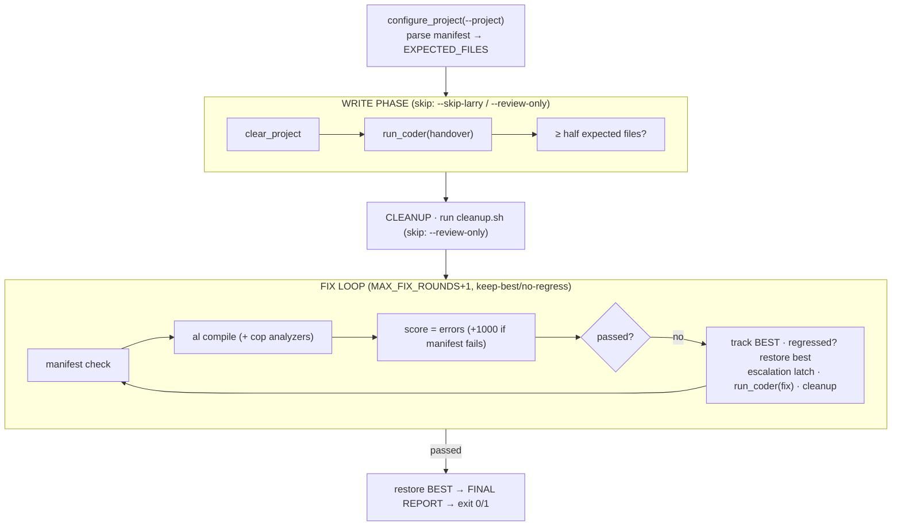

# `run-build.py` — the AL build orchestrator

> Larry's AL build orchestrator. Takes a **handover** doc, has a coder (pi/Larry or Claude Code) write
> the AL, then drives a compile→fix loop with the **compiler as ground truth** until it produces a clean,
> deployable extension — or exhausts its rounds. No LibreChat, no auth/JWT/2FA layer.

🧭 **The one idea:** *the compiler + the manifest are the only judges. The model writes; deterministic
normalizers fix mechanical noise; a keep-best guard stops regressions — so every model round is spent on
real semantic errors.*

## Document map

| You want… | Section |
|---|---|
| The shape in one picture | [Pipeline at a glance](#pipeline-at-a-glance) |
| Where each knob lives | [Configuration](#configuration) |
| How money/egress is gated | [Escalation](#escalation-automanual-money-safe) |
| Whether to arm escalation at all | [Evidence index](../reference/bench-results/README.md) |
| Why the loop can't regress | [Keep-best guard](#keep-best--no-regress-guard) |
| What bites in practice | [Sharp edges](#sharp-edges) |

**Status: 🟢 live.** stdlib-only Python 3. Companion memory: `project-pi-harness-plan`,
`project-al-route`, `project-tsg-map-integration`.

---

# ═══ Overview ═══

## Design principles

1. **Compiler + manifest = ground truth.** An LLM never judges correctness here — it was tried and
   removed ([EN-1](#lessons-learned--engineering-notes)).
2. **The handover owns the contract.** The manifest defines what must exist; `app.json` is written
   deterministically from the handover, not the model ([SE-2](#sharp-edges)).
3. **Deterministic before semantic.** Mechanical mistakes every local model makes are fixed by normalizers
   *before* compile, so model rounds chase real errors, not noise ([§ normalizers](#deterministic-normalizers-safety-nets)).
4. **Never regress.** The loop keeps the lowest-error snapshot and always fixes *from* the best state.
5. **Money is opt-in, egress is deny-by-default.** No Claude spend unless `ESCALATE_AFTER` is set *and* the
   egress policy allows it.

## Pipeline at a glance


*Figure 1 — write once, then loop compile→fix from the best-ever state until PASS or rounds exhausted.*

## Lessons learned — engineering notes

- **EN-1 — the LLM reviewer was deleted.** The pipeline once ran a second "AL Reviewer" LLM emitting
  `HIGH`/`MEDIUM`/`LOW` findings; the loop continued while HIGH findings existed. It was slow,
  non-deterministic, and hallucinated findings → replaced by compiler + manifest ground truth. Its dead
  helpers (`build_reviewer_msg`, `extract_high_findings`, `has_high_findings`) were removed 2026-07-01. The
  live fix path is `build_fix_msg()` fed by compiler + manifest findings. (The behaviour review returned as
  an *opt-in peer on a second model* — [COMS.md](COMS.md).)
- **EN-2 — the write bar is deliberately lenient.** The write phase only needs ≥ half the expected files;
  the fix loop fills the rest via MISSING findings. Chasing a perfect first write wastes rounds.
- **EN-3 — a semicolon auto-inserter was tried and reverted.** Blind AL0111 insertion produced garbage
  because the error is usually a symptom of a malformed construct. Only *truly* mechanical issues are fixed
  deterministically ([§ normalizers](#deterministic-normalizers-safety-nets)).

---

# ═══ Architecture ═══

## Core constraint

A local model is cheap but makes two predictable classes of mistake: **mechanical** (misplaced `using`,
unquoted caption prose, a mangled `app.json`) and **semantic** (wrong logic). If the model burns rounds on
the mechanical class, it never reaches the semantic one within the round budget. So the orchestrator strips
the mechanical class deterministically and reserves model rounds — and, only if armed, Claude — for the rest.

## Coder backends

- **`run_pi(prompt, …)`** — thin delegate to **`coder.run_pi`** (`pipeline/coder.py`), the single
  pi spawn shared by the AL, Go and C# pipelines. One-shot
  `pi -e <ext> --model <m> -p --no-session <prompt>` in `PROJECT_ROOT`; pi runs its own tool loop
  (read/bash/edit/write) and auto-loads `AGENTS.md`. Returns final text; empty string on timeout —
  check `coder.LAST["timed_out"]` to tell a timeout from a genuinely empty reply.

  `allow_write=False` passes `--tools read,grep,find,ls`, an **allow-list**. It is not `-xt
  write,edit`: a deny-list left Bash enabled, so "read-only run that emits patch text" was not a
  guaranteed property — a model with shell access can mutate the worktree outside the
  deterministic SEARCH/REPLACE applier, which is the mechanism the whole edit protocol depends on.

  stdin is pinned to `/dev/null`. pi registers fd 0 in its event loop, so an inherited descriptor
  left open with no data and no EOF (a socket or pipe — what a background job hands down) parks it
  in `epoll_wait` before it opens a connection. Three copies of this function used to exist and
  drifted; that is why there is now one.
- **`run_claude_code(prompt, …)`** — `claude -p <prompt> --permission-mode bypassPermissions`, same
  contract; auto-loads `CLAUDE.md` (which imports `AGENTS.md`). Uses Pro/Max quota.
- **`run_coder(prompt, label)`** — dispatches on `_coder_state["backend"]`. The single choke point
  escalation flips.

---

# ═══ Implementation reference ═══

## Configuration

| Name | Default | Meaning |
|---|---|---|
| `AL_CLI` | `~/.dotnet/tools/al` | the AL compiler CLI |
| `AL_MCP_URL` | `http://127.0.0.1:5001/` | shared al-mcp (unused by the scoped download path; see [symbols](#symbols--scoped-al-mcp-download)) |
| `CODER_BACKEND` (env) | `pi` | `pi` (local ollama, free) or `claude` (Pro/Max quota) |
| `PI_BIN` | `~/.npm-global/bin/pi` | pi harness binary |
| `PI_EXT` | `~/.pi/ollama-provider.ts` | pi provider extension (registers `ollama`) |
| `PI_CODER_MODEL`/`CODER_MODEL` (env) | `ollama/qwen3-coder:30b` | pi model |
| `CLAUDE_BIN` | `~/.npm-global/bin/claude` | Claude Code binary |
| `DEFAULT_PROJECT` | tsg-map-integration | project root if no `--project` |
| `MAX_WRITE_ATTEMPTS` | 3 | write-phase retries |
| `MAX_FIX_ROUNDS` | 8 | compile→fix iterations |
| `ESCALATE_AFTER` (env) | unset → `None` | pi does N fix rounds, then latch to Claude. OFF = no auto Claude spend |
| `ESCALATE_MID_AFTER` (env) | unset → `None` | cheap-cloud rung between pi and Claude. Requires `M < ESCALATE_AFTER` and a policy permitting OpenRouter, else prints `DISARMED`. **Measured 0/10 on the discriminating fixture** — off for a reason ([mid rung](#the-mid-rung--armed-by-hand-off-on-the-evidence)) |
| `MID_MODEL` (env) | `openrouter/deepseek/deepseek-chat` | the model the mid rung calls |
| `ESCALATE_ON_RULE` (env) | unset → off | escalate when the frozen capability rule fires, instead of at a fixed round. Experiment arm only; rows are marked `acted=true` |
| `CAPABILITY_SHADOW_LOG` (env) | `pipeline/.capability-shadow.jsonl` | where `capability_shadow` writes its observations. Logging only — it never changes a build |
| `CLAUDE_USAGE_STRICT` (env) | unset → off | `1` makes a Claude call with unattributable usage a hard failure instead of a counted one |
| `PIPELINE_NO_BENCH` (env) | unset | `1` forces `ESCALATE_AFTER=None` and `ESCALATE_ON_RULE=False` — set on any nested/child run so it cannot escalate ([SE-5](#sharp-edges)) |
| `EGRESS_POLICY` (env) | `local-only` | Anthropic egress gate (`egress_policy.py`): `local-only` blocks all Claude, `enterprise-anon` allows only via the anon hook, `personal` allows raw. Per-repo `.anon/config.yml [policy:]` overrides. See `tooling/anon-claude-hook.spec.md` §0 |
| `PI_TIMEOUT` | 3600 | ceiling for a coder call that has no narrower budget (s) |
| `PI_WRITE_TIMEOUT` (env) | 1200 | write phase. Shorter than `PI_TIMEOUT` so a stalled coder fails fast instead of burning `PI_TIMEOUT` x `MAX_WRITE_ATTEMPTS` |
| `PI_FIX_TIMEOUT` (env) | 600 | one fix round. Fix rounds used to inherit `PI_TIMEOUT`, which equals the bench `RUN_TIMEOUT`, so the inner guard could never fire. Sized from 2197 fix calls: median 17s, p99 120s |
| `PI_MAX_FIX_TIMEOUTS` (env) | 2 | consecutive fix rounds that may burn their whole budget before the loop is abandoned. `MAX_FIX_ROUNDS` x `PI_FIX_TIMEOUT` alone still outlasts the harness cap |
| `INJECT_TOPICS` (env) | `auto` | AL-REFERENCE topics injected into the write prompt. `auto` selects from the manifest and the **raw spec** (never the assembled prompt); a comma-separated list overrides and bypasses selection; `off` disables |
| `INJECT_BUDGET_K` (env) | 14 | ceiling on injected topics (k tokens). A **ceiling, not an allowance** — the real limit is `ctx_budget_k()` minus the rest of the prompt, and selection is handed the smaller of the two |
| `CODER_NUM_CTX` (env) | 32768 | the coder's context window, for the prompt budget |
| `CTX_OUTPUT_RESERVE` (env) | 0.40 | fraction of `CODER_NUM_CTX` held back for the model's own output plus tool traffic |
| `_coder_state` | `{"backend": CODER_BACKEND}` | **live** backend; escalation mutates this |
| `AL_PROFILE` (env) | `internal` | deployment profile from `al-profiles.yml` — sets the analyzer set, required app.json metadata, `target`, test and review policy, and warning escalation. An unknown name **aborts**; it never falls back to a laxer profile |
| `AL_UPGRADE_BASELINE` (env) | unset | the `.app` this build replaces. Required by any profile setting `breaking_changes` to `none`/`strict` — a policy that cannot be checked **fails**, it does not pass |
| `AL_BRAIN` (env) | unset → off | adds the ~500-char project profile to the coder prompt. Off by default: it changes every prompt, and prompt-budget changes have silently broken the benchmark control set before |
| `AL_PROBE` (env) | `1` (on) | compiler probes for object names neither the symbols nor the KB can ground (~6s each) |
| `WORKFLOW` (env) | `single` | `single`, `decomposed` (analyse→objects→symbols pre-flight) or `incremental` (one object per turn, tree stays green). **`incremental` measured null** — see the ratchet evidence before arming it |
| `VERBATIM_WRITE` (env) | `0` (off) | `1` writes files straight from the handover's fenced blocks — no coder in the write phase. Deterministic and faithful; eliminates the paraphrase-at-scale drift that clear+regenerate hits past ~20 files |
| `FIX_STRATEGY` (env) | `auto` | `auto` routes by error class (single-file rewrite where snippets cannot restructure, snippet edits otherwise); `snippet` always SEARCH/REPLACE; `rewrite` always the full-project fix message (pre-suite4 behaviour) |
| `RECOVER_MISSING` (env) | `1` (on) | recover dropped manifest files with a focused "write just these" step before the general fix |
| `MAX_RECOVERY_ROUNDS` (env) | 2 | focused-recovery attempts before falling through to the general fix |
| `INCR_MAX_SWEEPS` (env) | 3 | `WORKFLOW=incremental`: passes over the pending files. A later sweep exists so a file deferred for a not-yet-written dependency gets its turn once that dependency lands |
| `INCR_WRITE_ATTEMPTS` (env) | 3 | `WORKFLOW=incremental`: retries per file. One hallucinated write on the FIRST file used to leave sweep 1 with zero progress, stalling the ratchet by design — 6 of 7 runs in the first A/B died that way |
| `RAG_INJECT` (env) | `1` (on) | look up identifiers the compiler says are unresolved and hand the model their real declarations. The doclink failure profile was pure API hallucination — missing FACTS, not bad reasoning |
| `RAG_CORPUS` (env) | `bcapps-system,bcapps-foundation,alae-w1` | comma-separated corpora searched for those declarations |
| `RAG_HITS` (env) | 2 | declarations returned per unresolved identifier |
| `RAG_KB_FALLBACK` (env) | `0` (off) | fall back to the embedding KB when symbol lookup misses. **Off for a hardware reason**: the embedder alongside `qwen3-coder:30b` (21.7GB of a 24GB card) leaves nothing for KV cache, and the write phase thrashed into a 1200s timeout. Symbol lookup costs no GPU |
| `AL_APIS` (env) | unset → off | proactive API grounding (Phase 1b) — ground the signatures a handover will need *before* the first write. **Measured 0/20 on the discriminating fixture** |
| `AL_API_BUDGET_K` (env) | 2.0 | token ceiling for that grounding block |
| `REVIEW_BACKEND` (env) | `coms` | `coms` = local validator-peer via pi; `claude` = Claude Code reviewer (stronger, converts rules into catches) |
| `REVIEW_MODEL_DEFAULT` (env) | `ollama/qwen2.5-coder:14b` | the peer reviewer. Deliberately NOT `CODER_MODEL`: that default meant the coder grading its own work while the docstring advertised a diverse one |
| `REVIEW_INDEPENDENT` (env) | `1` (on) | refuse to call a review independent when reviewer and coder are the same model — report it and let the gate decide |
| `REVIEW_REQUIRED` (env) | unset → off | `1` makes an unavailable reviewer, a failed reviewer, or missing BCQuality rules FAIL the build instead of passing silently (security review T9) |
| `PI_REVIEW_FIX_ROUNDS` (env) | 2 | review-fix retries (revert-on-regress) before optionally escalating the fix |
| `PI_REVIEW_FIX_COMPILE_ROUNDS` (env) | 3 | a review fix is a whole-file rewrite and often slips a brace; let the coder iterate on its OWN compile errors before giving up |
| `COMS_VALIDATOR_MODEL` (env) | `REVIEW_MODEL_DEFAULT` | validator peer for `REVIEW_BACKEND=coms` |
| `COMS_RELAY_MODEL` (env) | `CODER_MODEL` | relay model for the coms review exchange |
| `MID_EXT` (env) | `~/.pi/openrouter-provider.ts` | pi provider extension for the mid rung. Egress-gated: only `personal`/`cloud-mid` repos may use it, so customer AL never does |
| `OLLAMA_WARM_URL` (env) | `https://larry.home.arpa:11443/v1/chat/completions` | pre-warm endpoint — loads the coder before the write phase so a slow ROCm cold-load does not eat the write timeout |
| `PREWARM_KEEP_ALIVE` (env) | `2h` | how long the pre-warm keeps the model resident |
| `PREWARM_TIMEOUT` (env) | 480 | seconds allowed for the pre-warm itself |
| `ALLOW_BARE_COMPILE` (env) | unset → off | opt-in escape for a box genuinely without the analyzers. Marked `bare_compile_only` in metrics and **`promote` refuses it** — a bare compile is not the referee this pipeline claims (PTE0004 is an ERROR only under PerTenantExtensionCop; the AA02xx family only under CodeCop/UICop) |
| `ALLOW_MODEL_MISMATCH` (env) | unset → off | `1` lets a bench run dir whose name claims one model run under another. **Metrics will be mislabelled** — the guard exists so a result cannot be silently attributed to the wrong model |
| `KB_BIN` (env) | `kb` on PATH, else `tooling/kb` | the hybrid-search CLI used for grounding lookups |
| `BUILD_METRICS` (env) | `pipeline/.build-metrics.jsonl` | one JSON line per run, fuel for `build_leaderboard.py`. Pure instrumentation — a metrics error never breaks a build |
| `BENCH_META` (env) | unset | extra JSON folded into each metrics row, so a bench harness can label its arm |
| `AL_PROBE_BUDGET` (env) | `2` | probes per fix round |
| `AL_RUN_TESTS` (env) | unset → off | `1` runs the project's `Subtype = Test` codeunits as part of the referee. **Fails closed**: a test failure AND an infrastructure failure both fail the build (see [AL intelligence](#al-intelligence-symbols-context-events-semantics-tests)) |
| `AL_TEST_ENV` (env) | `bc2` | `bcl` environment the tests run against |
| `AL_TEST_BACKEND` (env) | `guest` | `bcl test -runner`: `guest` (ClientContext over ssh in the KVM guest), `altool` (`al runtests` over the dev endpoint, **BC 28.0+ only**), or `websocket` (delegates to the upstream MsDyn365Bc.On.Linux runner). `guest` is the default because `AL_TEST_ENV` defaults to a BC 27.9 environment, and `/dev/TestRunnerHub` is Dev API 7.0. `altool` and `websocket` discover codeunits from the compiled `.app`, so they need one in the project root |
| `AL_PROFILE` (env) | `internal` | deployment profile recorded in the build context |

## AL intelligence (symbols, context, events, semantics, tests)

Fifteen instruments (fourteen deterministic; `al_testgen`'s generation half proposes, and the referee disposes) that constrain and verify the model rather than enlarging
the prompt. All are offline and model-free; the compiler remains the correctness authority.

| Module | What it answers | Where it runs |
|---|---|---|
| `al_symbols.py` | *Does this object/event/field/enum exist, with what signature?* `find_member` answers without needing to know the object first; every result cites the package and version. CLI: `alw api\|event\|field` | on demand, and by `error_profile`/`handover_lint` |
| `al_process.py` | *Where does this sit in the business flow?* objects lifted into BC stages (setup → document → posting → ledger → integration), answering what an event change affects, where a stage is triggered from, and what leaves the building. CLI: `alw process` | on demand |
| `al_temporal.py` | *When is this knowledge true?* introduced/removed/deprecated BC, runtime bounds, source and confidence — one model shared by BCQuality, the error KB and RAG selection. CLI: `al_temporal.py <file.md> --bc 27` | wherever knowledge is selected |
| `al_capability.py` | *Which model is measurably good at which AL failure?* per-class rates from the local metrics, and a routing suggestion only where the evidence supports one. CLI: `alw capability` | offline analysis |
| `al_brain.py` | *What is this project, in one page?* BC facts, objects, integrations, events, coverage and risk — assembled from the other instruments, never re-derived. CLI: `alw brain` | opt-in prompt context (`AL_BRAIN=1`) |
| `al_testgen.py` | *Which tests cover this change, and can a model write the missing ones?* deterministic selection via the graph; generation is a PROPOSAL the referee accepts or rejects. CLI: `alw testgen` | before a targeted test run |
| `al_errors.py` | *Why does the coder keep getting THIS diagnostic wrong?* evidence-linked guidance per code (`al-errors.yml`), version-aware, and the source of `error_profile.py`'s classification. CLI: `alw why AL0282` | in the fix message, beside the compiler's own text |
| `al_graph.py` | *What does this change break, and what covers it?* nodes for every object, event and field; edges for extends / subscribes-to / publishes / uses-table / uses-field / calls / tested-by. Answers impact and test-selection queries. CLI: `alw graph` | on demand |
| `al_upgrade.py` | *What breaks if this replaces the installed version?* compares two `.app` packages — deleted/renumbered objects, field id/type/deletion, enum ordinals, event and public signatures, API contracts, dependencies. Verdicts: SAFE / WARNING / BREAKING / DATA MIGRATION REQUIRED. CLI: `alw upgrade` | after a passing build, when the profile sets a policy |
| `al_profiles.py` | *Which bar does this have to clear?* `internal`/`customer`/`pte`/`appsource`/`upgrade` as data, not code. Deterministic policy is checked **before** the fix loop. CLI: `alw profile` | `configure_project()` + the final verdict |
| `al_probe.py` | *Is this construct legal at all?* compiles a hypothesis in a throwaway project — never the target. `verified`/`rejected`/`timeout`/`error` are distinct: the last two are facts about the harness, not the code. CLI: `alw probe` | in the repair loop, on ungroundable object names |
| `al_context.py` | *Which BC is this?* `{bc_version, runtime, target, application, dependencies}` from `app.json` **and** the downloaded symbols, reporting any mismatch between them. Feeds `bcquality.rules_for(bc_version=…)` | `configure_project()` |
| `event_verify.py` | *Is this subscriber real?* publisher/event existence, `[IntegrationEvent]` status, parameter NAME binding, obsolete markers | in the write→compile gap |
| `al_semantics.py` | *Does this compile cleanly and still misbehave?* N+1 `Get` in a loop, `CalcFields` without `SetAutoCalcFields`, `Commit` in a loop/TryFunction/subscriber, `SetCurrentKey`/filter mismatch, `HttpClient` with no timeout, HTTP in a loop or write trigger, unfiltered `FindSet(true)`. **Warnings only**. CLI: `alw perf` | before review; also in `bcw`'s facts pack |
| `al_tests.py` | *Does it actually work?* runs `Subtype = Test` codeunits via `bcl` | after a passing build, only when `AL_RUN_TESTS=1` |

Three states matter for tests and they are deliberately distinct: `no-tests` (fine — most
prototypes have none), `failed` (fails the referee), and `infrastructure` (container down,
publish rejected, no results file — **also** fails the referee). Reporting an
infrastructure failure as a clean build is how an enabled gate silently becomes a disabled
one. `build_receipt.verify(require_tests=True)` refuses a tree whose `tests_ok` is `None`.

Two more conditions count as `infrastructure`, and both exist because a test that never
ran reads as a test that passed. `bcl test` reports **codeunit errors separately from test
counts**, so a run in which every codeunit failed to execute prints `0 tests, 0 passed, 0
failed` — which the old parser scored as clean. So: **any** codeunit error is an
infrastructure failure, and **declared `Subtype = Test` codeunits that ran zero tests** is
an infrastructure failure. Neither is theoretical — the first live referee run against the
native tier hit the first guard. **Behaviour change:** a project that declares test
codeunits and runs none of them now fails, where it previously scored 0/0 passed.

`al_process` classifies objects by the Business Central vocabulary they touch, which is a
heuristic and is treated as one: anything unmatched lands in `unclassified` and is
**reported**, because a map that quietly drops what it did not recognise looks complete
and is not. Every assignment carries the token that caused it, so a wrong stage can be
traced rather than argued about, and a stated `Subtype = Install` beats any name match.
Expect a domain extension to be substantially unclassified — route-planner's vocabulary is
routes and vehicles, not BC process words, and forcing those into stages would be
inventing structure.

`al_temporal` does two jobs, and the second is the one that was missing. It **filters**
knowledge that cannot apply to a target — and when a version-scoped item DOES apply, it
**labels** it (`applicability: BC24 and later only`). Passing the filter silently presents
a conditional rule as a universal one, and the next reader applies it to a project it was
never true for. Deprecation deliberately does not filter: deprecated code still compiles,
and hiding the item would remove the only warning anyone was going to get. `confidence`
is only reported when explicitly declared and only filters on declared values — treating
absence as a score would delete the existing corpus the moment somebody set a floor.

`al_capability` breaks the build record down by FAILURE CLASS, because "which model
passes more often" is one number for a job that is not one job. Two rules keep it honest.
Rates are conditioned on runs that **produced diagnostics** — scoring over all runs let a
model that dies at syntax, and so never reaches the point where an API can be
hallucinated, come out best on API hallucination. And it returns **no recommendation**
when models are within 5 points or short of runs: a routing table built on thin evidence
looks like knowledge and is noise. On the current 253 runs it routes nothing, and says so
at the top of the report.

`al_brain` is a synthesis layer that owns no analysis of its own — a second way to count
codeunits here would guarantee two numbers that disagree. It carries **no timestamp**: a
generation time would make every regeneration differ and turn "has this project changed?"
into an unanswerable question, so provenance is a tree hash plus the pipeline revision.
A HIGH secret finding **refuses** the profile rather than redacting it — a scrubbed
profile looks clean while the secret stays in the repository.

`al_testgen` keeps two things apart that are usually conflated. Selection is
deterministic — the graph knows which tests reach a change, so a fix round runs four
tests instead of four hundred, and an empty selection means UNTESTED, never "nothing to
do" (it falls back to running everything rather than silently running nothing).
Generation is a proposal: output is rejected outright unless every object is a
`Subtype = Test` codeunit in the reserved 139900-139999 range, written only into
`src/test/` and marked as generated. Rejection, never repair — deleting the offending
production object out of a generated file leaves tests referencing something that no
longer exists.

`al_errors` never overrides the compiler. Guidance is rendered **alongside** the real
diagnostic and says so; an undocumented code produces silence rather than padding, and
context is capped so a wall of guidance cannot push the actual compiler output out of the
model's attention. Every entry cites where it was observed — this project has already
shipped one confidently-worded guess (an AL-SYNTAX rule claiming CodeCop enforced
per-field DataClassification, which no cop does), so `evidence:` is required, not
decoration.

`al_graph` reads only — generation never touches the source tree — and is reproducible
from the same source and symbol set, so two runs give byte-identical output. Impact
queries walk edges **backwards** (`--affected`: who depends on this); walking forwards
answers "what does this need", which is a different question and useless for impact.
`tests_for` returning empty means *untested*, never *passing*.

`al_upgrade` compares `.app` to `.app`, never source. A source extractor would be a
second, weaker reader that disagrees with the symbol packages about types and IDs, and two
extractors that disagree are worse than one that is merely incomplete — build the version,
then compare. ID identity is the spine: objects and fields match by ID first and name
second, so a same-name-different-ID pair is reported as a *renumber* rather than silently
treated as the same thing. That distinction is the whole point — a renamed field breaks
loudly at compile time, while a renumbered one keeps compiling and orphans its column.

One rule set, three consumers: the build referee injects `al_semantics` findings into the
review, `alw perf` runs them on demand, and `bcw analyse` puts them in its facts pack.
Before this, `bcw` handed the analyst raw grep hits labelled *"inspect if inside a loop →
N+1"* — asking a model to re-derive a judgement the rules already make deterministically.

Profiles are held to two rules. `internal` reproduces the pipeline's historical behaviour
exactly, pinned by a test — a profile system that quietly changes every existing build is
a regression wearing a feature's clothes. And a profile never implies a guarantee it
cannot deliver: policy under a profile's `declared:` key (breaking changes, upgrade
codeunits — these need AL-7) is reported as **unenforced** at build time, and a clean
result under such a profile prints PARTIAL PASS rather than PASS.

False positives are the thing these guard against, not just false negatives: a wrong "you
invented this event" sends a correct build into a repair loop chasing nothing. Hence
`event_verify` stays silent on compiler-synthesised table auto-events, on publishers the
project defines itself, and on numeric object references; and `al_semantics` was tuned
against 35,842 files of Microsoft's own AL, with one rule deleted outright because it
could not be made right without a parser.

Per-project globals (`PROJECT_ROOT`, `HANDOVER`, `CLEANUP`, `EXPECTED_FILES`) are set by
`configure_project()`. **CLI flags:** `--project <root>` (else `DEFAULT_PROJECT`); `--skip-larry` (skip the
write phase, fix existing files); `--review-only` (skip write **and** cleanup; just the compile/fix loop).

## Escalation (auto/manual, money-safe)

- **Off by default.** Unset/non-numeric `ESCALATE_AFTER` → `None` → pi only, never spends Claude.
- **Armed** with `ESCALATE_AFTER=N` (+ `CODER_BACKEND=pi`): pi handles rounds `0..N-1`; at round `N` the
  loop sets `_coder_state["backend"]="claude"` (one-way latch) and Claude closes the rest.
- **Guards:** startup errors if armed but `CLAUDE_BIN` missing; banner prints ARMED/off; each round labels
  the fixer (`Larry (Pi)` / `Claude`). Ignored when already `CODER_BACKEND=claude`.
- **Egress overrides escalation.** Every Claude call funnels through `run_claude_code()` →
  `egress_policy.allowed()`. Under the default `local-only`, escalation is **DISARMED** at startup and
  `CODER_BACKEND=claude` hard-errors. Set `EGRESS_POLICY=personal` (own box) or `enterprise-anon` to permit
  Claude — which is why a box that *relies* on escalation (e.g. COOP's 12 GB tier) must set the policy.

```sh
CODER_BACKEND=pi python3 run-build.py                    # free, manual
ESCALATE_AFTER=4 CODER_BACKEND=pi python3 run-build.py   # pi 4 rounds → Claude closes
```

### The mid rung — armed by hand, off on the evidence

`ESCALATE_MID_AFTER=M` inserts a cheap-cloud rung between pi and Claude: pi does rounds `0..M-1`,
`MID_MODEL` (default `openrouter/deepseek/deepseek-chat`) closes `M..N-1`, Claude closes `N+`.
Both latches are one-way.

- **Requires `M < N`.** If `ESCALATE_MID_AFTER >= ESCALATE_AFTER` the ladder inverts, so the rung
  prints `DISARMED` and the build continues without it ([`run-build.py:2887`](run-build.py)).
- **Requires a policy that permits the OpenRouter target** (`cloud-mid`). Otherwise the rung
  disarms at startup.
- **Measured, and it did not work.** On the one bench fixture that discriminates, the rung closed
  **0/10** stalled builds against a control of 0/10, `p = 1.0`, over 30 billed calls
  (`reference/bench-results/mid-ladder-tierA-results.md`). It stays off by default. Arm it only
  with new evidence.

### Cost telemetry — priced, and unable to price itself into a decision

Every Claude call goes through one chokepoint, so no call escapes accounting. `claude_egress.py`
reads the CLI JSON result and accumulates input tokens, output tokens, cache-read tokens and
`total_cost_usd` into the metrics row. Two rules keep the number honest:

- A call it cannot attribute increments `claude_calls_missing_usage`. **It is never priced as
  zero** — a synthesized zero-token result is *unpriceable*, not free ([SE-6](#sharp-edges)).
- `CLAUDE_USAGE_STRICT=1` turns an unattributable call into a hard failure
  ([`claude_egress.py:122`](claude_egress.py)).

`bench_ledger.py <tag>` totals a suite's realised spend. It deliberately exposes **no threshold,
no predicate and no boolean**: a cap driven by realised cost makes the stopping rule depend on an
outcome, the expensive cells consume the budget first, and later observations go selectively
missing.

### Capability shadow — observation, not a trigger

`capability_shadow.py` watches every fix round and records the round at which a frozen compound
capability-boundary rule *would* have fired. It changes nothing about the build: not the backend,
not `ESCALATE_AFTER`, not the egress gate. Rows carry `fire_round`, `terminal_class`,
`recovered_after_fire`, `rounds_after_fire` and `rounds_saved`, to `CAPABILITY_SHADOW_LOG`.

The rule is **frozen** and is not tunable by environment variable. It reaches recall of 0.73-0.98
on held-out data, but fires on 34-40% of builds that end as narrow stalls — good enough to log,
not good enough to spend. Re-tuning it against the existing traces while prospective data
accumulates would destroy the only property that makes the new data worth collecting.

`ESCALATE_ON_RULE=1` makes the rule actionable. It exists for one registered experiment arm and
is **off by default** ([`run-build.py:319`](run-build.py)). Rows produced while acting carry
`acted=true`, so they never pool with the observational ones.

**Nested runs cannot escalate.** `PIPELINE_NO_BENCH=1` forces `ESCALATE_AFTER=None` and
`ESCALATE_ON_RULE=False`, and `claude_egress` strips the escalation variables before the call.
A recursive child previously produced $0.9476 of spend that belonged to no cell.

> **When to arm any of this:** the full evidence and the break-even figure live in
> [`reference/bench-results/README.md`](../reference/bench-results/README.md). Short version —
> fixed-round escalation beats never escalating on doclink-shaped work when a failed build costs
> you more than about $0.56. Everything else is off for a reason.

## Handover parsing

- **`parse_manifest(handover)`** — reads the **last** `machine-readable manifest` heading, grabs the
  following fenced block, returns absolute paths → `EXPECTED_FILES`. The spec of what must exist.
- **`write_canonical_app_json()`** — pulls the JSON block under the handover's `## app.json` heading and
  writes `app.json` **deterministically**, overwriting whatever the coder wrote ([SE-2](#sharp-edges)).

## Symbols — scoped al-mcp download

- **`mcp_download_symbols()`** — spawns a **project-scoped** `al launchmcpserver` on a random free port,
  JSON-RPC `initialize` → `al_downloadsymbols {globalSourcesOnly, force}`, drops Microsoft symbols into
  `PROJECT_ROOT/.alpackages`. Scoped (not the shared 5001 service) because the shared one resolves
  `al_downloadsymbols` to its first project and fetches the wrong BC version into the wrong folder ([SE-3](#sharp-edges)).
- **`_mcp_rpc(...)`** — minimal JSON-RPC-over-HTTP client that also parses SSE (`data:` lines); threads the
  `Mcp-Session-Id`.
- **`_symbols_ready`** — module flag; download once per run, reuse `.alpackages` after.

## Deterministic normalizers (safety nets)

Run every compile, before `al compile` — they fix *mechanical* mistakes so model rounds go to semantics:

- **`normalize_using_directives()`** — moves any `using` the model put **inside** an object body up to the
  top (after `namespace`, before the object). Prevents AL0104/AL0114/AL0107 cascades. Only rewrites if a
  misplaced `using` is found.
- **`normalize_string_properties()`** — quotes unquoted prose for whitelisted string props (`Caption`,
  `ToolTip`, `InstructionalText`, …) → fixes AL0219. Whitelist-only, and only wraps values containing a
  space/non-identifier char, so a bare `Label` var is left alone.
- **Removed on purpose:** the AL0111 semicolon auto-inserter ([EN-3](#lessons-learned--engineering-notes)).

## Compile + scoring

- **`run_al_compile()`** — canonical app.json → normalizers → ensure symbols → `al compile /project:…
  /packagecachepath:… /analyzer:…`. Returns `("BUILD: PASSED/FAILED\n<output>", ok)`. **Compiles with the
  cop analyzers** (CodeCop/UICop/PerTenantExtensionCop, resolved from the dotnet tool's DLLs, fail-open if
  absent) — a bare compile misses analyzer-class errors like PTE0004 (missing permission set), so builds
  can no longer pass without one.
- **`run_manifest_check()`** — walks the tree (ignoring `.alpackages/.vscode/docs`, md/app/xlf), flags
  **unspecced** (present, not in manifest) and **missing** (in manifest, absent). Both HIGH.
- **`count_build_errors(text, ok)`** — `0` if passed, else count of `error (AL|PTE|AA|AS)\d+`. Basis of the score.
- **`truncate_build(text, max_lines=20)`** — dedupes the compiler dump (strips `path(line,col):` +
  `error ALxxxx:` prefixes) so repeated root errors collapse; caps length to protect model context.
- **`get_project_file_listing()`** — concise source listing injected into coder prompts.

**Error score** = `count_build_errors + (1000 if manifest_fail)`. Manifest failures dominate, so the loop
fixes missing/unspecced files before chasing compiler errors.

## Keep-best / no-regress guard

The coder can regress — rewrite near-clean files and make them worse. So the fix loop:

- **`snapshot_src()`** captures all `src/**.al` + `app.json`; **`restore_src(snap)`** writes it back.
- Tracks `best` (lowest error score). On a new best → snapshot. Each round: if the current state
  **regressed** vs best, `restore_src(best)` and fix **from** best, not the worse state. After the loop,
  disk is restored to the best snapshot regardless.
- **`build_fix_msg(findings)`** — the fix prompt: source listing + findings + strict rules (create MISSING
  files, fix only listed issues, don't touch clean files, never delete).

## `main()` control flow

1. Line-buffer stdout (live progress under `nohup`). Parse flags. `configure_project`.
2. Abort if no `EXPECTED_FILES` parsed, or the selected backend binary is missing.
3. Print backend + escalation banners (validates `CLAUDE_BIN` if escalation armed).
4. **Write phase** (unless `--skip-larry`/`--review-only`): clear → `run_coder(handover)` → need ≥ half
   expected files, retry up to `MAX_WRITE_ATTEMPTS`, else exit 1.
5. **Cleanup** (unless `--review-only`).
6. **Fix loop** ([Figure 1](#pipeline-at-a-glance) / [keep-best](#keep-best--no-regress-guard)), with escalation.
7. Restore best snapshot → FINAL REPORT → exit **0 (PASS)** if build ok and manifest clean, else **1 (FAIL)**.

## Sharp edges

- **SE-1 — "Downloaded 0 of N symbols" is almost always a bad `app.json`, NOT egress.** The download
  resolves against `app.json`: a wrong `application` version, or listing System/Base Application as explicit
  `dependencies` (they're implied by `application` — leave `dependencies: []`), fetches nothing and aborts.
  *Avoid:* fix the handover's `## app.json` block (correct `application`, e.g. `26.5.0.0`, empty deps).
  `egress_policy.py` gates **only** Anthropic egress — a `local-only` line in the log is unrelated to a
  symbol failure. Confirmed 2026-07-23. **Symbols are mandatory:** if the scoped al-mcp download fails, the
  build aborts (no copy fallback); needs the `al` CLI + network to Microsoft NuGet/AppSource.
- **SE-2 — `app.json` is owned by the handover, not the model.** The model mangles id/version/deps → AL1152,
  so `write_canonical_app_json()` overwrites it. *Avoid:* change id/version/deps by editing the handover's
  `## app.json` block, never the file.
- **SE-3 — always scope the symbol download.** The shared al-mcp (:5001) resolves `al_downloadsymbols` to
  its first project → wrong BC version into the wrong folder. *Avoid:* the pipeline spawns a project-scoped
  `al launchmcpserver` on a random port; don't point it at the shared service.
- **SE-4 — the manifest is the contract.** A model-written file not in the manifest is a HIGH finding and
  gets deleted/fixed away; missing manifest files get created. Keep the manifest truthful.
- **SE-5 — escalation spends real money** only when you set `ESCALATE_AFTER` or `ESCALATE_MID_AFTER`.
  Leave both unset to keep Larry free. A recursive child inherits neither — see `PIPELINE_NO_BENCH`.
- **SE-6 — a zero-token result is unpriceable, not free.** *What happened:* a synthesized Claude
  result carried a zero-token usage object and was recorded as $0.00, which made an unattributable
  call look like a cheap one and lowered every mean cost. *Why:* the parser treated "usage present"
  as "usage valid". *Avoid:* zero tokens increments `claude_calls_missing_usage`; `CLAUDE_USAGE_STRICT=1`
  hard-fails it. Guards: `test_zero_token_result_object_is_not_priced_as_free`,
  `test_strict_mode_hard_fails_an_unpriceable_call`.
- **SE-7 — an armed shell is not a clean run.** *What happened:* `.zshenv` exported `ESCALATE_AFTER`,
  `ESCALATE_MID_AFTER` and `MID_MODEL` globally, so a comparison that only *added* per-arm variables
  armed both sides and voided 20 runs. *Why:* the pipeline reads the ambient environment by design.
  *Avoid:* print the environment before any comparison (`bench_env_contract.py`), and assert each
  run's own startup banner rather than the variables you believe you set.

---

# ═══ Maintenance ═══

**Drift triggers**

| Change | Recheck |
|---|---|
| BC platform bump | handover `## app.json` `application` version (drives symbol download, [SE-1](#sharp-edges)) |
| dotnet `al` tool upgrade | cop-analyzer DLL paths (resolved from the tool; fail-open if moved) |
| pi/provider upgrade | `run_pi` flags + `--no-session`/tool-loop behaviour |
| Enterprise Claude + anon | flip `EGRESS_POLICY` so escalation can fire through the scrub |

## Provenance
- **New here:** the whole compiler-as-referee orchestrator — deterministic `app.json`, scoped symbol
  download, normalizers, keep-best guard, money/egress-safe escalation.
- **Removed:** the LibreChat auth layer and the judge-LLM reviewer ([EN-1](#lessons-learned--engineering-notes)).
- **Upstream, untouched:** the dotnet `al` compiler + cop analyzers; Microsoft NuGet/AppSource symbols.
