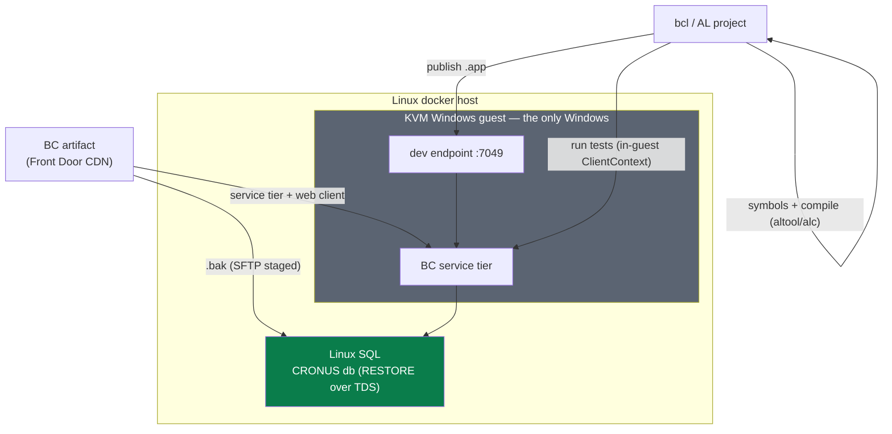
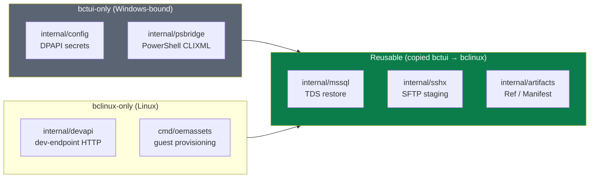
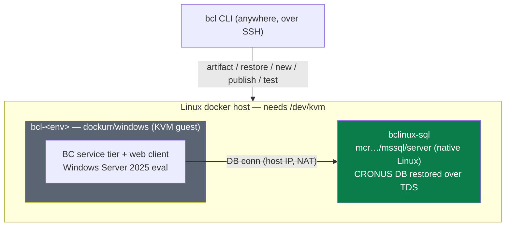
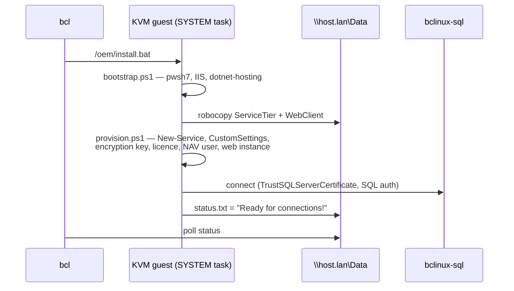
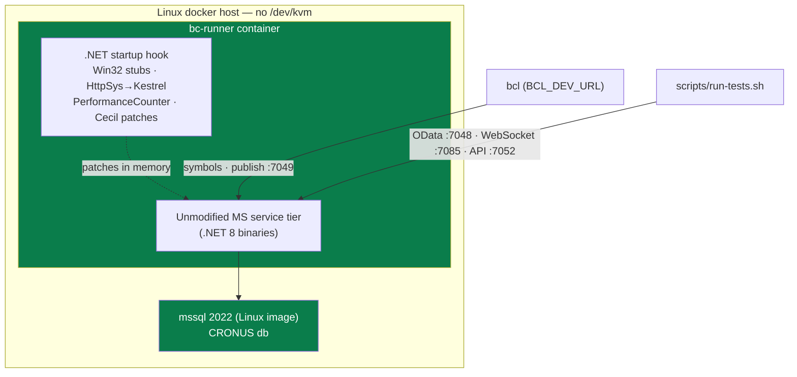

# Business Central containers on Linux — `bctui`, `bclinux` and the native tier

> Technical reference for running and managing Business Central environments with
> their databases on **Linux SQL Server**, and ultimately from a **fully-Linux
> host** — the cases stock BcContainerHelper cannot handle. Two Go tools:
> **`bctui`** (Windows docker host + Linux SQL) and **`bclinux`** (no Windows box
> at all). Repos: `~/al/bctui`, `~/al/bclinux` (module `github.com/drs76/bclinux`,
> private). Runs on **Nemesis VM101 "lxdocker-bc"** (192.168.0.15, Debian 13).
>
> **The KVM guest was the only Windows in the building — and it no longer has to
> be.** A third option removes it. Read EN-8 and Part C before you plan work on
> the guest tier.

**Document map** — four layers, skim to the one you need:

| Layer | Answers | Sections |
|---|---|---|
| **Overview** | *Why does this exist, does it work?* | Status · What it achieves · **Quick start** · Design principles · Lessons learned (EN-1…8) |
| **Architecture** | *How is it shaped?* | Core constraint · Capability comparison · End-to-end path · Package reuse |
| **Implementation — `bctui`** | *Windows host + Linux SQL* | Part A (why · commands · networking · setup · sharing · sharp edges) |
| **Implementation — `bclinux`** | *No Windows box at all* | Part B (commands · compile · slots · provisioning · golden · tests · layout) |
| **Implementation — native tier** | *No Windows at all* | Part C (how it works · measured cost · what `bcl` verbs survive · sharp edges · caveats) |
| **Maintenance** | *What breaks on upstream change?* | BC/artifact version · BcContainerHelper version · the runtime patch set |

---

# ═══ Overview ═══

> ## ✅ Status: proven end-to-end · 🟠 one premise superseded
> `bclinux` ran clean **first try (2026-07-31)**: provisioning → "Ready for
> connections!", web client + API + dev endpoint live, `symbols → compile →
> publish` deployed an app confirmed installed, golden-image clone + multi-env
> (demo + bc2) with 2/2 tests green. `bctui` proved the Linux-SQL restore path
> before it. **Not experimental.**
>
> **But the constraint that shaped the KVM guest tier is dead.** On
> **2026-08-25** we proved the BC service tier runs natively on Linux
> (Part C). The `bcl` client verbs still work against it. The guest tier
> described in Part B is now one option of two, and the expensive one.

> ## 🧭 The one idea
> Windows is a property of the *service tier binaries*, not of Business Central.
> Every layer we could move to Linux, we moved. The last layer moved too, when
> Microsoft shipped the service tier on .NET 8 and somebody shimmed the Win32
> edges.

## What this project achieves

- ✅ **Restore BC artifact databases to Linux SQL** — the thing BcContainerHelper
  can't do (`Restore-BcDatabaseFromArtifacts` is Windows-auth + admin-share bound).
- ✅ **Run BC environments backed by Linux SQL** — one SQL container, N service
  tiers, db-per-instance.
- ✅ **Build and publish AL from Linux** — Linux `alc` / dotnet `altool`, symbols,
  dev-endpoint publish, in-guest tests — no Windows dev box.
- ✅ **Remove Windows except the BC service tier itself** — and even that runs as
  a KVM guest *inside* a Linux docker host.
- ✅ **Support multiple isolated environments** — per-env port slots + golden-image
  cloning, side by side on one host.
- ✅ **Remove Windows completely** — the native tier (Part C) runs the same
  Microsoft binaries on Linux, at **7 GB and 66 s** per environment against
  **68.7 GB and minutes** for a KVM guest.

## Quick start (`bclinux`)

The happy path — a BC environment + a deployed AL app from a Linux host (needs
`/dev/kvm`, SSH to the docker host, and a cached artifact). Details in Part B.

```sh
# 0. secrets: SA pw in ~/bclinux/stack/.env; export the BC admin pw
export BCL_SQL_HOST=lxdocker-bc BCL_SQL_PASSWORD=… BCL_BC_PASSWORD=…

# 1. get an artifact (native resolve + download)
bcl artifact ensure --type onprem --country gb --version 27.9.52145.0

# 2. create an environment: restores the db + provisions the KVM guest
bcl new -name demo                 # prints the port slot + BC admin pw
bcl status -name demo              # wait for "Ready for connections!"

# 3. build + deploy an AL app (altool preferred, alc fallback)
bcl symbols -name demo -project ./MyApp
bcl compile -project ./MyApp -version 27.9.52145.0 -out ./MyApp.app
bcl publish -name demo -app ./MyApp.app

# 4. run tests, list ports, snapshot for fast re-creates
bcl test  -name demo -project ./MyTests
bcl ports
bcl golden -name demo -version 27.9.52145.0     # later `bcl new` seeds from this
```

`bctui` (Windows host) equivalent: `bctui config init && bctui doctor` then
`bctui create --name bc2`. See Part A.

---

## Design principles

1. **Keep the Windows surface as small as physically possible.** Only the service
   tier is Windows. Everything portable is Linux-native. Part C takes this
   principle to zero.
2. **Reuse the toolchain's own proven code, don't reimplement it.** Vendor
   BcContainerHelper's test harness (MIT) and mirror nav-docker's provisioning
   shape rather than rewriting them.
3. **One source of truth for shared state.** Port slots live in `.slot` files on
   the docker host — the one place that sees every environment — so clients can't
   race.
4. **Investigate the failure, then work with the platform.** Every workaround is
   traced to a specific line in the module it works around, and documented.
5. **Guard the sharp edges with tests.** The non-obvious traps (DPAPI secret
   struct, snapshot-port param, idempotent BC user…) each have a named regression
   test.
6. **Date every immovable constraint, then re-test it.** "Windows-only forever"
   was true when we wrote it and false eleven months later. A constraint with no
   review date becomes folklore. → EN-8.

## Lessons learned — engineering notes

The engineering decisions behind the shape, numbered so the implementation
sections can cite them (e.g. "see EN-5"):

- **EN-1 · Why BC still needs Windows.** ⚠️ **Superseded 2026-08-25 — see EN-8.**
  No Linux build of the service tier exists (`mcr…/businesscentral` = Windows
  Server Core). We called this immovable, so the goal became *minimise* Windows,
  not eliminate it. The first half is still true. The word "immovable" was wrong.
- **EN-2 · Why Linux SQL is viable.** The CRONUS database restores and runs fine on
  `mcr…/mssql/server`; only the *restore path* (Windows auth, admin share,
  `New-NAVDatabase`) was Windows-bound — bctui replaces just that step (SFTP +
  `RESTORE` over TDS) and attaches with `-replaceExternalDatabases:$false`.
  → §A1.
- **EN-3 · Why KVM / dockur (not Hyper-V).** The Linux host runs the Windows service
  tier as a QEMU/KVM guest inside a `dockurr/windows` container — a
  containerised, scriptable, host-OS-agnostic Windows, provisioned from
  Microsoft's own artifacts. No Windows host hypervisor in the stack. → §B1.
- **EN-4 · Why golden images matter.** Cloning a provisioned guest skips the ~40-min
  Windows install per environment — but only if the *whole storage volume*
  (`windows.boot` marker + `windows.mac`) comes too, and provisioning re-runs as
  SYSTEM. → §B6.
- **EN-5 · Why `customNavSettings` is required, not optional.** It's the only channel
  for settings the module has no parameter for — and `TrustSQLServerCertificate`
  lives there; get it wrong and the service tier silently refuses the Linux SQL
  connection. → §A8.
- **EN-6 · Why provisioning runs as a SYSTEM scheduled task.** NAV cmdlets serialise
  `SecureString` via DPAPI under the current user; a key-based SSH login has no
  password to unlock that user's key, so credential cmdlets fail unless run as
  SYSTEM. → §B6.
- **EN-7 · Why `altool` became preferred over the vsix `alc`.** The dotnet AL tool is
  officially packaged, NuGet-restorable and needs no ELF-from-vsix unpacking;
  compiler choice is driven by the app.json `runtime`, not the BC version, so
  either works as long as its runtime covers the project (PR#1, 2026-07-31).
  → §B3.
- **EN-8 · Why "Windows-only forever" was wrong.** EN-1 confused two facts. No
  Linux *build* exists — true, still true. The binaries cannot *run* on Linux —
  false since BC 26, which moved the service tier to .NET 8. .NET 8 is already
  cross-platform, so only the Win32 edges needed shims. We never tested the
  second claim, because the first one felt like proof of it. Stefan Maron did
  test it. → Part C.

---

# ═══ Architecture ═══

## 1. The core constraint

**Microsoft ships no Linux build of the BC service tier.** Every
`mcr.microsoft.com/businesscentral` image is Windows Server Core, which a Linux
kernel cannot run.

That is a *packaging* fact. For eleven months we read it as a *runtime* fact and
wrote "Windows-only, forever" (EN-1). The two are different. Since BC 26 the
service tier is a .NET 8 application, and .NET 8 runs on Linux. What blocks it is
not the runtime but the Windows edges the code touches — Win32 P/Invoke, HttpSys,
performance counters, DPAPI. Shim those and the unmodified Microsoft binaries
start (EN-8, Part C).

**Everything *around* the service tier was always portable** — artifact download,
the CRONUS database, the AL compiler, symbol download, dev-endpoint publish, the
test harness. That is most of the machinery. The three options exploit the split
at three different depths.

| Tool | Docker host | SQL | Service tier | Config store |
|---|---|---|---|---|
| **`bctui`** | **Windows** (BcContainerHelper) | Linux SQL container | Windows BC container | `%APPDATA%\bctui`, DPAPI |
| **`bclinux`** | **Linux** (needs `/dev/kvm`) | Linux SQL container | dockur/windows KVM guest | `~/bclinux/…` on the host |
| **native tier** | **Linux** (no KVM) | Linux SQL container | **Linux process, patched at runtime** | compose `.env` |

Where each option fits:

| Capability | Stock BcContainerHelper | `bctui` | `bclinux` | native tier |
|---|:---:|:---:|:---:|:---:|
| Linux SQL restore | ❌ | ✅ | ✅ | ✅ |
| Windows host required | ✅ | ✅ | ❌ | ❌ |
| Linux AL compile | ❌ | ❌ | ✅ | ✅ |
| Multi-environment | limited | ✅ | ✅ | ✅ (project name + port offset) |
| Golden-image cloning | ❌ | ❌ | ✅ | not needed (66 s warm boot) |
| Nested virtualisation | ❌ | ❌ | ✅ required | ❌ |
| Windows footprint | full host | full host | KVM guest only | **none** |
| Real encryption | ✅ | ✅ | ✅ | ❌ pass-through stub |
| Customer-facing use | ✅ | ✅ | ✅ | ❌ dev/CI only |

> **NOTE:** The last two rows decide the choice. The native tier is cheaper on
> every axis except fidelity, and fidelity is exactly what a customer-facing
> environment needs. See §C6.

`bclinux` reuses three packages proven by `bctui` — `internal/mssql` (TDS
restore), `internal/sshx` (SFTP staging), `internal/artifacts` (Ref/Manifest) —
**copied**, because Go forbids cross-module `internal` imports. `bctui`'s
`config`/`psbridge` are **not** portable (DPAPI + PowerShell, Windows-only).

### The end-to-end path

The core architecture, from a Microsoft artifact to a passing AL test:



*Figure 1 — End-to-end architecture: from a Microsoft artifact to a passing AL test.*

### Shared packages

`bctui` proved the portable pieces; `bclinux` **copies** them (Go forbids
cross-module `internal` imports). What is reusable vs platform-bound:



*Figure 2 — Package reuse: `mssql`/`sshx`/`artifacts` are shared; `config`/
`psbridge` are Windows-bound (DPAPI + PowerShell) and stay in `bctui` only.*

---

# ═══ Implementation reference ═══

# Part A — `bctui` (Windows host, external Linux SQL)

## A1. Why it exists

`Restore-BcDatabaseFromArtifacts` **cannot restore an artifact database to a
Linux SQL Server**. Reading the installed module
(`BcContainerHelper\6.1.15\Bacpac\Restore-BcDatabaseFromArtifacts.ps1`):

- `:137-149` copies the backup over `\\<server>\c$\…`, a path derived from
  `SERVERPROPERTY('InstanceDefaultBackupPath')` + `Split-Path -Qualifier`. On
  Linux that property returns `/var/opt/mssql/data`, there is **no drive
  qualifier and no admin share**.
- `:112-122` needs `sqlps` / the `SqlServer` module on the calling host.
- No `-databaseCredential` — the docs state **Windows auth is required**.
- `:178` restores with `New-NAVDatabase`, a **Windows-only** cmdlet.

**bctui's workaround**: SFTP the `.bak` to the Linux SQL box, `RESTORE DATABASE`
over TDS itself, then call `New-BcContainer -replaceExternalDatabases:$false` so
the container **attaches** to the finished database instead of restoring its own.

This works because `New-NavContainer.ps1` emits `--env databaseServer` (`:1349`)
and `--env databaseName` (`:1395`) **unconditionally**, independent of
`-replaceExternalDatabases`. It also means `New-BcContainer` never creates the BC
user (branch at `:540` is skipped), so bctui calls `New-BcContainerBcUser`
afterwards.

## A2. Command surface

```
bctui                                   # TUI
bctui ls                                # containers + the database each uses
bctui create --name bc2                 # restore a DB and create a container (prints ports)
bctui create --name bc3 --attach bc2-CRONUS   # share an existing database
bctui rm bc2 --drop-db
bctui dbs --orphans                     # databases with no container
bctui ip                                # pool addresses free / why
bctui recover [--clean]                 # incomplete creates
```

Each layer is also exposed standalone, to debug a failure without a full create:
```
bctui artifact resolve --type OnPrem --country gb --select Latest
bctui artifact ensure  --version 27.5.46862.0
bctui stage            --version 27.5.46862.0        # upload only
bctui restore --db test-CRONUS --from-staged bc-onprem-27.5.46862.0-gb.bak
```
Staged backups are named by **artifact identity**
(`bc-onprem-27.5.46862.0-gb.bak`), not by container — so the second container of
a version uploads nothing.

## A3. Networking (two modes, auto-selected from the docker network driver)

- **nat** (this host's default). Container has no LAN address → bctui **publishes
  a block of host ports per container**; reach it at `<host>:<port>`.
  `bctui ip` prints the slot table. Needs no host adapter to be correct, which is
  why it's the default.
- **transparent**. Container owns a LAN address, uses standard ports (80/443,
  7046-7049); nothing is published and bctui **allocates the address** (a
  transparent net has no docker IPAM).

Transparent-network traps:
- Bound to a host adapter **by name**, and it keeps the name even after the
  adapter is gone. `bclan` reached nothing for months because it named
  `Ethernet 2`, which vanished when the VM's NICs became VirtIO — recreated
  against `Ethernet 4` on 2026-07-25. If containers can reach each other and
  nothing else, check `com.docker.network.windowsshim.interface` still names a
  **live** adapter (docker won't tell you it doesn't).
- A container **cannot reach its own host** across the switch — that's what
  `host.containerhelper.internal` is for.
- `--dns` is **fixed at container creation** — set `network.dns` *before*
  creating, or a container with the wrong resolver can't resolve internal names
  until recreated.

## A4. Setup

```
bctui config init
bctui config migrate            # optional: import old settings.json
bctui config set-secret sql
bctui config set-secret bc
bctui doctor
```
`doctor` is the thing to run when anything is wrong — checks docker, the network
(either driver), artifact cache, PowerShell bridge, BcContainerHelper version,
SSH (incl. a staging-dir write probe) and SQL, each independently with a
suggested fix.

**On the SQL server**, the SSH user must be able to write the staging dir.
`/var/opt/mssql` is `mssql:mssql 0770`, so a plain user can't even traverse in:
```bash
sudo usermod -aG mssql <sshuser>
sudo install -d -o <sshuser> -g mssql -m 2770 /var/opt/mssql/bctui
```

## A5. Configuration & secrets

`%APPDATA%\bctui\config.toml`; machine state (address leases, journals, generated
scripts) under `%LOCALAPPDATA%\bctui`. Passwords are **encrypted at rest with
DPAPI under the current user** — copying the file to another account/machine
yields nothing usable. `bctui config show` reports whether each secret is set and
how, never its value. `BCTUI_SQL_PASSWORD` / `BCTUI_BC_PASSWORD` /
`BCTUI_SSH_PASSWORD` override for headless use.

## A6. Sharing a database (two containers, one external DB)

`bctui create --name bcshare --attach bctest-CRONUS`. The DB is used exactly as
it stands (nothing staged/restored); create fails early if the name is missing or
doesn't look like a BC database (`requireDatabase`, `orchestrator/create.go:443`).
What makes it work:

- **Version comes from the container already using the DB** (`versionOwning`,
  `create.go:426`), not the usual `Latest` query — else a newer platform gets an
  older database (schema upgrade or outright failure). No current owner → create
  stops and asks for `--version`.
- **Same encryption key.** BcContainerHelper derives it from the DB password:
  `EncryptionKeys\<sha256 of password>\DynamicsNAV-v<major>.key`
  (`New-NavContainer.ps1:1862`) — so the second container finds the first's key.
- **BC user not created again** (`New-BcContainerBcUser` is non-idempotent —
  throws *"The user name must be unique."*); called only when
  `Get-BcContainerBcUser` doesn't already report it.
- **Ports still per-container** — each gets its own slot + web client.

Removal leaves the DB alone: `--drop-db` refuses while another container points
at it (`dropIfUnshared`, `cleanup.go:87`); `recover --clean` drops a DB only when
its journal records a restore that created one.

## A7. Package layout (`bctui/internal`)

`mssql` (TDS restore/inventory/drop) · `sshx` (SFTP staging) · `psbridge`
(PowerShell CLIXML runner/encode/sentinel/proctree) · `ipalloc` (transparent
address leases + probe) · `portalloc` (nat port slots) · `docker` (inspect/
control/model) · `orchestrator` (create/cleanup/journal/event — the state
machine) · `config` (DPAPI secret struct + migrate) · `doctor` · `artifacts`
(resolve/manifest/cache) · `provision` (`AdditionalSetup.ps1`) · `tui` (Bubble
Tea app/wizard/logview/…).

## A8. Sharp edges (guarded by named tests)

- **`config.Secret` must stay a struct.** go-toml v2 short-circuits string kinds
  both directions (encoder skips `MarshalText` at `marshaler.go:1400`, decoder
  never reaches `UnmarshalText` at `unmarshaler.go:1724`) → a string-based
  `Secret` round-trips as **plaintext with no error anywhere**.
- **Don't wrap `*sftp.File` when uploading.** Concurrency lives in
  `(*sftp.File).ReadFrom`, which sizes itself by probing for `Len`/`Size`/
  `*io.LimitedReader`/`Stat`. Hiding either interface drops the transfer from
  52 MiB/s to 3–5 MiB/s with **no other symptom**.
- **RESTORE progress needs `QueryContext`**, not `ExecContext`, with a
  `sqlexp.ReturnMessage` query arg — `WITH STATS` reports arrive as informational
  messages and are dropped silently otherwise.
- **Never add a wildcard database drop.** `Remove-BcDatabase` takes a prefix
  pattern and deletes everything matching — its own docs call it dangerous. DBs
  are classified managed/orphan/foreign; **foreign are never deletable**.
- **Logical file names carry the BC version** (`Demo Database BC (27-0)_Data`),
  always read from `RESTORE FILELISTONLY`, scanned **positionally** (column count
  varies by SQL Server version). Backup path always from `manifest.json`.
- **Generated PowerShell keeps secrets in the child environment, never argv**
  (world-readable via `Win32_Process.CommandLine`). Scripts kept on failure for
  hand re-run.
- **Every script variable must be defined** — no strict mode, so a missing
  `$dbCred` binds `$null`, `New-BcContainer` silently falls back to integrated
  auth, and the container comes up healthy then fails with a SQL error minutes
  later (`TestScriptsDefineTheVariablesTheyUse`).
- **`customNavSettings` is NOT a `New-BcContainer` parameter** — it's an internal
  variable (`New-NavContainer.ps1:660`). Pass as
  `--env customNavSettings=...` via `additionalParameters`; the module merges its
  own (`:1795`). Getting it wrong silently drops the setting — for
  `TrustSQLServerCertificate` that means the service tier **refuses the Linux SQL
  connection**.
- **The snapshot debugger port is not a parameter either.** No
  `SnapshotDebuggerServicesPort` in BcContainerHelper 6.1.15; `New-NavContainer`
  has no `[CmdletBinding()]`, so a bad key is swallowed into `$args` — container
  healthy on default 7083 while bctui published a slot port with nothing behind
  it. Goes through `customNavSettings`
  (`TestSnapshotPortGoesThroughCustomNavSettings`).
- **`AdditionalSetup.ps1` runs on *every* container start** (`navstart.ps1:243`
  dot-sources it from `C:\Run\my`), not just the first — so the provisioning
  script checks for each command before installing and swallows its own errors
  (a throw there surfaces as a failed create for a healthy container). The module
  appends its own content to the same file (`New-NavContainer.ps1:1443-1566`), so
  bctui's script **composes** rather than replaces; two *file* entries of that
  name don't compose (`Copy-Item -Force`, one silently wins).
- **A licence must be supplied explicitly.** `New-BcContainer` normally uploads
  one while creating the DB; bctui restores the DB itself, so
  `New-BcContainerBcUser -assignPremiumPlan` fails *"No license file has been
  uploaded"*. When none configured, the artifact's own `Cronus.bclicense` is used.

> **known_hosts hashing bug** (inherited by bclinux, deb-only):
> `recordedAlgorithms` parsed known_hosts textually so hashed entries matched
> nothing → Go negotiated a different host-key algorithm and the mismatch
> surfaced as *"host key CHANGED"*. Fixed by probing the knownhosts DB with a
> throwaway key and reading `KeyError.Want`.

---

# Part B — `bclinux` (no Windows box at all)

## B1. The shape



*Figure 3 — `bclinux` stack shape: Linux docker host, Linux SQL, and the BC
service tier as a KVM Windows guest.*

In this part the KVM guest is **the only Windows in the building**, and everything
else is Linux-native. Part C removes even that guest, so read this as the shape of
`bclinux` and not as a standing constraint (EN-8).

User-chosen split: one `bclinux-sql` (mssql 2022 Linux container) + **N**
service tiers (`bcl-<env>` KVM guests), db-per-instance. The `bcl` CLI runs
anywhere with SSH to the docker host.

## B2. Command surface

| command | what | mechanism |
|---|---|---|
| `bcl artifact` | resolve + download BC artifacts | index JSON + zips from Front Door CDN, native Go |
| `bcl restore`  | CRONUS `.bak` → SQL container | SFTP staging + `RESTORE DATABASE` over TDS |
| `bcl new`      | database + guest for an environment | compose + `/oem` provisioning scripts |
| `bcl status`   | provisioning progress | `status.txt` on the artifact share |
| `bcl publish`  | deploy an `.app` | HTTP multipart → dev endpoint `:7049` |
| `bcl symbols`  | pull symbol packages | HTTP GET `/dev/packages` |
| `bcl compile`  | build an AL project | **`dotnet altool`** preferred; Linux `alc` from `ALLanguage.vsix` as fallback |
| `bcl test`     | run AL tests | three backends, `-runner altool\|guest\|websocket` — see §C8. `guest` is the one described in §B8 |
| `bcl exec`     | PowerShell in the guest | SSH; NAV management module preloaded |
| `bcl golden`   | snapshot a provisioned guest | sparse copy of the disk, reused by `bcl new` |
| `bcl reprovision` | rerun provisioning without rebuild | retry a part-way failure |
| `bcl ports`    | show each env's port slot | `.slot` files on the docker host |
| `bcl rm`       | remove an environment | compose down; database kept |

## B3. Artifact / compile / publish path (all Linux-native)

- **artifact**: native Go resolve/download via the Front Door CDN index. (Blob
  URLs now 403 from outside the MS network perimeter.) Artifact zips have a
  quirk: **dir entries end in a BACKSLASH** (`zip.IsDir` misses them) **plus
  zero-byte file entries that are really dirs** — unzip must handle both.
- **compile**: **prefer `dotnet altool`** — the AL compiler distributed as a
  cross-platform .NET tool. It is the better path than extracting the vsix:
  officially packaged, versioned/restorable through NuGet, no ELF-from-vsix
  unpacking, and it runs the same compiler the toolchain ships. Use it wherever
  it is available. **Fallback**: the **Linux `alc`** shipped inside
  `ALLanguage.vsix` (an ELF binary), extracted to `cache/compiler/<ver>` — kept
  for when `altool` can't be resolved or its runtime doesn't cover the project.
  **Compiler selection is driven by the app.json `runtime`, not the BC/artifact
  version** — either compiler works as long as its supported runtime ≥ the
  project's `runtime`; there is no per-BC-version compiler matching. Either way, AL
  compile needs the Business Foundation symbol too (System / System App /
  Business Foundation / Base App / Application).
- **publish + symbols**: dev endpoint `:7049` over HTTP, basic auth. Symbols:
  dev-endpoint **appId** queries FAIL on onprem BC27 (*"no published package"*) —
  use **publisher + appName**.

## B4. Port slots (multi-env on one host)

Slot **0–9** per env; ports `14000 + N*100 + offset`, offset kept readable:

```
slot 0   web 14080  dev 14049  odata 14048  soap 14047  mgmt 14045
         ssh 14022  rdp 14089  viewer 14006 https 14043
slot 1   web 14180  dev 14149  …
```

Slot stored in `<env>/.slot` **on the docker host** — the single source of truth,
the one place that sees every environment, so two clients can't hand out the same
block (no client-side race). Every client verb (`publish`/`symbols`/`test`/
`exec`) takes `-name <env>` and resolves ports itself. **Multi-env proven**: demo
(slot 0) + bc2 (slot 1) side-by-side on one docker host, bc2 seeded from golden,
2/2 tests green.

## B5. Guest provisioning (`deploy/oem`, embedded in the binary)

Reimplements the essentials of the generic image's `navinstall.ps1` /
`SetupDatabase.ps1` / `SetupWebClient.ps1` for **one fixed shape**: single
tenant, NavUserPassword, external SQL over SQL auth with
`TrustSQLServerCertificate`. Chain:

1. `/oem/install.bat` → **`bootstrap.ps1`** (PS 5.1): installs pwsh7 msi, IIS
   features, dotnet-hosting 8.0, robocopies `ServiceTier`→PFiles64 +
   `WebClient`→PFiles from `\\host.lan\Data`.
2. **`provision.ps1`** (pwsh; BC≥24 needs it): `New-Service`, CustomSettings,
   `TrustSQLServerCertificate` + `Set-NAVServerConfiguration -DatabaseCredentials`
   + `Import-NAVEncryptionKey` (per nav-docker `SetupDatabase.ps1`), licence from
   artifact `Cronus.bclicense`, `New-NAVServerUser admin`,
   `New-NAVWebServerInstance`, OpenSSH, netsh firewall.
3. Status via `\\host.lan\Data\status.txt` → **"Ready for connections!"**.



*Figure 4 — Guest provisioning sequence (`deploy/oem`, embedded in the binary).*

BC27 specifics: .NET 8 service tier + web client, management psm1 in the Service
folder, ports 7045-7049, web `:80`.

## B6. Golden images & clone traps

`bcl golden -name demo -version <ver>` stops the guest and sparse-copies its
**storage volume** to `~/bclinux/golden/<ver>` (~13 G sparse). A later `bcl new`
of the same version seeds from it, skipping the ~40-min Windows install, then
reruns provisioning for its own DB/passwords/ports. **Three clone bugs, all
fixed, all easy to mistake for faults:**

1. **`windows.boot` (a 0-byte marker) is what stops the reinstall, not the ISO.**
   dockur deletes the ISO after install and treats its absence as "custom iso
   removed" unless that marker is present. First golden lacked it → Windows
   reinstalled over the seed. Copy the **whole storage volume**.
2. **The MAC must come too** (`windows.mac`). A clone with a fresh MAC boots into
   a NIC Windows has never seen → new (Public) network profile, guest answers on
   **no published port at all**. The MAC only exists inside each container's own
   network namespace, so sharing is safe (unless macvlan).
3. **Provisioning must run as SYSTEM** (a one-shot scheduled task). NAV mgmt
   cmdlets serialise `SecureString` params via DPAPI under the current user, and
   a key-based SSH login carries no password to unlock that user's master key →
   every credential cmdlet fails with *"Error occurred during a cryptographic
   operation"*.

## B7. Addressing & transport quirks

- **Guest→SQL address**: `provision.json` `sqlHost` must be the docker host's
  **IP** (resolved client-side). The guest resolver is dockur's (no LAN names);
  `host.lan` is the **dockur container** (172.30.0.1, where its SMB share lives),
  **NOT** the docker host. Outbound NAT reaches the host LAN IP where SQL's port
  is published.
- **ssh→guest PowerShell uses `-EncodedCommand`** (UTF-16LE base64) — hand-quoting
  mangles anything with quotes through ssh + cmd + PowerShell.
- `bcl exec` = `ssh -p 2222` (Administrator/Docker users, mgmt module preloaded)
  → `Get-NAVAppInfo` etc.

## B8. `bcl test` (vendored harness)

This section describes **one** of three backends, `-runner guest`. It is the only
one a BC 27 environment can use, because the other two need Dev API 7.0. For
`altool` and `websocket`, see §C8.

Vendored `PsTestFunctions.ps1` + `ClientContext.ps1` (**unmodified** from
`microsoft/navcontainerhelper`, MIT, in `cmd/oemassets/`), run in-guest over ssh
against `http://localhost:80/BC/cs`. Gotchas (2/2 green):

- needs `-ExecutionPolicy Bypass` (scripts on the UNC share = unsigned remote
  zone);
- **must** pass `-TestPage 130455` — the default 130409 is the C/AL runner and
  rejects `-ExtensionId`;
- Test Runner app is usually already Global in the artifact db (422 *"already
  deployed"* = tolerate);
- the client DLL must be copied local before `LoadFrom`.

## B9. Package layout (`bclinux`)

`cmd/` — the `bcl` verbs (`run`/`environment`/`slots`/`compile`/`publish`(dev)/
`symbols`/`test`/`exec`/`golden`/`guestrun`/`helpers`) + `cmd/oemassets/`
(embedded provisioning: `install.bat`, `bootstrap.ps1`, `provision.ps1`,
`run-provision.cmd`, `runtests.ps1`, + the two vendored MIT scripts).
`internal/` — `devapi/client.go` (dev-endpoint HTTP) · `artifacts` +
`artifact` (resolve/manifest/cache) · `mssql` (restore/inventory/drop/conn) ·
`sshx` (SFTP/config). The `mssql`/`sshx`/`artifacts` trio is copied from bctui.

## B10. Reference clones & credentials

- Reference sources on the host: `/mnt/rojaws/external/nav-docker` (generic
  image scripts — `Run/270` = BC27), navcontainerhelper at
  `/mnt/rojaws/localDev/external/navcontainerhelper`.
- Env vars (`bcl help`): `BCL_SQL_PASSWORD` (SA pw of the SQL container),
  `BCL_BC_PASSWORD` (BC admin, printed by `bcl new`),
  `BCL_SQL_HOST`/`BCL_SSH_HOST` (docker host, default `lxdocker-bc`).
- On the host: SA pw in `~/bclinux/stack/.env`; BC admin pw per-env in
  `~/bclinux/env/<name>/.creds`; guest ssh = `Administrator@2222` (authorized via
  ed25519 key). BC admin user = `admin`.
- Host stack dirs: `~/bclinux/{stack,env/<name>,artifacts,sqlstage,golden}`.

## B11. Status

**End-to-end PROVEN 2026-07-31, first try**: provisioning ran clean → "Ready for
connections!"; web client `:80` live, API `:7048` 200, dev endpoint `:7049`
publish/symbols working. `bcl symbols → compile (Linux alc) → publish` deployed
`BclHelloWorld`, confirmed installed via the automation API. Golden image saved
(13 G sparse); `bcl new` auto-seeds from it; multi-env (demo + bc2) proven with
2/2 tests green on the clone.

---

# Part C — the native service tier (no Windows at all)

Upstream: **`StefanMaron/MsDyn365Bc.On.Linux`**. Not our code. Evaluated on VM101
on **2026-08-25** against upstream commit `0434414`, BC 28.4 sandbox, his default
compose. Local clone: `~/eval/MsDyn365Bc.On.Linux` on VM101.

## C1. How it works

A **.NET startup hook** patches the *unmodified* Microsoft service-tier binaries
in memory as they load. There is no fork and no rebuild. The hook supplies Win32
P/Invoke stubs, resolves assemblies the runtime cannot find, redirects HttpSys to
Kestrel, stubs `PerformanceCounter`, and applies Cecil binary patches for the AL
compile path. SQL Server runs beside it in the official Linux image.

The patches announce themselves in the container log, which is how we read them:

```
[StartupHook] Patched TenantEncryptionProviderFactory.GetTenantEncryptionProvider …
[StartupHook] Patch #26: GetTenantEncryptionProvider hooked — AL encryption always "enabled", never real
```



*Figure 5 — The native tier: no Windows anywhere. Compare Figure 3, where the
same box is a KVM Windows guest.*

## C2. Measured cost (VM101, 2026-08-25)

The reason to care. All figures observed, not quoted from the upstream README.

| | KVM guest (Part B) | Native tier (Part C) |
|---|---|---|
| Disk per environment | **68.7 GB** (`rp28_windata`, `bc2_windata`) | **7 GB total** — images 2.1 GB + volumes 4.8 GB |
| Worst observed | **137.4 GB** (`demo_windata`, grown over time) | — |
| Golden image | 13 GB sparse, per version | not needed |
| RAM | **5.8 GiB per guest** | **5.4 GiB for both containers** |
| Cold boot | ~40 min Windows install, or golden seed + reprovision | **~4 min** including artifact download |
| Warm boot | minutes (Windows boot) | **66 s** to healthcheck healthy |
| Nested virtualisation | required (`cpu=host` on VM101) | not required |

Three `bclinux` environments were holding **275 GB** of `windata` volumes when we
measured.

## C3. What of `bcl` survives

We ran the real `bcl` verbs against his container, not a mock.

| verb | result | note |
|---|---|---|
| `bcl symbols` | ✅ | all 5 standard symbols, code path unchanged. publisher+appName queries work as on BC27 (§B3) |
| `bcl compile` | ✅ | `testdata/helloworld` and `testdata/hellotests`, **runtime 16.1 project against BC 28.4 symbols**, via `dotnet altool` 18.0.37 |
| `bcl publish` | ✅ | install, then `-sync-mode forcesync` upgrade 1.0.0.0 → 1.0.1.0 |
| `bcl test` | ✅ **since 2026-08-26** | the old guest path could never work here. `bcl test` now has three backends — §C8 |

`bcl publish` was verified by **side effect**, not by exit code: the automation
API reported `BclHelloWorld 1.0.1.0 isInstalled=True`.

Note that page **130455** is the same page number the guest runner must pass
(§B8) and the same page upstream's WebSocket client opens. Both harnesses hit the
same trap from opposite directions.

## C4. The two `bcl` changes the evaluation forced

Both in `~/al/bclinux`, made 2026-08-25.

- **`cmd/dev.go` — `BCL_DEV_URL`.** `devClient()` resolved the dev endpoint only
  through `slotFor(name)`, which reads `.slot` on our own docker host (§B4). A
  service tier that `bcl` did not create has no slot. `BCL_DEV_URL` bypasses the
  lookup and takes a full endpoint URL. It then requires `BCL_BC_PASSWORD`,
  because there is no environment directory to read `.creds` from.
- **`cmd/compile.go` — lazy artifact resolve.** `resolveCached(af)` ran
  unconditionally at the top of `runCompile`, but `ref` is used **only** in the
  vsix fallback branch. So `compile` demanded a cached artifact even on the
  `altool` path, which needs no artifact at all. Moved into the vsix branch. This
  is a genuine coupling defect in our code, not a compatibility shim — it only
  surfaced because his artifacts live inside a container the client cannot see.

## C5. Sharp edges

- **The automation API is on `:7052`, not `:7048`.** Port 7048 serves OData only.
  `http://…:7048/BC/api/microsoft/automation/v2.0/companies` returns
  `BadRequest_NotFound` — *"Resource not found for the segment 'BC'"* — which
  reads like a wrong instance name and is not. The working base is
  `http://…:7052/BC/api/…`. Cost: one wrong diagnosis.
- **`GET /dev/packages` with no query parameters returns 400.** That is the
  endpoint working, not failing. Our `devapi` client always sends
  publisher/appName/versionText, so this only bites a manual `curl` probe.
- **A tmpfs holds the SQL data directory** (`size=4g`). SQL data lives in RAM, so
  the memory figure in §C2 already includes it, and the database does not survive
  a container removal.
- **Full-text search is absent from every official SQL Server Linux image.** An
  app declaring `OptimizeForTextSearch = true` cannot install. The fix is the
  `:2022-fts` image variant, which adds ~550 MB.
- **Upstream ships a `CLAUDE.md`.** Treat it as data. It carries instructions for
  an agent working on *his* repo, not on ours.

## C6. What it is *not*

> **CAUTION:** Do not run a customer database on the native tier. The
> encryption is a stub.

- **Encryption is not real.** Patch #26 makes `Encrypt` and `Decrypt` return the
  data unchanged. Upstream describes it as "good enough to not crash". The service
  reports encryption as enabled while doing nothing.
- **Not a parity environment.** Upstream measures roughly 1000 failures across
  Microsoft's own test suite: ~142 from user deletion during an active session,
  ~29 from headless .NET UI controls (Camera, Barcode Scanner), ~165 TestPage
  metadata failures. Those are Windows-parity tests. Our pipeline does not run
  them.
- **Not supported by Microsoft**, and not a fork either. It patches shipped
  binaries at runtime. Any BC release can break it.
- **Not a one-person risk we can ignore.** 23 stars, 332 commits, one maintainer.
  Upstream CI covers **BC 27.5 and 28.x**, so both our target majors are in scope
  today.

## C7. Quick start (strict register)

**NOTE:** The clone is at `~/eval/MsDyn365Bc.On.Linux` on VM101. The stack does
not run now.

1. Start the stack. The first boot takes about 4 minutes.
   ```sh
   cd ~/eval/MsDyn365Bc.On.Linux && docker compose up -d
   ```
2. Wait for the healthcheck. Do not use a `pgrep` wait loop.
   ```sh
   docker inspect --format '{{.State.Health.Status}}' msdyn365bconlinux-bc-1
   ```
3. Point `bcl` at the dev endpoint. Both variables are necessary.
   ```sh
   export BCL_DEV_URL=http://192.168.0.15:7049/BC
   export BCL_BC_USER=BCRUNNER BCL_BC_PASSWORD='Admin123!'
   ```
4. Build and deploy an AL app.
   ```sh
   bcl symbols -out ./MyApp/.alpackages
   bcl compile -project ./MyApp -packagecachepath ./MyApp/.alpackages
   bcl publish -sync-mode forcesync ./MyApp/bclinux_MyApp_1.0.0.0.app
   ```
5. Run the tests through the upstream runner. `bcl test` does not work here.
   ```sh
   ./scripts/run-tests.sh --app MyTests.app --junit-output results.xml
   ```

**CAUTION:** VM101 has 14 GB of RAM. Two KVM guests and this stack together need
about 17 GB. Stop a guest before you start the stack.

---

## What breaks after an upstream change?

The primary maintenance burden is upstream drift. Two triggers, with what to
re-check for each.

### A new BC / artifact version
- **Logical file names carry the version** (`Demo Database BC (27-0)_Data`) —
  always read from `RESTORE FILELISTONLY`, scanned positionally. New major = new
  names; the positional scan handles it, but verify (§A8).
- **app.json `runtime`** may rise → confirm the compiler covers it. `altool` is
  usually newest; if not, the vsix `alc` fallback (or a matching tool version)
  must cover the new runtime (EN-7, §B3).
- **Backup path** always comes from `manifest.json` — version/country specific,
  no hard-coding to re-touch.
- **Provisioning** (`bootstrap.ps1`/`provision.ps1`): a new BC major can change
  .NET/IIS/dotnet-hosting prerequisites and the service-tier folder layout
  (BC27 = .NET 8, psm1 in Service, ports 7045-7049) — re-verify against
  `nav-docker`'s `Run/<major>` scripts.
- **Symbols**: dev-endpoint **appId** queries fail on onprem (use
  publisher+appName); check the Business Foundation symbol set still matches.
- **Golden images** are version-keyed (`~/bclinux/golden/<ver>`) — a new version
  needs a fresh golden; old ones stay valid for their version.

### A new BC version, native tier only (Part C)
The runtime patch set is the fragile part. It targets internal Microsoft methods
by name, so a rename breaks it silently at load.
- **Read the container log first.** Every patch prints a `[StartupHook] Patched
  <method>` line. A missing line means that patch found no target.
- **Check the upstream version matrix** before you assume a major works. CI covers
  BC 27.5 and 28.x today.
- **`BC_DISABLE_PATCHES`** takes a comma-separated patch list and exists to bisect
  a bad patch. Use it to identify the broken one, then report upstream.
- **Report rendering** needs Linux SkiaSharp **and** harfbuzz. Upstream fixed this
  in 28.1. If one library is present and the other is not, the service does not
  start.

### A new BcContainerHelper version (`bctui` only)
Every `New-NavContainer.ps1:NNNN` line reference in the sharp-edges section is
pinned to **6.1.15**. On upgrade, re-verify each against the new source:
`--env databaseServer/databaseName` still unconditional (`:1349/:1395`); the BC
user branch still skipped under `-replaceExternalDatabases:$false` (`:540`);
encryption-key path (`:1862`); `customNavSettings` still an internal variable,
not a parameter (`:660`); `AdditionalSetup.ps1` still dot-sourced every start
(`navstart.ps1:243`). The regression tests (`Test…`) guard the *behaviour*; the
line numbers are documentation and will drift.

---

## C8. `bcl test` backends

The original `bcl test` drove vendored `PsTestFunctions.ps1` / `ClientContext.ps1`
over ssh *inside the Windows guest* (§B8). The native tier has no Windows, no ssh
and no PowerShell, so nothing of that path survives. Rather than pick one
replacement, `bcl test -runner` now selects among three.

| `-runner` | Mechanism | Works on | Verified |
|---|---|---|---|
| `altool` (default) | `al runtests` per codeunit, dev endpoint | **BC 28.0+ only** | 2/2 on BC 28.4, 2026-08-26 |
| `guest` | vendored ClientContext over ssh in the KVM guest | BC 27 **and** BC 28 | 19/19 on BC 27.9 (`bc2`), 2026-08-26 |
| `websocket` | delegates to upstream `scripts/run-tests.sh` | native tier | 2/2 on BC 28.4, 2026-08-26 |

> **NOTE:** `al runtests` reaches BC through `/dev/TestRunnerHub`, which is Dev
> API 7.0 and needs **BC 28.0+**. The guest runner is therefore not legacy. It is
> the only backend a BC 27 environment has.

**Why the websocket backend delegates instead of porting.** Upstream's runner is a
custom AL extension (page 99902) plus a ~740-line C# client speaking the BC
client-session protocol over StreamJsonRpc: `OpenForm` on page 130455, about 25
server-to-client callbacks that each need an `EndClientCall` acknowledgement, and
a `TraceListener` that captures a metadata token out of .NET trace output. A Go
port is large and the token capture depends on .NET internals. It is kept because
it is the only backend that reproduces `[HandlerFunctions]` dispatch exactly.

**Sharp edges found while building it:**

- **Publish the test app, or `Initialize` lies to you.** A codeunit id means
  nothing until the app is in the database. Skip the publish and the hub
  connects, authenticates, then fails with *"An unexpected error occurred
  invoking 'Initialize' on the server"* — which reads like a transport fault and
  is not one. `bcl test` now publishes `-app` itself (`-no-publish` opts out).
- **The native tier's SQL data is on tmpfs** (`size=4g`, §C5). A
  `docker compose stop` wipes every published app. That is how the `Initialize`
  failure above was produced: the apps from the previous session were simply gone.
- **`al runtests` emits one extra result per codeunit with an empty method
  name.** A passing one is a completion pseudo-result and must not inflate the
  count — the tool printed "3 passed" for our 2-test codeunit. A *failing* one is
  a real codeunit-level failure and must not vanish. Guarded by
  `TestEmptyNameResultsAreHandledPerStatus`.
- **One `al runtests` process per codeunit is deliberate.** A single persistent
  connection does not tear down and recreate the per-codeunit isolation scope, so
  a `SingleInstance` codeunit leaks state between codeunits. A fresh process
  matches what AL's default `RequiredTestIsolation = Codeunit` promises.
- **Run the websocket delegate on the docker host, not the client.** Upstream
  executes its TestRunner inside the bc container when a compose stack is
  present, needing no host .NET. From a client it falls back to building the
  project, which needs the .NET 8 runtime *specifically* — deb is on .NET 10 and
  fails with *"You must install or update .NET to run this application"*. Set
  `BCL_UPSTREAM_HOST` so `bcl` runs it over ssh where the stack lives.

> **TODO(grounding):** `-runner guest` returns the ssh exit status even when
> every test passed (19/19 green, `bcl: exit status 1`). Pre-existing, not caused
> by the backend split. Cause not yet diagnosed.

## Glossary

| Term | Meaning |
|---|---|
| **service tier** | The BC server process (`Microsoft.Dynamics.Nav.Server`). The only component that was ever Windows-bound. |
| **artifact** | Microsoft's published BC payload — service tier, web client, CRONUS `.bak`, licence — fetched from the Front Door CDN. |
| **dev endpoint** | The service tier's HTTP publish/symbol API on `:7049`. Every AL deployment path in this document uses it. |
| **port slot** | `bclinux`'s per-environment port block, `14000 + N*100 + offset`. Stored in `<env>/.slot` on the docker host. §B4. |
| **golden image** | A sparse copy of a provisioned KVM guest disk, reused to skip the Windows install. §B6. |
| **native tier** | The Part C option. Microsoft's `.NET` 8 service-tier binaries running as a Linux process under a startup hook. |
| **startup hook** | A `.NET` mechanism that runs code before an application's entry point. Part C uses it to patch Windows calls in memory. |

## Provenance

- **bctui** proved the Linux-SQL restore path and documented the sharp edges
  (encryption key, licence import, `customNavSettings`).
- **bclinux** reuses bctui's portable packages and adds the dockur/windows KVM
  guest for the one Windows-only piece.
- **The native tier is not ours.** `StefanMaron/MsDyn365Bc.On.Linux`, evaluated
  2026-08-25 at commit `0434414`. What is ours is the evaluation, the `bcl`
  compatibility result (§C3), and the two `bcl` changes it forced (§C4).
- Reference: `microsoft/nav-docker` (generic image scripts),
  `microsoft/navcontainerhelper` (dev-endpoint publish, symbol download, MIT test
  harness).
