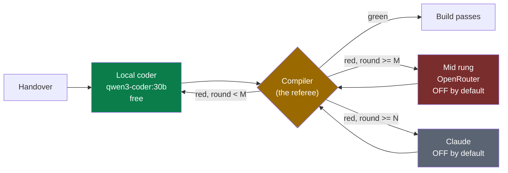
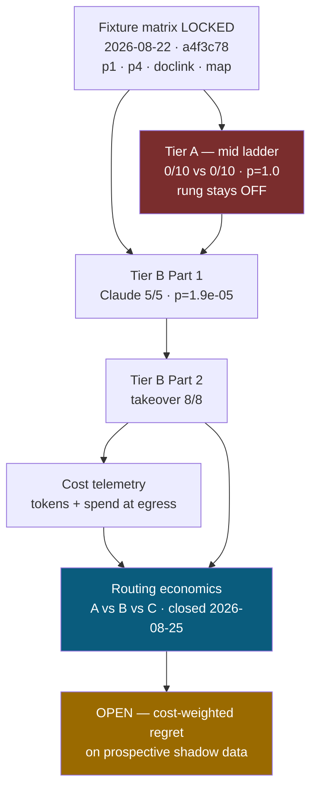

# Escalation, routing and repair behaviour — state of evidence

> What the benchmark programme has established about **when the pipeline should pay a cloud
> model to finish a build**, and — since 2026-09-01 — **how the local repair loop behaves when
> it does not**. What it has not established is marked as such. *The trigger is the
> intervention — re-running generic model capability answers nothing new.*

Two programmes now live here. They share a fixture matrix, a driver pattern and a
pre-registration discipline, but answer different questions and must not be pooled:

| programme | question | files |
|---|---|---|
| **Escalation / routing** | when to pay a cloud model | `tierb-*`, `mid-ladder-*`, `routing-economics-*` |
| **Repair behaviour** | what the local fix loop does with a broken tree | `inline-var-repair-factorial.md`, `unmask-ab-pilot-results.md` |

## Document map

| You want | Read |
|---|---|
| What is proven, in one screen | [Status of every claim](#status-of-every-claim) |
| Which rung to arm today | [Operating policy](#operating-policy) |
| Why the ladder is shaped this way | [Core constraint](#-architecture-) |
| How to run or repeat a suite | [Running a suite](#running-a-suite) |
| The traps that voided real runs | [Sharp edges](#sharp-edges) |
| A single experiment in full | The per-experiment files in [Provenance](#-provenance-) |

> 🟢 **Live.** Four escalation/routing experiments closed 2026-08-21 to 2026-08-25; repair-behaviour
> work opened 2026-09-01. The capability question is answered. The routing question is answered
> for one fixture only. Repair behaviour has one closed component-attribution result and one
> inconclusive pilot. No rule in this directory is armed in production by default.

🧭 **The one idea.** Capability and routing are different questions, and evidence for one is not
evidence for the other. Claude closes builds the local model cannot close. That fact says nothing
about whether an automatic trigger should spend money at round N, because a trigger must decide
without knowing the outcome.

## What this programme achieves

- ✅ Proves the local model has a real capability boundary, not a prompt defect — 0/82 tracked
  doclink runs against Claude 5/5, `p = 1.9e-05`.
- ✅ Proves Claude repairs the local model's own terminal trees — 8/8, within-state.
- ✅ Prices escalation. Every Claude call now records tokens and spend at the egress chokepoint.
- ✅ Gives a break-even figure for one fixture — fixed-round escalation wins above $0.56 per
  failed build.
- ✅ Rejects the cheap-cloud middle rung on the evidence, instead of on opinion.
- ✅ Records what an automatic capability trigger *would* have done, prospectively, without
  spending anything.
- ✅ Attributes a repair fix to its components — each of two interventions independently cleared
  the seeded parser cascade, so the pair-level claim was an understatement.
- ✅ Identifies what AL0151 actually is, from 46 recovered sites plus compiler probes, after an
  earlier attempt followed the model's own (wrong) explanation and failed to reproduce it.
- ❌ Does **not** establish a general routing policy. Every number below is fixture-specific.
- ❌ Does **not** settle whether the unmask decision helps or harms. The pilot was underpowered
  by design and makes no treatment-effect claim.

## Status of every claim

| Claim | Status | Evidence | Closed |
|---|---|---|---|
| Claude crosses the ABS boundary, Qwen does not | 🟢 established | [`tierb-part1-results.md`](tierb-part1-results.md) | 2026-08-23 |
| Claude repairs Qwen's stalled trees | 🟢 established | [`tierb-part2-results.md`](tierb-part2-results.md) | 2026-08-23 |
| A cheap-cloud mid rung closes stalled doclink builds | 🔴 no evidence | [`mid-ladder-tierA-results.md`](mid-ladder-tierA-results.md) | 2026-08-23 |
| Fixed-round escalation beats never escalating | 🟡 one fixture, above a cost threshold | [`routing-economics-results.md`](routing-economics-results.md) | 2026-08-25 |
| The compound capability rule is fit to drive escalation | 🟡 shadow logging only | `pipeline/capability_shadow.py` | frozen |
| Escalation is worth it, in general | ⚪ unmeasured | — | — |
| Repair prompts inherit the write phase's AL-REFERENCE grounding | 🔴 disproven | [`inline-var-repair-factorial.md`](inline-var-repair-factorial.md) | 2026-09-01 |
| Each repair intervention alone clears the seeded inline-var cascade | 🟢 established, seeded reproduction | [`inline-var-repair-factorial.md`](inline-var-repair-factorial.md) | 2026-09-01 |
| AL0151 is option syntax on a non-option receiver, not an enum fault | 🟢 established, compiler-verified | [`../al0151-investigation.md`](../al0151-investigation.md) | 2026-09-01 |
| Retaining the unmasked tree beats reverting it | ⚪ inconclusive, underpowered pilot | [`unmask-ab-pilot-results.md`](unmask-ab-pilot-results.md) | 2026-09-05 |

## Operating policy

The evidence supports three settings. All three are the defaults, so a normal build needs no
environment at all.

| Rung | Default | Change it when |
|---|---|---|
| Local coder (`CODER_BACKEND=pi`) | on | never — this is the free path |
| Claude at a fixed round (`ESCALATE_AFTER`) | **off** | a failed build costs you more than $0.56, and the work resembles doclink |
| Mid rung (`ESCALATE_MID_AFTER`) | **off** | new evidence appears — Tier A found none |
| Rule-driven escalation (`ESCALATE_ON_RULE`) | **off** | after the cost-weighted regret review, not before |

```sh
python3 pipeline/bench_ledger.py <suite-tag>     # realised spend for a suite
python3 pipeline/fixture-audit.py                # round-1 signature per fixture
```

## Design principles

1. **Register before you measure.** Every suite has an `exp-*-preregistration.md` file written
   before the driver existed. Amendments are numbered and additive. Nothing is redefined after
   the data arrives.
2. **A VOID execution is preserved, never repaired.** Four Arm C executions were voided. Their
   artefacts stay in this directory and their spend stays out of the analysis.
3. **Telemetry must not be able to change a run.** `bench_ledger.py` exposes no threshold and no
   boolean, because a cap driven by realised cost makes the stopping rule depend on an outcome.
4. **Report per fixture. Never pool.** A pooled rate hides that three of the four fixtures pass
   under every arm and only doclink discriminates.
5. **Separate the mechanisms.** Arm C failed for two independent reasons — the trigger missed
   builds, and the treatment closed 5 of 8 it did reach. One compound number hides both.
6. **The compiler is the referee.** No model grades the code, in a benchmark or in production.
7. **State the noise floor.** Two identical 10-run blocks of the frozen corpus gave residual
   medians of 7 and 3. Read every n=10 result against that.

## Lessons learned — engineering notes

**EN-1 — A validator that matches only the valid shape is blind.** Five separate defects in this
sequence shared one structure: the check proved the intended form was present, not that the
required behaviour occurred. `_OBJREF_RE` matched variable declarations rather than `extends`
targets. `event_verify._SUB_RE` matched only quoted event names, so malformed ones vanished. The
driver's backend guard was satisfied by a stale log line from an earlier run. Assert the effect.

**EN-2 — A low error count is not proximity to done.** Four of the five smallest residuals in the
frozen corpus were parse-class or unresolved-symbol states. An unparseable construct suppresses
every downstream error in its object, so a low score means *less visible*, not *nearly finished*.
Selecting the takeover corpus by minimum residual would have measured whether Claude can
transcribe syntax, not the boundary in question.

**EN-3 — An inherited shell is not a clean arm.** `.zshenv` exported `ESCALATE_AFTER`,
`ESCALATE_MID_AFTER` and `MID_MODEL` globally. A suite that only *adds* per-arm variables armed
both arms and voided 20 runs. `bench_env_contract.py` now records the launching environment, and
`bench-run-suite.sh` asserts each run's own banner against its declared arm.

**EN-4 — A null at one rung is not a null for escalation.** Tier A showed Kimi closing 0/10
stalled doclink builds. That is not evidence that escalation cannot work. It is evidence that
*that rung did not supply the missing ABS-contract knowledge*. Kimi and Qwen lacked the same
thing, and Tier B then showed Claude did not.

**EN-5 — Price the zero.** A synthesized result with zero tokens is unpriceable, not free.
Recording it as $0.00 makes an unattributable call look like a cheap one and quietly lowers every
mean cost. See `test_zero_token_result_object_is_not_priced_as_free`.

**EN-6 — A within-state comparison beats a between-group test.** Part 2 ran Claude on the eight
trees that ARE Qwen's terminal output, after Qwen had spent five fix rounds on each. Qwen 0/8,
Claude 8/8, identical bytes. No fixture or handover explanation survives that.

**EN-7 — Regret, not accuracy, decides a trigger.** The frozen capability rule reaches recall of
0.73 to 0.98 on held-out data and removes about 63% of the false fires you get by always
escalating. It still fires on 34% to 40% of builds that end as narrow stalls. Accuracy cannot
settle whether that is acceptable. Only the cost of a wrong fire against the rounds it saves can.

**EN-8 — Pre-register the endpoint against the stage the treatment acts on.** A 5+5 doclink A/B
measured AL0104 cascade *occurrence* while the fix it tested lived entirely in the repair path —
the write phase was byte-identical across arms, so the treatment could not move an occurrence
rate at any sample size. The targeted defect then occurred 0/10 and the suite tested nothing.
That is a failed **endpoint/design** test, not a failed treatment test, and pre-registration is
what made the difference visible rather than hideable. Where the target condition is too rare to
arise on its own, seed it: the seeded probe was the only design that could reach the mechanism.

**EN-9 — A harness bug that announces itself is worth more than one that does not.** The unmask
pilot's first dispatch died in 2s per run on a missing handover path rewrite. Sitting behind it,
undetected, was a second bug that copied the fixture's `src/` into every run directory. The loud
bug produced twelve obviously-void runs; the quiet one would have produced twelve *plausible*
runs — full logs, real scores, sensible trajectories — every one handed a finished tree. Only
the loud failure forced the inspection that found the silent one. When reimplementing something
an existing driver already does, read its comments first: `run_one`'s path-rewrite comment exists
because that exact bug had already cost a previous session its write budget.

---

# ═══ Architecture ═══

## Core constraint

The local model is free and slow. The cloud model is capable and billed per token. The pipeline
must decide, **at round N and without knowing the outcome**, whether this build will ever close
locally. Every experiment in this directory exists because that decision had no evidence behind
it.

The decision is hard for a specific reason: the two outcomes it separates look identical at the
moment of the decision. A build that needs four more local rounds and a build that will never
close both present as "still failing at round 2".

## Capability comparison — the rungs

| Rung | Cost | Closes doclink | Closes stalled trees | Evidence |
|---|---|---|---|---|
| `qwen3-coder:30b` local | free | ❌ 0/82 | ❌ 0/8 | frozen corpus |
| Kimi K2 via OpenRouter | cheap, billed | ❌ 0/10 | — | Tier A |
| Claude, as coder | billed | ✅ 5/5 | — | Tier B Part 1 |
| Claude, as repairer | billed | — | ✅ 8/8 | Tier B Part 2 |

Three of the four bench fixtures do not discriminate between these rungs at all. `p1`, `p4` and
`map` pass under every arm. Read the doclink row.

## Figure 1 — the ladder, and what each rung is proven to do



*Figure 1 — Both cloud rungs are disarmed unless you set `ESCALATE_MID_AFTER` or
`ESCALATE_AFTER`. The mid rung is red because Tier A measured it at 0/10 on the one fixture that
discriminates.*

## Figure 2 — how the four experiments depend on each other



*Figure 2 — Tier B made the routing question worth asking. The routing result then reopened the
trigger question, which is the only one still live.*

## The routing result in one table

Doclink only, n=10 per arm. `lambda` is the operational cost of one failed build.

| arm | policy | closure | mean $/run | preferred |
|---|---|---|---|---|
| A | never escalate | 0.00 | 0.00000 | lambda below $0.5585 |
| B | escalate at a fixed round | 0.80 | 0.44684 | lambda above $0.5585 |
| C | escalate when the frozen rule fires | 0.50 | 0.60788 | never |

B beats C at every lambda, because `L_C - L_B = 0.3*lambda + 0.16104`. C decomposes into a
trigger that missed 2 of 10 builds and a treatment that closed 5 of the 8 it reached. Those are
different defects and need different fixes.

---

# ═══ Implementation reference ═══

## Running a suite

**NOTE:** a suite spends real money once an arm declares `ESCALATE_AFTER` or
`ESCALATE_MID_AFTER`. The allocation bounds the exposure, not the ledger.

1. Write the pre-registration file first. Declare the arms, the allocation and the primary
   outcome.
2. Print the launching environment. `bench_env_contract.py` records what the shell already
   exports.
3. Run the suite. `bench-run-suite.sh` clears the derived variables per run and asserts each
   run's banner against its arm.
4. Read the ledger with `python3 pipeline/bench_ledger.py <tag>`.
5. Write the results file. Report per fixture. Do not pool.

## Cost telemetry

Every Claude call goes through one chokepoint, so usage cannot be missed. `claude_egress.py`
parses the CLI JSON result and accumulates input tokens, output tokens, cache-read tokens and
`total_cost_usd`. A call it cannot attribute is counted in `claude_calls_missing_usage` and is
never priced as free. Set `CLAUDE_USAGE_STRICT=1` to make an unattributable call a hard failure
(`claude_egress.py:122`).

`bench_ledger.py` reads those metrics rows and appends a suite total. It exposes no threshold,
no predicate and no boolean, because there must be nothing here for a driver to branch on
(`bench_ledger.py:28`).

## The frozen capability rule

`capability_shadow.py` observes every fix round and records the round at which a compound
capability-boundary rule would have fired. It changes nothing. Its parameters are deliberately
not tunable by environment variable, because re-tuning against the existing 121 traces while
prospective data accumulates destroys the one property that makes the new data worth collecting.

The log lives at `CAPABILITY_SHADOW_LOG` (`capability_shadow.py:89`). Rows record `fire_round`,
`terminal_class`, `recovered_after_fire`, `rounds_after_fire` and `rounds_saved`. Cost weighting
is applied at review time, not at write time.

`ESCALATE_ON_RULE=1` makes the rule actionable. It exists for Arm C and is off by default
(`run-build.py:319`). Rows produced while acting carry `acted=true`, so a rule that changed the
outcome never pools with a rule that watched it.

## Sharp edges

**A rule fingerprint that omits the predicate.** *What happened:* a threshold change would have
produced shadow rows indistinguishable from the previous rule. *Why:* the fingerprint covered
parameters only. *Avoid:* the fingerprint now covers thresholds **and** predicate.
Guard: `test_rule_fingerprint_covers_thresholds_and_predicate`.

**Arm C passed its own assertions while delivering nothing.** *What happened:* four consecutive
Arm C executions were void. The worst case asserted policy *labels* while the treatment was
suppressed. *Why:* the code tested `allowed("anthropic")`, which is deliberately False at rest
under `enterprise-anon` — Anthropic is armed only inside the scrub context. *Avoid:* use
`escalation_available()`, the same predicate the `ESCALATE_AFTER` path uses. Guard: the
behavioural invariant added in `f534b65`.

**The escalated child re-entered the pipeline.** *What happened:* a recursive pipeline invocation
by the escalated child produced $0.9476 of spend that belonged to no cell. *Why:* the child
inherited the escalation variables. *Avoid:* `PIPELINE_NO_BENCH=1` forces `ESCALATE_AFTER=None`
and `ESCALATE_ON_RULE=False` in the child (`run-build.py:320`), and `claude_egress` strips the
variables before the call (`claude_egress.py:139`). The $0.9476 stays unassigned.

**Fixture cleanup destroyed the per-run git repository.** *What happened:* the map fixture
cleanup removed `.git`, which broke provenance and voided the execution. *Avoid:* cleanup now
preserves the repository (`projects` commit `3240e31`).

**The scrub mirror trusted an ancestor repository.** *What happened:* `git` discovery walked up
from the mirror and found an ancestor repo, so an anonymisation step could operate on the wrong
tree. *Why:* `git rev-parse` succeeds from any descendant directory. *Avoid:* the mirror now
fails closed. Guards: `test_mirror_refuses_when_git_discovers_an_ancestor` and
`test_autocommit_refuses_to_commit_an_ancestor_repo`.

**A suite total read as a verdict.** *What happened:* a spend cap was proposed as a safety
feature. *Why:* it looks like a guard. *Avoid:* a guard that prevents an INVALID measurement is
legitimate. A guard that selectively stops expensive VALID measurements changes the experiment,
because the expensive cells consume the budget first and later observations go selectively
missing. Guard: `test_ledger_totals_are_descriptive_not_a_verdict`.

## What this directory is *not*

- Not a model leaderboard. See [`build-leaderboard.md`](../build-leaderboard.md), which is
  generated from all builds and answers a different question.
- Not a production configuration. Nothing here is armed by default.
- Not transferable to another workload. Doclink is one fixture, chosen because it discriminates.

---

# ═══ Maintenance ═══

| Trigger | What to check |
|---|---|
| A fixture changes | The matrix is LOCKED. A content change invalidates every baseline that cites the old `fixture_commit`. Freeze a new revision instead. |
| The local coder model changes | Every closure rate here is conditioned on `qwen3-coder:30b`. Re-measure before citing any of them. |
| The Claude CLI changes its JSON result | `claude_egress` usage capture is parsed from that shape. Guard: `test_usage_is_captured_from_a_json_result`. |
| Anyone proposes tuning the capability rule | It is frozen. Re-tuning needs a new pre-registration and a fresh evaluation, or the prospective shadow data loses its meaning. |
| Shadow data reaches a reviewable size | Run the pre-registered three-question protocol in `capability_shadow.py`: safety, usefulness, economics. Do not collapse them into one accuracy number. |

---

# ═══ Provenance ═══

| File | What it is |
|---|---|
| `exp-tierb-claude-preregistration.md` | Tier B registration (in `reference/`) |
| `exp-mid-ladder-preregistration.md` | Mid-rung registration (in `reference/`) |
| `exp-routing-economics-preregistration.md` + Amendments 1-6 | Routing registration (in `reference/`) |
| `tierb-part1-results.md`, `tierb-part2-results.md` | Claude capability, both directions |
| `tierb-part2-corpus-manifest.md` | The frozen eight states, sha256 `c85ebfe368194755…` |
| `mid-ladder-tierA-results.md` | The mid-rung null |
| `routing-economics-results.md`, `routing-economics-launch-record.md` | The routing result and its launch SHA transition |
| `larry-escalation-evidence.md` | The three-claim separation that set up the routing work |
| `doclink-frozen-corpus.md`, `doclink-clean-phase2.md`, `doclink-clean-phase3b.md` | How the discriminating fixture was cleaned and frozen |
| `inline-var-repair-factorial.md` + `seeded-2x2/` | Component attribution for the `7784470` repair fix — each intervention individually sufficient; includes the destroyed-artifact account |
| `unmask-ab-pilot-results.md` + `unmask-ab-pilot/` | Unmask retain-vs-revert pilot — underpowered, no treatment-effect claim; includes the void harness batch |
| `routecon{3,4,5}-armC-void/`, `routecon-b2454b2-failed/` | Voided executions, preserved intact |
| `claude-usage-schema.md` | The usage row schema (in `reference/`) |
| `*.log` | Raw suite summaries |

New in this programme: the pre-registration and amendment discipline, the egress-chokepoint cost
capture, the arm-isolation assertions, and the prospective shadow log. Reused: the existing
fixture matrix, `bench-run-suite.sh`, and the compiler referee.
