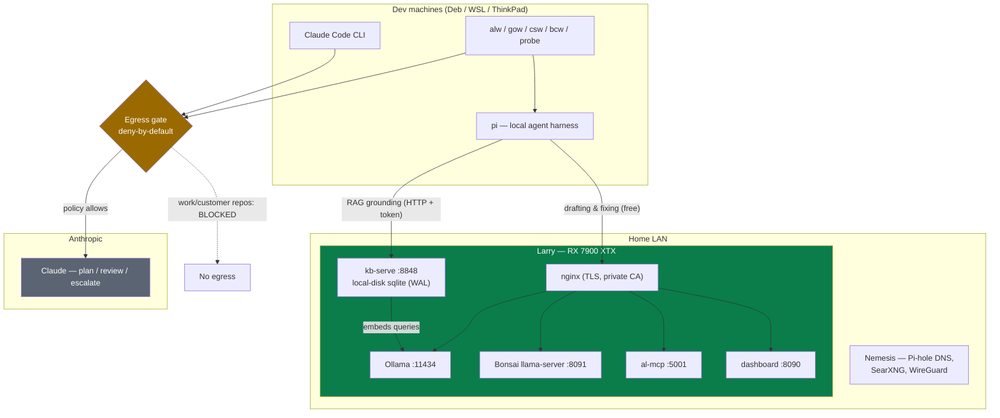
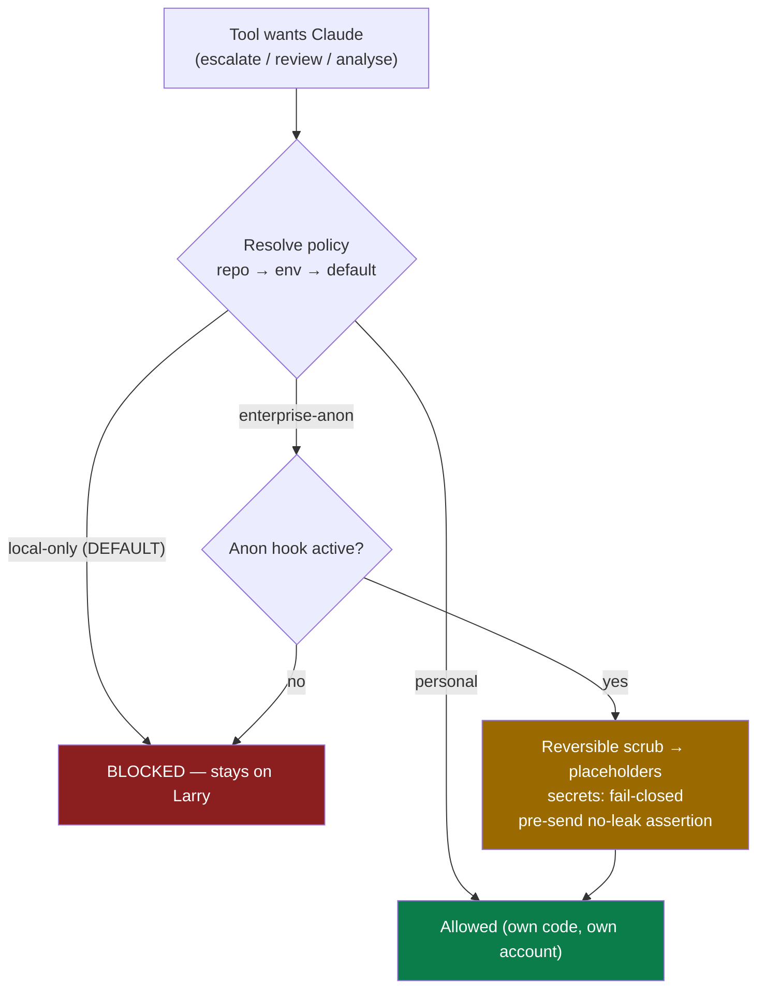
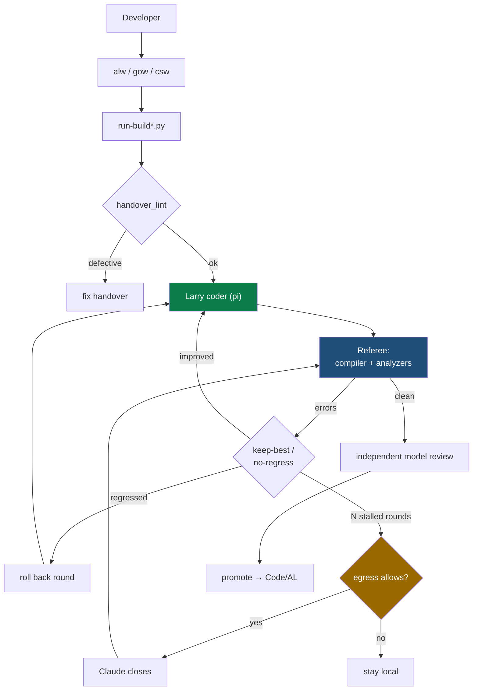
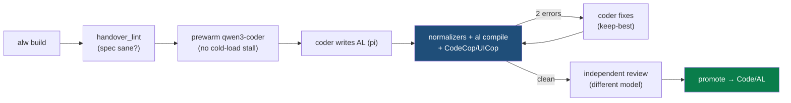

# Larry — AI Inference Tower

> Internal engineering handbook for the self-hosted GPU inference server
> ("Larry") and the AL/Go/C# coding pipeline built on top of it.
> **Reference** (architecture, services, policy) is the body; **runbook**
> (install commands, troubleshooting) lives in the appendices.
>
> Source of truth for infra: `/mnt/rojaws/localDev/setup/` (git, private remote
> `drs76/larry-setup`).

---

> ## 🧭 The one idea
> **The compiler is the referee.** No LLM grades code — the real toolchain
> (compiler + analyzers + tests) is the single source of truth for correctness.
> Everything else (local-first inference, the egress gate, keep-best fix loops)
> exists to feed that referee cheaply, privately, and repeatably.

## Document map

| You want | Read |
|---|---|
| Is it working, and what is broken | [Current status](#current-status) |
| Why it is shaped this way | [Design principles](#design-principles) · [Architecture](#architecture) |
| What runs where, and on which port | [Services](#services) |
| Whether code can reach Anthropic | [Security — the egress gate](#security--the-egress-gate) |
| Which model handles what | [Model routing](#model-routing) · [The coding pipeline](#the-coding-pipeline) |
| One concrete end-to-end run | [A typical build](#a-typical-build) |
| The traps that cost time | [Lessons learned](#lessons-learned--engineering-notes) |
| How to rebuild or fix the box | Appendices A-E (runbook) |

---

# ═══ Overview ═══

## Current status

Live state verified 2026-08-28 against the tower itself, not from memory.

| Component | State | Note |
|---|---|---|
| Ollama inference (LAN/HTTPS) | 🟢 live | primary workload |
| Coding pipeline (`alw`/`gow`/`csw`) | 🟢 live | proven end-to-end, 3 languages |
| Egress gate + anonymisation | 🟢 live | enterprise account live 2026-07-06 |
| Maintenance dashboard | 🟢 live | `https://larry.home.arpa/dash` |
| KB hybrid-search serve | 🟢 live | `kb serve :8848`, local-disk sqlite; hosts the RAG index (moved off Deb 2026-08-06) |
| Bonsai chat brain | 🟡 experimental | chat/light-Q&A only; Q2 quant unreliable for code |
| `ornith:35b` coder | 🔴 broken | ROCm cold-load hang; do not use |
| LibreChat web UI | ⚪ retired | pipeline moved off it; container in `setup/archive/`. Two nginx configs (`librechat.conf`, `librechat-admin.conf`) are still in `conf.d` — harmless, nothing listens behind them |
| al-mcp shared server | 🟠 loopback-only | enabled and listening on `127.0.0.1:5001`, but `:5003` is **not** open in firewalld, so no client can reach it. Nothing needs it — builds spawn a project-scoped server per run (see Services) |
| pi 0.81 provider migration | 🟠 pending | done on Deb (0.81); **Larry itself is still 0.80.2**; outstanding on some thin clients |
| pi stream wedge (long agentic runs) | 🟠 open bug | keep pi missions small; escalate big ones |

---

## Design principles

The implementation choices downstream fall out of these:

1. **Local-first; cloud only when justified.** Larry does all routine work for
   free on the LAN; Claude is bought deliberately for planning and the last 10 %.
2. **The compiler and tests are the source of truth.** No LLM grades code — the
   real toolchain (compiler + analyzers) is the referee.
3. **Builds must be reproducible from git.** Infra, pipeline, prompts, knowledge
   and runbooks are all versioned.
4. **Infrastructure is declarative and version-controlled.** Canonical configs
   live in the setup repo; machines symlink them into place (no copy drift).
5. **Security defaults to no egress.** Deny-by-default per repository; secrets
   fail closed.
6. **Optimise for unattended iterative development.** Keep-best/no-regress fix
   loops, escalation only after N stalled rounds, model pre-warm.
7. **Human review remains the final gate for production changes.**

---

## Platform versions

**Architecture-relevant** (a change here can change how the system behaves):

Verified against the live tower 2026-08-28.

| Component | Version |
|---|---|
| OS | Rocky Linux 10.2 "Red Quartz" (minimal, headless), kernel 6.12.0-211.26.1.el10_2 |
| GPU | AMD Radeon RX 7900 XTX 24 GB (gfx1100) |
| ROCm | 7.2.3 (built on 6.3; drifted upward) |
| Ollama | 0.33.2 (upgraded 2026-08-31; was pinned 0.31.1 — see `exp-ollama-0332-upgrade-validation.md`) |
| pi (on Larry) | 0.80.2 |
| System RAM | 16 GB |

**pi is a per-machine version, not a tower one.** Larry runs 0.80.2; deb runs 0.81 with the
migrated provider form. The 0.81 migration is a client-side task and is still outstanding on
some thin clients — see the status table and the Lessons Learned note.

**Deployment details** (packaging, no architectural meaning — expect these to
drift with the distro and don't treat them as contracts): nginx = distro package
(TLS terminator); Python = system `python3` (pipeline scripts); systemd unit
files per service. If Rocky 11 renames or repackages these, nothing in the
architecture above changes.

---

## Glossary

Project-specific terms used throughout:

| Term | Meaning |
|---|---|
| **pi** | A lightweight local **agent harness** (terminal cockpit) that drives Larry's models with read/write/shell tools. The thing that actually edits files during a build. |
| **handover** | The build brief handed to the coder — a structured markdown doc (from `/handover` or `/spec`) describing what to build, grounded in the reference/knowledge. `alw new` scaffolds one. |
| **referee** | The **deterministic** correctness authority: the real compiler + analyzers (+ tests). Never a model. A build passes only when the referee says so. |
| **keep-best / no-regress** | Each fix round is scored; a round that makes things worse is rolled back automatically, so a build never regresses. |
| **escalation** | Handing a stalled build to Claude after **N** local rounds — only if the egress gate allows it. |
| **promote** | Ship a passing prototype from the working area to the canonical tree (`Code/AL`). The `promote` verb. |
| **egress gate** | The deny-by-default policy check every Claude-bound call funnels through (`anon`/`egress_policy.py`). |
| **al-mcp** | The AL MCP server on Larry that downloads BC symbols (`al_downloadsymbols`) for the pipeline. |
| **RAG injection** | Grounding the coder by pre-fetching relevant AL reference/source and injecting it into the prompt (the coder can't tool-call for it). |
| **AL Knowledge** | The curated reference corpus (`AL-REFERENCE` + `AL-KNOWLEDGE`, split into topic files) read by handovers and injected into builds. |
| **Bonsai** | The experimental ternary-quantised chat model wired as pi's chat brain — separate from the build coder (see Services). |
| **bcw** | CLI to **analyse** a customer BC extension → wiki + performance docs (not codegen; Larry-first, egress-gated). |
| **probe** | Read-only local investigation session over any repo — entirely on Larry, no egress. |
| **warplan** | The hardest planning tier: Claude simulates a hard build on paper once (moves → failures → counters, abort conditions) → a local blueprint a free model then executes repeatedly. |
| **`alw` / `gow` / `csw`** | The per-language workflow CLIs (AL / Go / C#). Same verbs, different referee. |

---

# ═══ Architecture ═══

## Architecture

Larry is a headless GPU box on the home LAN running open-source coder/reasoning
models via Ollama, served over TLS to every dev machine. It does the bulk of the
work; **Claude (Anthropic)** is invoked sparingly and only through a
deny-by-default egress gate.



*Figure 1 — System architecture: dev machines → Larry (local, via TLS) → the egress gate → Claude.*

### Network machines

| Name | Role |
|---|---|
| **Larry** | Rocky Linux 10, RX 7900 XTX — Ollama + ROCm + nginx, inference tower |
| **Nemesis** | Proxmox NUC — Pi-hole (DNS), SearXNG/Navidrome/WireGuard LXCs, dev/BC VMs |
| **Deb** | Primary Linux dev workstation — local CA origin, AL/BC dev |
| **Thin clients** | WSL2 Debian (corp laptop), ThinkPad roamer — Larry clients, no local GPU |

- IP `192.168.0.173` (moved house 2026-06; was `192.168.1.183`).
- Root ops use **`doas`** (non-interactive over SSH), not sudo.

### What Larry is *not*

Deliberate boundaries — these keep the architecture honest:

- **Not a store of customer data.** Customer/work code stays `local-only`; NDA
  material runs on Larry but is never egressed (see the egress gate).
- **Not a CI/build server.** It runs inference; the *referee* (compiler/tests)
  runs on the dev box / client. Larry drafts and fixes, it does not gate merges.
- **Not a replacement for compiler validation.** Models never grade code; a build
  passes only when the real toolchain says so.
- **Not a multi-model host.** 24 GB VRAM = one large model resident at a time;
  Bonsai and the coder **time-share**, they don't co-reside.
- **Not internet-exposed.** Raw Ollama (`:11434`) is LAN-only; all access is via
  the nginx TLS proxy, and off-LAN reach is WireGuard-only.

---

# ═══ Implementation reference ═══

## Services

| Service | Endpoint | Backing |
|---|---|---|
| Ollama API (HTTP) | `http://larry:11434` | native, LAN-only |
| Ollama API (HTTPS) | `https://larry.home.arpa:11443` | nginx → `:11434` (`nginx-larry.conf`) |
| al-mcp (SSE) | `https://larry.home.arpa:5003/sse` — **not reachable from a client**, see below | nginx → `127.0.0.1:5001` (`nginx-almcp-proxy.conf`) |
| Maintenance dashboard | `https://larry.home.arpa/dash` | nginx → `127.0.0.1:8090`, basic-auth |
| Bonsai chat | `https://larry.home.arpa:8444/v1` | nginx → `127.0.0.1:8091` |
| KB hybrid-search | `http://larry.home.arpa:8848` | `kb serve` (user unit), token-gated; DB local disk, WAL |
| SSH | `dav@larry` | doas for root |

- **KB hybrid-search** (`kb-serve.service`, user systemd + linger): serves the
  BM25+vector RAG index to every client over HTTP (`KB_REMOTE`→`:8848`, bearer
  token in `serve.env`). The sqlite store lives on **Larry local disk**
  (`~/.local/share/kb/kb.db`, WAL) and embeds queries against local Ollama
  (`:11434`) — no proxy hop. Nightly `kb-refresh.timer` (03:30) re-indexes changed
  corpora idempotently. Port `8848/tcp` opened in firewalld. See EN-8 below and
  `pipeline/KB-SEARCH.md`.

- **al-mcp is effectively loopback-only, and nothing depends on the LAN endpoint.** The
  service is enabled and listening (`127.0.0.1:5001`, nginx on `:5003`), but **5003 is not
  open in firewalld** — the open set is `3443, 3444, 8444, 8848, 11443` — so a client gets
  "no route to host". Nothing needs it: `run-build.py` spawns a **project-scoped** al-mcp on
  a random free port for each symbol download, because the shared one resolves
  `al_downloadsymbols` to its first project and fetches the wrong BC version
  (`RUN-BUILD.md`, SE-3). Treat the row above as an internal detail, not a client endpoint.
  Verified 2026-08-28.

- **Model storage**: `$HOME/ollama-models` (`OLLAMA_MODELS` in systemd
  override; the home dir needs `o+x` for the ollama user). Non-Ollama models
  (Bonsai) on NVMe `/mnt/models`.
- **Ollama keepalive**: `OLLAMA_KEEP_ALIVE=2h` drop-in keeps a model resident
  across a whole build.
- **NFS**: mounts the NAS (`192.168.0.175:/mnt/storage5/data`) at `/mnt/rojaws`
  with robust systemd-automount options (Appendix C). Root-squash → privileged
  deploys stage via `/tmp`, services run from local `/opt`.

### Maintenance dashboard

Flask app (`setup/dashboard/`), deployed to local `/opt/larry-dashboard/`,
systemd `larry-dashboard.service`, binds `127.0.0.1:8090`, nginx basic-auth.
Six tabs: **Maintenance** (Ollama status/version/models, update, restart, nginx
reload — privileged via passwordless doas; long ops = polled background jobs) ·
**Builds** (alw/gow/csw over ssh to `$BUILD_BOX`, streamed) · **Nomad** (docker
control for the self-hosted stack) · **Logs** (journalctl) · **AL Knowledge** ·
**Docs**.

### Bonsai — the chat brain (experimental)

`Ternary-Bonsai-27B` (Qwen3.6-27B post-compressed to ternary weights, GGUF
`Q2_0`, ~1.71 bpw) wired as pi's **chat** brain, distinct from the build coder.

- **Time-share, not co-resident** (Lessons Learned): 27B ≈ 9.55 GB + coder 18 GB
  > 24 GB. One big model hot at a time. Build pipelines call `bonsai off` before
  loading the coder so a build never OOMs against chat.
- GPU-accelerated on ROCm 7.2.3/gfx1100 via the Bonsai-demo fork llama-server
  (~52 tok/s). systemd `bonsai-llama.service` (on-demand), `bonsai-idle.timer`
  frees VRAM after 15-min idle. Control: `/usr/local/bin/bonsai {on|off|status}`
  or the dashboard API.
- **Chat/light-Q&A only** — the Q2 quant hallucinates AL APIs and can degenerate
  into repeating loops. Route AL/code to `qwen3-coder`/`al-rag`/Claude.

---

## Security — the egress gate

Every path that could send code to Anthropic funnels through **one** policy check
(`tooling/anon` → `pipeline/egress_policy.py`), resolved **per repository**
(`repo .anon/config.yml → env → default`).



*Figure 2 — The egress gate: per-repo policy resolution, deny-by-default.*

| Property | How |
|---|---|
| **Deny-by-default** | No config = `local-only` = no egress; escalation silently disarms. |
| **Per-repo** | A work repo is `local-only` while a personal repo on the same box is `personal`. |
| **Secrets fail closed** | A high-confidence credential aborts any send, even when policy allows it. |

**Anonymisation hook** (for an approved enterprise account, no-training /
zero-retention): (1) **reversible token substitution** — declared tokens + auto
GUIDs/user-paths → stable placeholders (`ANON_NAME_001`); `reverse(forward(x))==x`
is a property test. (2) **secret gate** — one-way, fail-closed: keys/tokens/JWTs/
connection-string passwords → inert dummy, never restored; high-confidence hit
aborts. (3) **pre-send no-leak assertion** — outgoing content re-scanned for every
known token + live secret pattern; anything found = hard abort. (4) **agentic
mode** — the AI works in a scrubbed mirror; its diff is reverse-mapped back.

> **Honest scope**: substitution protects *identifiers*; the **structure and
> business logic still leaves the machine** — governed by the enterprise
> contract, not this tool. Until such an account exists, work code stays
> `local-only` (nothing leaves).

---

## Model routing

Larry runs 14–35B models. The routing rule: **route by project size, not by
tuning** (Lessons Learned).

| Model | Role | VRAM |
|---|---|---|
| **`qwen3-coder:30b`** | **pipeline DEFAULT** — fast (~80 tok/s), only local model that scales to large multi-file projects | 18 GB |
| `al-coder-qwen36` | most **reliable** on small/medium AL (9/9 vs 5/10) but collapses at write-phase on large projects | 17 GB |
| `al-coder-qwen3` | interactive AL (`alcode`) — never in the pipeline (double-prompts) | 18 GB |
| `qwen3.6:27b` | AL/BC + general base | 17 GB |
| `qwen2.5-coder:32b` | code incl. FIM/completions | 19 GB |
| `deepseek-r1:14b` / `gpt-oss:20b` | reasoning | 9 / 13 GB |
| `gemma4:26b` | vision | 17 GB |
| `phi4:14b`, `llama3.1:8b`, `mxbai-embed-large` | reasoning / fast / embeddings | — |

- **`al-coder-*` = a Modelfile `SYSTEM` wrap, not a fine-tune.** A baked SYSTEM
  is **inert** when a harness sends its own system message → put AL rules in the
  handover/AGENTS.md.
- **Cold-load mitigations**: Ollama `OLLAMA_KEEP_ALIVE=2h` + `run-build`'s
  `prewarm_coder()` (pings the coder over nginx with `keep_alive` before the
  write phase, fail-open).
- **Transport**: pipeline always uses the nginx HTTPS proxy
  `https://larry.home.arpa:11443/v1`; native `:11434` is not exposed to dev
  boxes. `~/.pi/ollama-provider.ts` is per-machine (baseUrl differs), not
  git-tracked.

---

## The coding pipeline

One shape across AL / Go / C#: **interview → handover → build loop → review →
promote**. Full lifecycle: `setup/pipeline/PROJECT-LIFECYCLE.md`.



*Figure 3 — Build fix-loop: referee-gated, keep-best, escalate only after N stalled rounds.*

### CLIs (git-tracked in `setup/tooling/`, symlinked into `~/.local/bin`)

| CLI | Language | Referee |
|---|---|---|
| `alw` | AL / Business Central | `al compile` + CodeCop/UICop/PerTenantExtensionCop |
| `gow` | Go | `go build` + `vet` + `test` |
| `csw` | C# / Azure Functions | `dotnet build` + format gate + `test` |

Verbs: `route` · `new` · `build [N]` (escalate after N stalled rounds) ·
`promote` · `edit` (deterministic FIND/REPLACE + pi, git-diff gated) · `--review`.

### Design points

- **Referee is deterministic** — a build can't pass with e.g. a missing
  permission set.
- **`handover_lint`** runs first — catches fixture/spec defects before a build is
  spent (`LINT=0` bypass).
- **Curated knowledge injection** — BCQuality + a custom house-style layer
  auto-injected into every coder prompt, cited by reviewers.
- **Coder backend pluggable** — `CODER_BACKEND=pi` (local, free) or `claude`
  (Pro-sub quota).
- **AL specifics** — symbols via al-mcp (`al_downloadsymbols globalSourcesOnly`,
  no auth); deterministic normalizers (using-placement, string-prop quoting,
  canonical `app.json`); AL-REFERENCE topic injection + optional RAG.

### Planning tiers

| Tier | When | Output |
|---|---|---|
| `/handover` | simple, known shape | light interview → build brief |
| `/spec` | needs a spec | SPEC + agile tasks + brief |
| `/warplan` | hard / risky | pre-simulated moves (action → failure → counter), abort conditions, open-question ledger — Claude plans **once**, a local model executes the blueprint repeatedly |

Alongside builds: `bcw analyse` (customer BC extension → wiki + perf docs,
Larry-first, egress-gated) · `probe` (read-only local investigation) · `/al`
(compiler-grounded BC/AL Q&A) · `/bc-agent` (BC AI-agent discovery workbook).

---

## A typical build

What `alw build` actually does, end to end — the concepts above made concrete:



*Figure 4 — A typical build, end to end.*

1. **`alw build myproj`** — the developer kicks it off.
2. **`handover_lint`** checks the handover/spec isn't defective before a build is
   spent on it (`LINT=0` to bypass).
3. **Pre-warm** — `prewarm_coder()` pings `qwen3-coder:30b` over the nginx
   endpoint with `keep_alive` so a cold NVMe load doesn't eat the write timeout.
4. **Write** — pi drives the coder to write the AL files, with AL-REFERENCE topics
   (and optional RAG) and the BCQuality rule library injected into the prompt.
5. **Referee** — deterministic normalizers fix mechanical mistakes, then
   `al compile` + CodeCop/UICop/PerTenantExtensionCop runs. Say it returns **2
   errors**.
6. **Fix loop** — the coder fixes; the round is scored; if it regressed it's
   rolled back. Repeat until the referee is **clean** (or N rounds stall → offer
   escalation to Claude, gated).
7. **Review** — a *different* model reviews behaviour vs intent and the rule
   library, citing findings.
8. **`alw promote`** — ship it to `Code/AL`.

The whole loop is free and private; Claude only enters at step 6, only after a
stall, and only if policy allows.

---

## Build reproduction

Canonical tool copies live in `setup/tooling/`; each machine **symlinks** them
(no copy drift). See Appendix E for the relink commands. Runbooks in
`setup/tower/`: `wsl-setup.md` (WSL2 thin client) · `windows-setup.md` (native
Windows client) · `coop-setup.md` (standalone C# box with its own GPU) ·
`thinkpad-setup.md` (roaming thin client).

Off-LAN reach via **WireGuard** (server = Navidrome LXC 108 on Nemesis,
`10.9.0.0/24`, `duckdns:51820`) so thin clients keep the same `larry.home.arpa`
endpoints on the road. The memory dir is git-synced across clients
(`drs76/claude-memory-localdev`) via SessionStart-pull + Stop-push hooks.

---

# ═══ Maintenance ═══

## Lessons learned — engineering notes

Numbered so the sections above can cite them (e.g. "see EN-1").

**EN-1 · Why AL-tuning the coder was abandoned.** QLoRA hallucinates APIs; a Modelfile
`SYSTEM` wrap benched 3/12, *worse* than base qwen3-coder's 5/10. The handover
already injects AL context per project, so a baked SYSTEM double-prompts. Conclusion:
**route by project size, not by tuning** (qwen36 small/medium, qwen3-coder large).

**EN-2 · Why SYSTEM prompts aren't enough.** A baked Modelfile SYSTEM is inert the moment
an agent/harness sends its own system message. AL rules belong in the handover /
AGENTS.md, not (only) the model.

**EN-3 · Why `ornith:35b` isn't used.** llama-server allocates the ~20 GB buffer then
never becomes ready inside Ollama's ~5-min load timeout — an ornith-specific init
hang on this ROCm setup (not disk, not RAM, not general Ollama; qwen loads fine).

**EN-4 · Why `devstral` isn't used.** Loads fine but is incompatible with pi's write
harness — its tool-call format (Continue.dev/Mistral) means it writes 0 files.
Passing an agentic benchmark ≠ working in this harness; pi tool-call compat is the
gate.

**EN-5 · Why Bonsai time-shares instead of staying co-resident.** 27B (9.55 GB) + coder
(18 GB) > 24 GB VRAM — can't both be hot. So one big model at a time, VRAM handed
back on idle.

**EN-6 · Why model pre-warm is an explicit design concern.** Cold-load from NVMe eats the
write timeout; keepalive + `prewarm_coder()` keep a model resident across a build.

**EN-7 · pi 0.81 provider regression.** pi 0.81 broke tool-calling for the legacy
extension provider form (tool calls leaked as text). Fix = migrate to
`createProvider(openAICompletionsApi())`. Done on Deb; pending on some thin
clients.

**EN-8 · Why the KB sqlite store must live on the serving host's local disk (not
NFS).** *What happened:* the RAG index (`kb.db`, 788 MB) sat on the NFS mount
(`/mnt/rojaws/.../.kb-index/kb.db`) with `journal_mode=delete`; a `kb index` write
(the nightly refresh, or an ad-hoc reindex) racing the live `kb-serve` reader
corrupted the `chunks` B-tree — `PRAGMA integrity_check` returned hundreds of
`unable to get the page … error code=8458`, every query then `database disk image
is malformed` (2026-08-06). *Why:* SQLite's locking is unreliable over NFS, and a
concurrent reader+writer on a rollback-journal DB there can shear pages; the
network share bought nothing because clients query over HTTP (`kb serve`), never
the file. *How to avoid:* the DB lives on the **serving host's local disk**
(`~/.local/share/kb/kb.db`) in **WAL** mode (`db()` sets `journal_mode=WAL` +
`busy_timeout=30000`, `kb_core.py`), so serve (reader) and refresh (writer)
coexist safely; clients share it only via `kb serve` over HTTP. *Regression
guard:* `KB_DB` must resolve to a local path — a `/mnt/` (NFS) value is the defect
to catch in review; the WAL pragma is inert-to-harmful on NFS, so the two
constraints travel together.

---

# ═══ Runbook (appendices) ═══

## Appendix A — Rocky Linux 10 install

- Minimal ISO, no GUI, SSH enabled from install.
- **SELinux → permissive** (blocks Ollama otherwise):
  ```bash
  doas setenforce 0
  doas sed -i 's/^SELINUX=enforcing/SELINUX=permissive/' /etc/selinux/config
  ```

## Appendix B — ROCm + AMD driver

Hard-won gotchas:

1. **`kernel-modules-extra` is required** — minimal install skips it; without it
   the in-kernel `amdgpu` module is missing entirely.
2. **`python3-wheel`** (needed by `amd-smi-lib`) lives in the **CRB** repo —
   enable CRB first.
3. **The AMD DKMS `amdgpu` module breaks on Rocky 10** (missing CEC symbols) —
   remove it (`dkms remove`) and use the **in-kernel** amdgpu from
   `kernel-modules-extra`.
4. **Secure Boot must be OFF** — blocks the unsigned AMD kernel module.

```bash
doas dnf install -y kernel-headers kernel-devel kernel-modules-extra gcc make git curl wget epel-release
doas dnf install -y https://repo.radeon.com/amdgpu-install/6.3/el/10/amdgpu-install-6.3.60300-1.el10.noarch.rpm
doas dnf config-manager --enable crb
doas dnf install -y python3-wheel
doas amdgpu-install --usecase=rocm      # in-kernel amdgpu, NOT the DKMS build
doas usermod -aG render,video $USER
doas reboot
rocm-smi   # verify: RX 7900 XTX, 24GB
```

Ollama systemd override:
```ini
[Service]
Environment="OLLAMA_HOST=0.0.0.0:11434"
Environment="OLLAMA_MODELS=/home/<user>/ollama-models"
Environment="OLLAMA_KEEP_ALIVE=2h"
# Environment="HSA_OVERRIDE_GFX_VERSION=11.0.0"   # only if GPU not detected
```

Firewall (firewalld):
```bash
doas firewall-cmd --permanent --add-service=ssh
doas firewall-cmd --permanent --add-rich-rule='rule family="ipv4" source address="192.168.0.0/24" port port="11434" protocol="tcp" accept'
doas firewall-cmd --reload
```

## Appendix C — NFS storage

Robust fstab options, or the network races the mount at boot and it surfaces
later as `[Errno 2] No such file or directory`:
```
192.168.0.175:/mnt/storage5/data /mnt/rojaws nfs _netdev,nofail,x-systemd.automount,x-systemd.mount-timeout=30,rw 0 0
```
`_netdev` (wait for network) · `nofail` (boot if NAS down) · `x-systemd.automount`
(lazy-mount + auto-remount after a drop) · `mount-timeout=30`. Apply:
`doas systemctl daemon-reload && doas mount -a`, then `findmnt /mnt/rojaws`.

> **root-squash**: `doas` on Larry cannot read repo files under `/mnt/rojaws` —
> stage privileged files via `/tmp`; run services from local `/opt`.

## Appendix D — Troubleshooting

- **VPN DNS trap** — Mullvad blocks all off-tunnel `:53`, so `*.home.arpa` stops
  resolving while LAN TCP still works. Looks like "Larry is down", isn't. Fix with
  `/etc/hosts` pins (larry / nemesis / searxng).
- **Console SVM noise** — `"amdgpu: already allocated by SVM"` is benign ROCm
  noise, not a fault. Console loglevel lowered to 4 (`sysctl.d`).
- **pi stream wedge (open)** — long agentic pi runs wedge with
  `"Stream ended without finish_reason"` (suspected 32K ctx overflow mid
  tool-loop; GPU 0 % + pi alive = this). Keep pi missions small; escalate big
  ones to Claude.
- **known_hosts / host-key CHANGED** — hashed known_hosts entries can cause a
  wrong host-key algorithm negotiation surfacing as "host key CHANGED" (see the
  BC-on-Linux tooling doc for the fix pattern).

## Appendix E — Command reference

Relink tooling on a new machine:
```sh
ln -s  /mnt/rojaws/localDev/setup/tooling/alw ~/.local/bin/alw
ln -sf /mnt/rojaws/localDev/setup/tooling/anon ~/.local/bin/anon && chmod +x ~/.local/bin/anon
for f in al-route cs-route go-route spec handover warplan al fable; do
  ln -sf /mnt/rojaws/localDev/setup/tooling/$f.md ~/.pi/agent/prompts/$f.md
done
```

TLS renewal: re-sign on Deb with `larry/larry.ext`, scp to Larry,
`doas systemctl reload nginx` (CA valid 10 yr → no client reinstall).

Pipeline one-liner: `alw route` triages an ask; `alw new` scaffolds a prototype;
`alw build [N]` runs Larry then optionally escalates to Claude after N stalled
rounds; `alw promote` ships it to `Code/AL`. **The compiler is the referee.**
